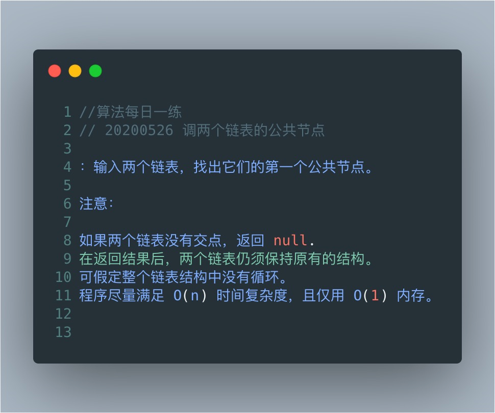
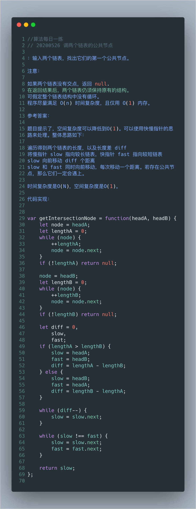

# 两个链表公共节点



在时间复杂度要求O(n)，空间复杂度O(1)的要求下，暴力破解法就无法适用

双指针是唯一符合此方法的算法，定义两个指针A,B分别指向HEAD1 HEAD2，两个指针同时遍历，当其中一个节点到尾部时切换指向另一个链表的头节点 例如：A指向HEAD2，B指向HEAD1；当循环到两指针指向的节点相同时，退出循环，返回相同的节点

```js
/*
 * Definition for singly-linked list.
 * function ListNode(val) {
 *     this.val = val;
 *     this.next = null;
 * }
 */

/**
 * @param {ListNode} headA
 * @param {ListNode} headB
 * @return {ListNode}
 */
var getIntersectionNode = function(headA, headB) {
    let node1 = headA
    let node2 = headB
    while(node1!==node2){
        node1 = node1!==null?node1.next:headB
        node2 = node2!==null?node2.next:headA
    }
    return node1
};
```

