# 实现四则运算

```
1+2*3+3/2
```

总成借助状态机与栈的思想

通过栈维护运算信息，当遇到需要优先运算的时候【括号，乘除】就新建信息入栈，知道运算结束位置

```js
function calculate(str) {
  let stack = []
  stack.push({
    a: '', b: ''
  })
  for (let i = 0; i < str.length; i++) {
    const c = str[i];
    let s = stack[stack.length - 1]
    switch (c){
      case '(':
        stack.push({
          a: '',
          b: ''
        })
        break
      case ')':
        // 右括号，则需要计算当前栈的执行结果值，出栈，将结果赋值给上一个栈
        let result = excu(s)
        stack.pop()
        if (stack.length) {
          s = stack[stack.length - 1]
          // 赋值
          s.sig ? (s.b = result) : (s.a = result)
        } else {
          stack.push({
            a: result,
            b: ''
          })
        }
        break
      case '*':
      case '/':
        // 乘除操作
        // 如果当前栈已有操作符，且为加减时,添加一个栈
        if (s.sig && (s.sig === '+' || s.sig === '-')) {
          stack.push({
            a: s.b,
            sig: c,
            b: ''
          })
        } else if (s.sig && (s.sig === '*' || s.sig === '/')) {
          let result
          if (s.c && s.c !== '') result = excu(s)
          else result = 0
          stack.pop()
          stack.push({
            a: result,
            sig: c,
            b: ''
          })
        } else (
          s.sig = c
        )
      
      break
      case '-':
      case '+':
        let result
        if (s.b && s.b !== '') {
          result = excu(s)
          stack.pop()
          stack.push({
            a: result,
            sig: c,
            b: ''
          })
        }
        else {
          s.sig = c
        }
        break
      default: 
        s.sig ? (s.b += c) : (s.a += c)
        console.log(s)
        break
    }

  }
  while (stack.length) {
    let s = stack.pop()
    if (stack.length === 0) return excu(s)
    stack[stack.length - 1].b = excu(s)
  }
}

function excu(s) {
  return eval(s.a + s.sig + s.b)
}

console.log(calculate('(1+2)*3'))
```


**这里可以扩展个逆波兰表达式的算法知识**，这题的解法也可通过这个思想进行求解

### 逆波兰表达式

先说一下中缀表达式，平时我们使用的运算表达式就是中缀表达式，例如1+3*2，中缀表达式的特点就是：**二元运算符总是置于与之相关的两个运算对象之间**

人读起来比较好理解，但是计算机处理起来就很麻烦，运算顺序往往因表达式的内容而定，不具规律性


 

后缀表达式，后缀表达式的特点就是：每一运算符都置于其运算对象之后，以上面的中缀表达式**1+2\*3**为例子，转为后缀表达式就是**123\*+**

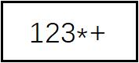

 

下面先分析怎么把**中缀表达式**转换为**后缀表达式，**这里我们考虑六种操作符**'+'、'-'、'\*'、'/'、'('、')'**，完成中缀转后缀我们需要两个数组，都以栈的方式来操作，一个数组用来存放后缀表达式（char num[100]），

一个数组用来临时存放操作数（char opera[100]）（这里说**临时**存放，是因为最后都要入栈到后缀表达式数组**num**中，这个数组就相当于一个中转站）

 

1、从左往右扫描中缀表达式（这里我们以1*(2+3)为例）

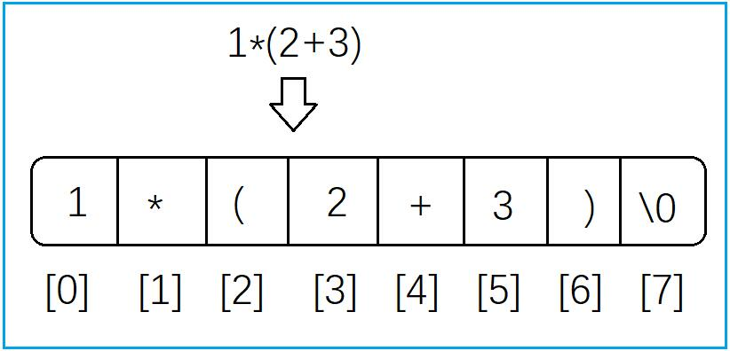

 

2、如果是数字那么将其直接入栈到数组**num**中

3、如果是操作数，需要进一步判断

（1）如果是左括号'('直接入栈到数组**opera**中

（2）如果是运算符（'+'、'-'、'*'、'/'），先判断数组**opera**的**栈顶**的操作数的优先级（如果是空栈那么直接入栈到数组**opera**），如果是左括号那么直接入栈到数组**opera**中，如果栈顶是运算符，且栈顶运算符的优先级大于该运算符

那么将栈顶的运算符出栈，并入栈到数组**num**中，重复步骤3，如果栈顶运算符优先级小于该运算符，那么直接将该运算符入栈到opera中

（3）如果是右括号')'，那么说明在**opera**数组中一定有一个左括号与之对应（在你没输错的情况下），那么将**opera**中的运算符依次出栈，并入栈到**num**中，直到遇到左括号'('（注意左括号不用入栈到**num**）

4、如果中缀表达式扫描完了，那么将**opera**中的操作数依次出栈，并入栈到**num**中就可以了，如果没有没有扫描完重复1-3步

上面就是中缀表达式转后缀表达式的步骤了，下面用图来直观的了解一下这个过程

 


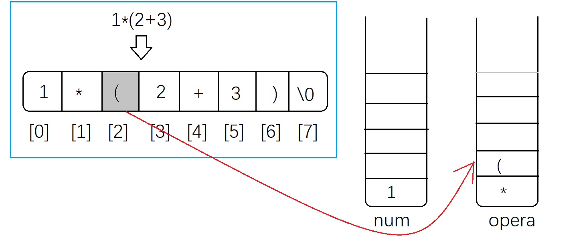

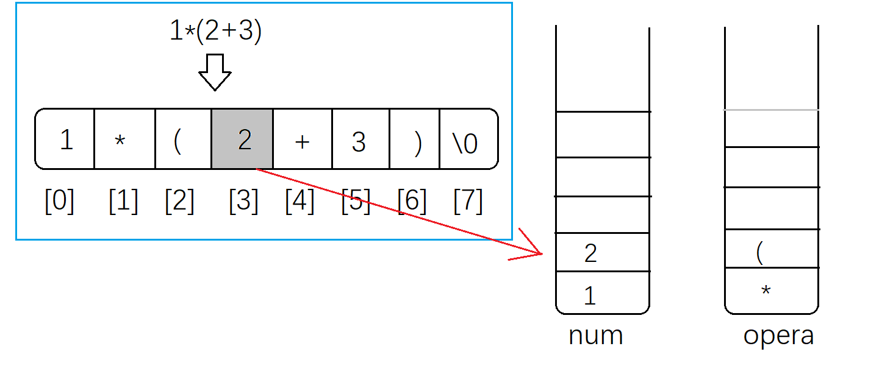

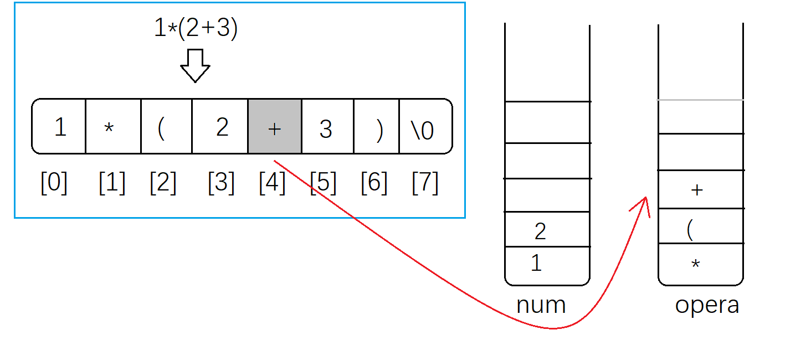


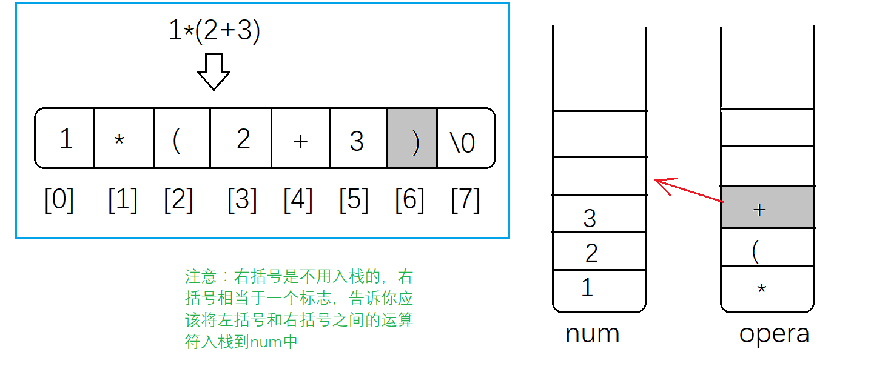


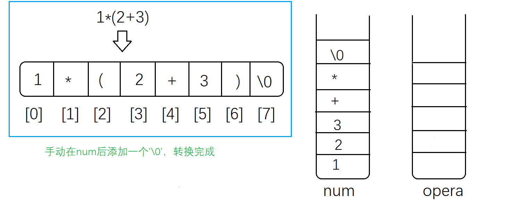

需要注意的是：opera中操作数，越靠近栈顶，优先级越高


# 后缀表达式的计算

完成了中缀表达式转后缀表达式，接下来就是后缀表达式的计算了，后缀表达式的计算比中缀转后缀要稍微简单一点，只需要对我们转换好的后缀表达式从左往右依次扫描，并依次入栈就行了，

意思是只需要用一个数组（double num[100]）就OK了

需要考虑的情况如下

1、如果是数字，那么直接入栈到num中

2、如果是运算符，将栈顶的两个数字出栈（因为我们考虑的运算符加、减、乘、除都是双目运算符，只需要两个操作数），出栈后对两个数字进行相应的运算，并将运算结果入栈

3、直到遇到'\0'

下面用几张图，来直观了解下这个过程，以上面转换好的后缀表达式"123+*"为例（这里用**ss**来存储后缀表达式，**num**来存储计算结果，注意不要与上面图中**num**搞混淆了）

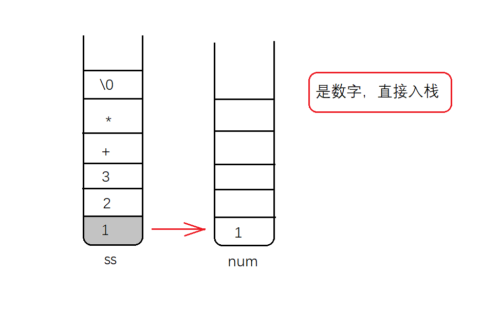

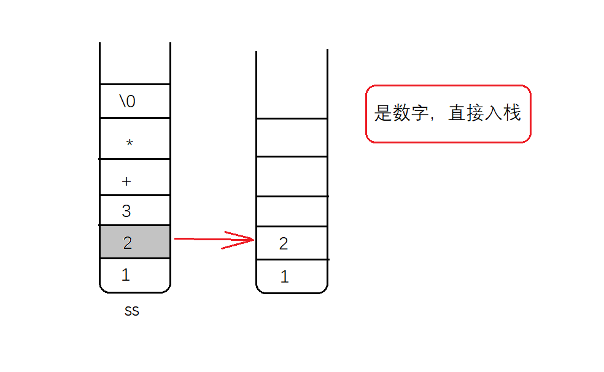

 

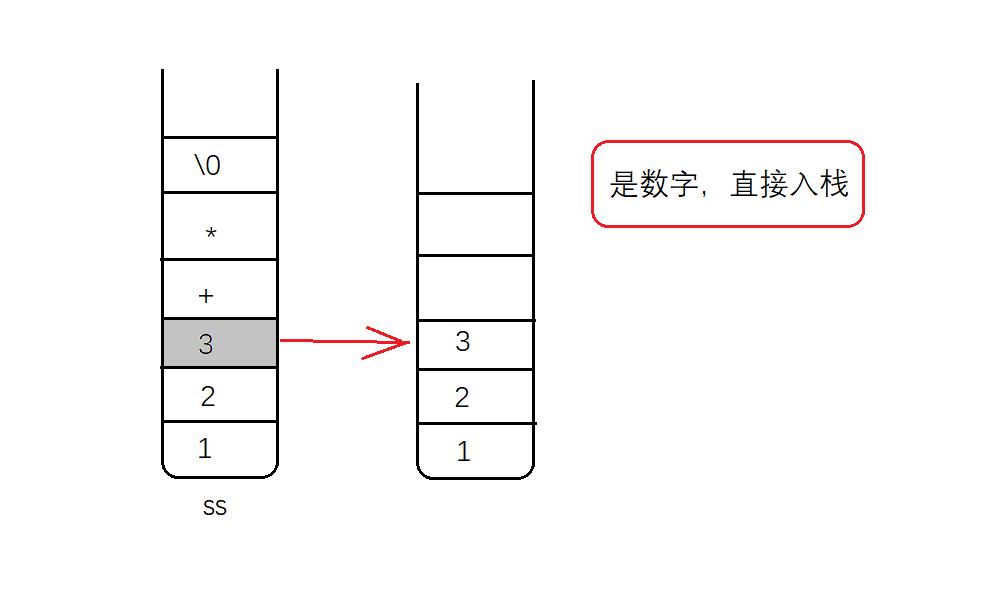

 

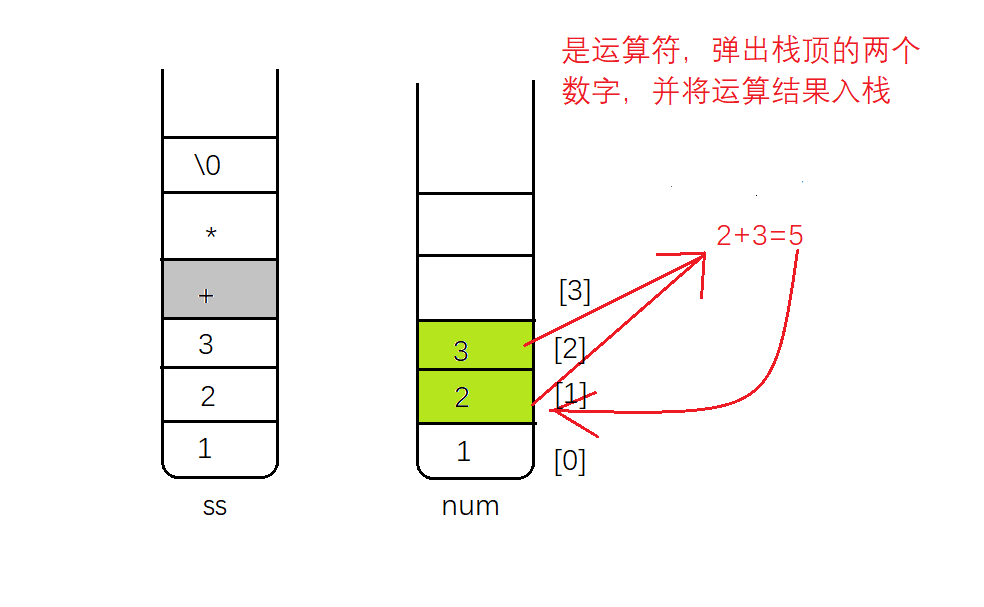

（注意：这里将计算结果5入栈后，栈顶从之前的[3]变成[2]）

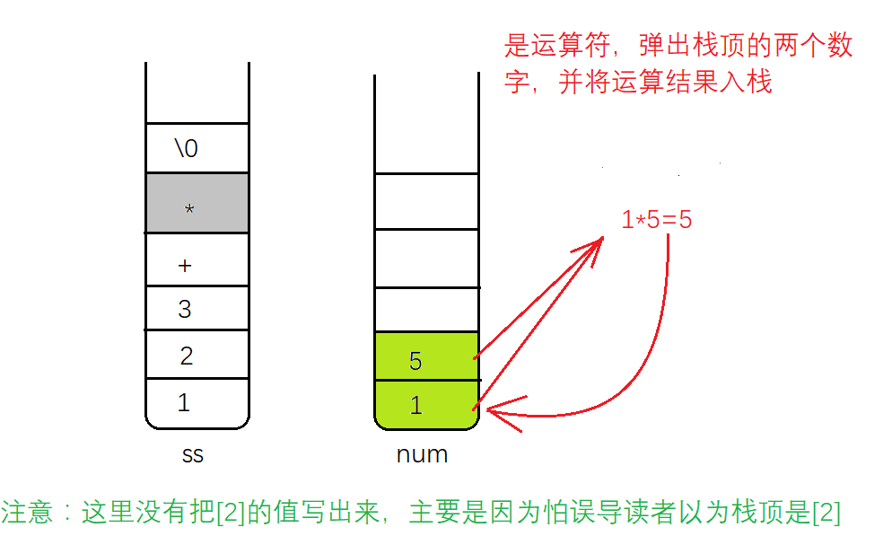

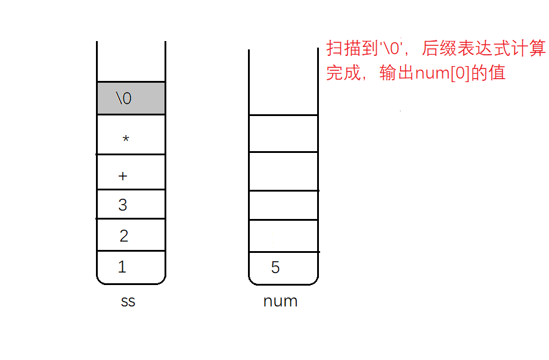

到这里后缀表达式的计算就结束了