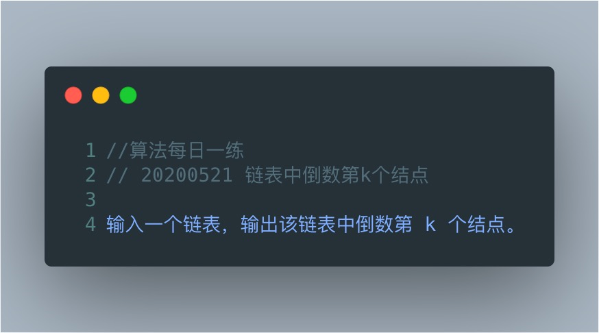
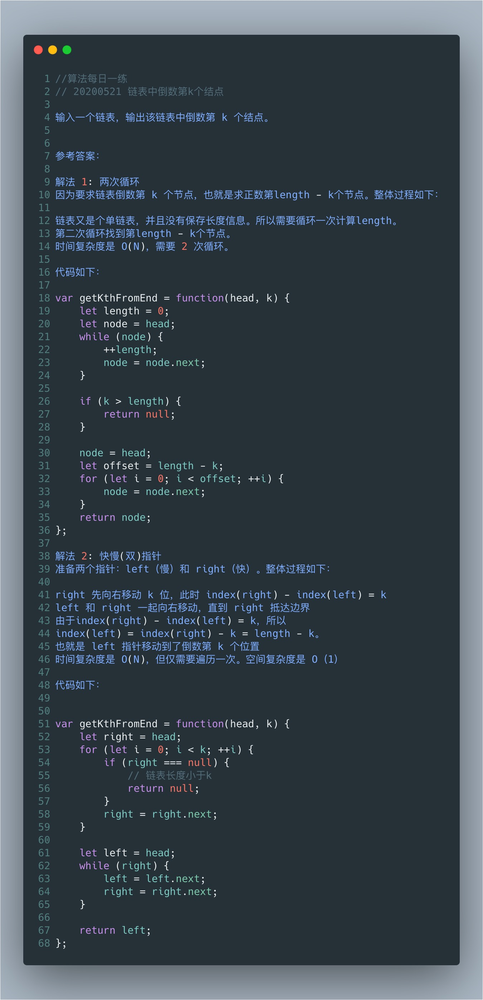

# 链表中倒数第K个节点



思路一：数组解法

建立一个数组，从头遍历一遍将节点放入数组，然后再在数组中取出倒数第K个节点

时间复杂度 O(n) 空间复杂度O(n)

```js
function getKNode(lists,k){
	let arr = []
	while(lists){
		arr.push(lists)
		lists = lists.next
	}
	return arr[arr.length-1-k]
}
```


思路二：双指针

时间复杂度 O(n) 空间复杂度O(1) 

```javascript
function getKnode(lists,node){
	let curNode = lists
	let kNode = lists
	while(k--){
		curNode = curNode.next
	}
	while(curNode){
		curNode = curNode.next
		kNode = kNode.next
	}
	return kNode
}
```

