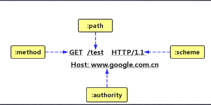
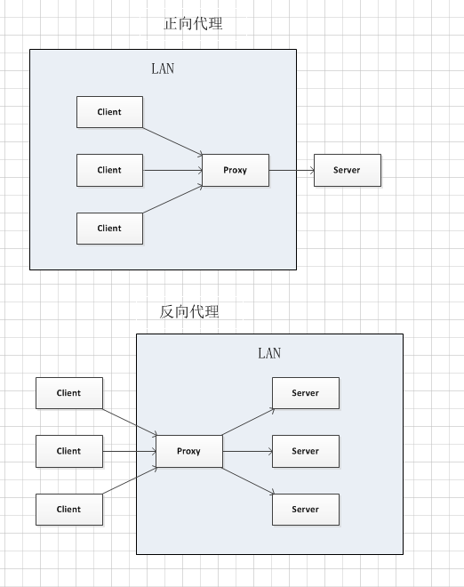
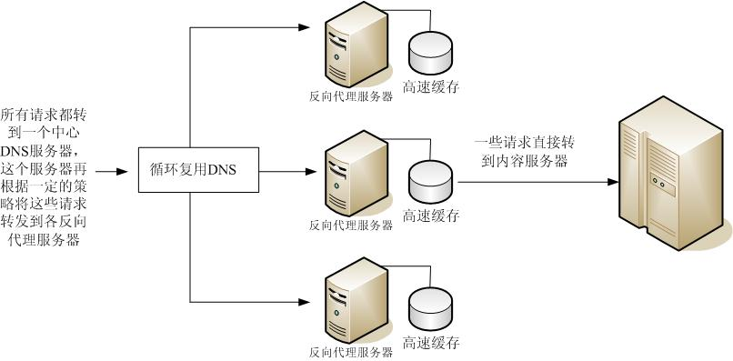

# HTTP协议

HTTP协议是Hyper Text Transfer Protocol(超文本传输协议) 的缩写,是用于从万维网 (WWW:World Wide Web) 服务器传输超文本到本地浏览器的传送协议。

HTTP是一个基于TCP/IP通信协议来传递数据 (HTML 文件, 图片文件, 查询结果等)。

HTTP是一个属于应用层的面向对象的协议，由于其简捷、快速的方式，适用于分布式超媒体信息系统。它于1990年提出，经过几年的使用与发展，得到不断地完善和扩展。目前在WWW中使用的是HTTP/1.0的第六版，HTTP/1.1的规范化工作正在进行之中，而且HTTP-NG(Next Generation of HTTP)的建议已经提出。

HTTP协议是由从客户机到服务器的请求(Request)和从服务器到客户机的响应(response)进行约束和规范


> http 协议在哪一层

**ISO/OSI估计标准组织定义**：应用层 表示层 会话层 传输层  网络层 数据链路层 物理层

应用层：为用户提供服务 http ftp dns smtp

传输层：为应用层实体提供端到端的通信功能，保证数据包的顺序传送及数据的完整性（TCP/UDP）

网络层：IP协议 解决主机到主机的通信问题

网络接口层（数据链路层 ：比特信号转成光信号/电信号；物理层）：监视数据在主机与网络间交换


## http工作过程

一次HTTP操作称为一个事务，其工作过程可分为四步:

1、客户端与服务器建立TCP连接

2、客户端发送请求给服务器

3、服务器接到请求给出响应

4、客户端收到信息展示到浏览器中，然后断开连接

## URL 和 URI

每个web 服务器资源都有一个名字,服务器资源名称被称为 **统一资源标识符**,如 web 服务器上一个图片资源的 URI:

http://www.joes-hardware.com/specials/saw-blade.gif

URI 有两种形式,分别称为 **URL** 和 **URN**

### URl

**统一资源定位符 (URL)** 是资源标识符最常见的形式。URL 描述了一台特定服务器 上某资源的特定位置。它们可以明确说明如何从一个精确、固定的位置获取资源

URL 说明了协议,服务器和本地资源

大部分 URL 都遵循一种标准格式，这种格式包含三个部分

- URL的第一部分被称为 方案,说明了访问资源所使用的的协议类型. 这部分通常就是 **HTTP** 协议(http://)
- 第二部分给出了服务器的因特网地址(如,www.joes-hardware.com)
- 其余部分指定了 Web 服务器上的某个资源(如,/imgage/asw.gif)

现在,几乎所有的 URI 都是 URL

### URN

URI 的第二种形式就是统一资源名(URN). URN是作为特定内容的唯一名称使用的,与目前的资源所在地无关. 通过 URN,还可以用同一个名字通过多种网络协议来访问资源


## GET 和 POST 有什么区别?

差别如下:

- 从缓存的角度，GET 请求会被浏览器主动缓存下来，留下历史记录，而 POST 默认不会
- 从编码的角度，GET 只能进行 URL 编码，只能接收 ASCII 字符，而 POST 没有限制
- 从参数的角度，GET 一般放在 URL 中，因此不安全，POST 放在请求体中，更适合传输敏感信息。
- 从幂等性的角度，GET是幂等的，而POST不是。(幂等表示执行相同的操作，结果也是相同的)
- 从TCP的角度，GET 请求会把请求报文一次性发出去，而 POST 会分为两个 TCP 数据包，首先发 header 部分，如果服务器响应 100(continue), 然后发 body 部分。(火狐浏览器除外，它的 POST 请求只发一个 TCP 包)


## 状态码

**状态代码有三位数字组成，第一个数字定义了响应的类别，共分五种类别:**

- **1xx：指示信息--表示请求已接收，继续处理**
- **2xx：成功--表示请求已被成功接收、理解、接受**
- **3xx：重定向--要完成请求必须进行更进一步的操作**
- **4xx：客户端错误--请求有语法错误或请求无法实现**
- **5xx：服务器端错误--服务器未能实现合法的请求**

**常见状态码：**

| 状态码                    | 解释                                                         |
| ------------------------- | ------------------------------------------------------------ |
| 200 OK                    | 客户端请求成功                                               |
| 304 Not Modified          | 当协商缓存命中时会返回这个状态码                             |
| 400 Bad Request           | 客户端请求有语法错误，不能被服务器所理解                     |
| 401 Unauthorized          | 请求未经授权，这个状态代码必须和WWW-Authenticate报头域一起使用 |
| 403 Forbidden             | 服务器收到请求，但是拒绝提供服务                             |
| 404 Not Found             | 请求资源不存在，eg：输入了错误的URL                          |
| 500 Internal Server Error | 服务器发生不可预期的错误                                     |
| 503 Server Unavailable    | 服务器当前不能处理客户端的请求，一段时间后可能恢复正常       |

## HTTPS

### 秘钥交换算法

1）Alice与Bob确定两个大素数n和g，这两个数不用保密 

（2）Alice选择另一个大随机数x，并计算A如下：A=gx mod n 

（3）Alice将A发给Bob

（4）Bob选择另一个大随机数y，并计算B如下：B=gy mod n 

（5）Bob将B发给Alice

（6）计算秘密密钥K1如下：K1=Bx mod n 

（7）计算秘密密钥K2如下：K2=Ay mod n K1=K2，因此Alice和Bob可以用其进行加解密


### https加密过程

认证服务器。浏览器内置一个受信任的CA机构列表，并保存了这些CA机构的证书。第一阶段服务器会提供经CA机构认证颁发的服务器证书，如果认证该服务器证书的CA机构，存在于浏览器的受信任CA机构列表中，并且服务器证书中的信息与当前正在访问的网站（域名等）一致，那么浏览器就认为服务端是可信的，并从服务器证书中取得服务器公钥，用于后续流程。否则，浏览器将提示用户，根据用户的选择，决定是否继续。当然，我们可以管理这个受信任CA机构列表，添加我们想要信任的CA机构，或者移除我们不信任的CA机构。

协商会话密钥。客户端在认证完服务器，获得服务器的公钥之后，利用该公钥与服务器进行加密通信，协商出两个会话密钥，分别是用于加密客户端往服务端发送数据的客户端会话密钥，用于加密服务端往客户端发送数据的服务端会话密钥。在已有服务器公钥，可以加密通讯的前提下，还要协商两个对称密钥的原因，是因为非对称加密相对复杂度更高，在数据传输过程中，使用对称加密，可以节省计算资源。另外，会话密钥是随机生成，每次协商都会有不一样的结果，所以安全性也比较高。

加密通讯。此时客户端服务器双方都有了本次通讯的会话密钥，之后传输的所有Http数据，都通过会话密钥加密。这样网路上的其它用户，将很难窃取和篡改客户端和服务端之间传输的数据，从而保证了数据的私密性和完整性。


- https协议 SSL协议 TLS协议、握手协议的关系

- https 基于ssl的http协议

- SSL协议是一种记录协议，扩展性良好，可以方便添加子协议

- 握手协议是SSL的一个子协议

- TLS是SSL的后续版本


### TLS握手过程

1. ClientHello：客户端发送所支持的 SSL/TLS 最高协议版本号和所支持的加密算法集合及压缩方法集合等信息给 服务器端。
2. ServerHello：服务器端收到客户端信息后，选定双方都能够支持的 SSL/TLS 协议版本和加密方法及压缩方法， 返回给客户端。
3. SendCertificate（可选）：服务器端发送服务端证书给客户端。 
4.  RequestCertificate（可选）：如果选择双向验证，服务器端向客户端请求客户端证书
5.  ServerHelloDone：服务器端通知客户端初始协商结束。
6. ResponseCertificate（可选）：如果选择双向验证，客户端向服务器端发送客户端证书。 
7.  ClientKeyExchange：客户端使用服务器端的公钥，对客户端公钥和密钥种子进行加密，再发送给服务器端。
8. CertificateVerify（可选）：如果选择双向验证，客户端用本地私钥生成数字签名，并发送给服务器端，让其通 过收到的客户端公钥进行身份验证。
9. CreateSecretKey：通讯双方基于密钥种子等信息生成通讯密钥。 
10.  ChangeCipherSpec：客户端通知服务器端已将通讯方式切换到加密模式。 
11.  Finished：客户端做好加密通讯的准备。
12. ChangeCipherSpec：服务器端通知客户端已将通讯方式切换到加密模式。 
13.  Finished：服务器做好加密通讯的准备。
14. Encrypted/DecryptedData：双方使用客户端密钥，通过对称加密算法对通讯内容进行加密。 
15. ClosedConnection：通讯结束后，任何一方发出断开 SSL 连接的消息。


## HTTP2

**特点：**

​	1、使用二进制格式传输，更高效，更紧凑；原本是用ASCII码进行传输，也就是纯文本，对于大的纯数字的时候，二进制格式占用容器更小

​	2、报头压缩，降低开销

​	3、多路复用，一个网络连接实现并行请求

​	4、服务器主动推送，减少请求的延迟

​	5、默认使用加密


### **二进制分帧层**

HTTP2定义了如何封装HTTP消息在客户端与服务端的传输

在1.1之前的模型中，HTTP消息是一串文本，以换行符作为请求头请求体的分隔符，而HTTP2则对HTTP消息进行了封装，把头与数据分成了两个更小的二进制格式数据帧。这个”层“是位于套接字接口与应用的HTTP API之间的一个优化的新编码机制，所以对应用使用不影响。

在 HTTP/2 中，有了二进制分帧之后，HTTP 2.0不再依赖TCP链接去实现多流并行了，在HTTP/2：

- 同域名下所有通信都在单个连接上完成。
- 单个连接可以承载任意数量的双向数据流。
- 数据流以消息的形式发送，而消息又由一个或多个帧组成，多个帧之间可以乱序发送，因为根据帧首部的流标识可以重新组装。

这一特性，性能会有极大的提升，因为：

- 同个域名只需要占用一个TCP连接，消除了因多个TCP连接而带来的延时和内存消耗。
- 单个连接上可以并行交错的请求和响应，之间互不干扰。

### 报头压缩

在 HTTP/1 中，我们使用文本的形式传输 header，在 header 携带 cookie 的情况下，可能每次都需要重复传输几百到几千的字节。

在 HTTP /2 中，使用了 HPACK 压缩格式对传输的 header 进行编码，减少了 header 的大小。并在两端维护了索引表，用于记录出现过的 header ，后面在传输过程中就可以传输已经记录过的 header 的键名，对端收到数据后就可以通过键名找到对应的值。


### **多路复用**

在1.1中，客户端想要发起多个并行请求，必须使用多个TCP连接，这种模式会导致队首阻塞，降低连接效率。且在HTTP1.1中浏览器会限制一个域名的TCP连接请求数，一般为6个

HTTP2则将消息分解成一个一个的独立数据帧，交错发送，接收端再将帧重组成HTTP消息。

特点：1、交错发送多个请求，互不影响；2、并行交错发送多个响应，互不干扰；3、使用一个TCP连接发送多个请求和响应；4、消除不必要的延迟和提高现有网络容量的利用率；


### **服务器推送**：

Server push是HTTP/2中一个很强大的功能：

- 服务器除了响应客户端的请求外，还可以向客户端额外推送资源。
- 服务器推送的资源有自己独立的URL， 可以被浏览器缓存，可以达到多页面共享。
- 资源推送遵守同源策略，服务器不可随便推送第三方资源给客户端。
- 客户端可以拒绝推送过来的资源。

服务端可以对一个客户端请求发送多个响应。

- 应用可以通过额外的http头部，列出需要服务器推送哪些资源。
- 服务器可以解析请求的html，推测出客户端接下来需要请求的资源，然后提前向客户端推送。

**场景**：服务器已经知道客户端下一步要请求什么资源，这时候服务推送即可派上用场


服务器推送有一个很麻烦的问题。所要推送的资源文件，如果浏览器已经有缓存，推送就是浪费带宽。即使推送的文件版本更新，浏览器也会优先使用本地缓存。

一种解决办法是，只对第一次访问的用户开启服务器推送。下面是 Nginx 官方给出的示例，根据 Cookie 判断是否为第一次访问。

```yml

server {
    listen 443 ssl http2 default_server;

    ssl_certificate ssl/certificate.pem;
    ssl_certificate_key ssl/key.pem;

    root /var/www/html;
    http2_push_preload on;

    location = /demo.html {
        add_header Set-Cookie "session=1";
        add_header Link $resources;
    }
}


map $http_cookie $resources {
    "~*session=1" "";
    default "</style.css>; as=style; rel=preload";
}
```


#### **伪头字段**

http2内置了几个特殊的已“:”开始的key，用以替代HTTP/1.x中请求行/响应行的信息

```
:method  请求方法
:scheme 请求协议
:authority 请求域名
:path 请求地址

:status 响应状态

```




##### 存在的缺点（其实是tcp的缺点）

- tcp 以及tcp+tls建立连接延时，两个握手延时
- tcp队头阻塞：队头阻塞会导致 HTTP/2 在更容易丢包的弱网络环境下比 HTTP/1.1 更慢

### http1.x存在的缺点

1.请求阻塞 如上已清晰说明

2.以明文文本字符串的形式传输内容，存在安全问题

3.http 请求头无状态特性 导致传输效率低下
多个http请求头大部分信息是相同的，重复传输，导致宽带浪费.请求头多达几百字节，而请求主体却只有十几个字节，有效信息比很低。

4.只能浏览器主动请求响应，不能服务器主动推送信息过来

### HTTP 3特点

基于QUIC协议（UDP协议）

- 减少了握手的延迟（1-RTT 或 0-RTT）
- 多路复用，并且没有 TCP 的阻塞问题
- 连接迁移，（主要是在客户端）当由 Wifi 转移到 4G 时，连接不会被断开

HTTP 3与HTTP 1.1和HTTP 2没有直接的关系，也不是http2的扩展

HTTP 3将会是一个全新的WEB协议

HTTP 3目前处于制订和测试阶段

https://www.chromium.org/quic


## HTTP与代理



#### 正向代理

正向代理代理一般是指代理客户端，为客户端收发请求，使真实客户端对服务器不可见

#### 反向代理

反向代理是代理服务器端，为服务器收发请求，使真实服务器对客户端不可见

#### 反向代理的用途

- 加密和SSL加速
- 负载均衡
- 缓存静态内容
- 压缩
- 减速上传
- 安全
- 外网发布

#### 反向代理做负载均衡

反向代理服务器位于用户与目标服务器之间，但是对于用户而言，反向代理服务器就相当于目标服务器，即用户直接访问反向代理服务器就可以获得目标服务器的资源。同时，用户不需要知道目标服务器的地址，也无须在用户端作任何设定。反向代理服务器通常可用来作为Web加速，即使用反向代理作为Web服务器的前置机来降低网络和服务器的负载，提高访问效率;

