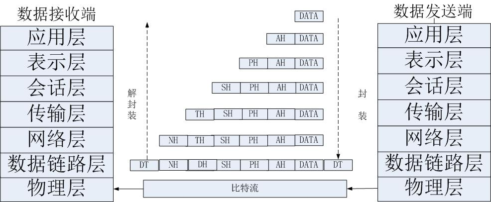
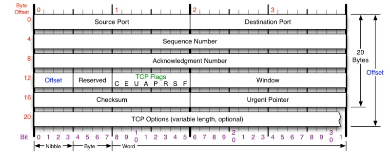
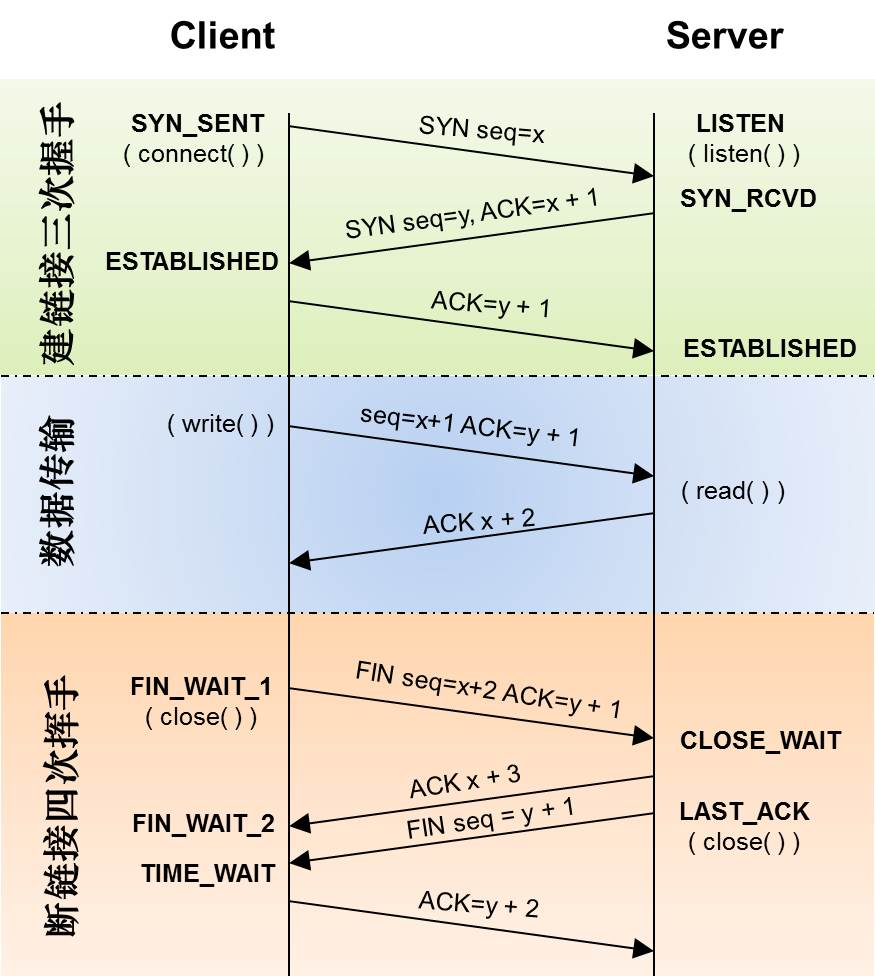

# TCP 协议

## 模型详解

### iso 标准

**iso标准** 应用层、表示层和会话层合并为应用层。在TCP协议中为一层

所以就为： 应用层 -> 传输层 -> 网络层 -> 数据链路层 -> 物理层

| OSI中的层  | 功能                                  | TCP/IP协议族                       |
| ---------- | ------------------------------------- | ---------------------------------- |
| 应用层     | 文件传输,电子邮件,文件服务,虚拟在终端 | TFTP,HTTP,SNMP,FTP,SMTP,DNS,Telnet |
| 表示层     | 数据格式化,代码转换,数据加密          | 没有协议                           |
| 会话层     | 解除或建立与接的节点的联系            | 没有协议                           |
| 传输层     | 提供端对端的接口                      | TCP,UDP                            |
| 网络层     | 为数据包选择路由                      | IP,ICMP,RIP,OSPF,BGP,IGMP          |
| 数据链路层 | 传输有地址的帧一级错误检测功能        | SLIP,CSLIP,PPP,ARP,RARP,MTU        |
| 物理层     | 以二进制数据形式在屋里媒体上传输数据  | ISO2110,IEEE802,IEEE802.2          |

### 流程

发起请求

url -> 添加请求头等包装 -> tcp协议进行打包 -> 继续打包 

接受请求

逐条解压 ...-> 只留数据

### 应用层

传输层之上，便是应用层。传输层的UDP报文和TCP报文段的数据部分就是应用层交付的数据，不同类型的网络应用有不同的通信规则，

因此应用层协议是多种多样的，比如 DNS、FTP、Telnet、SMTP、HTTP、RIP、NFS 等协议都是用于解决其各自的一类问题。

### 传输层

网络接口：**套接字**

**TCP**：

- 有连接:需要用端口号建立连接
- 可靠传输:发送者能感知到是否发送成功
- 面向字节流:字节流读取数据

**TCP最核心的机制**：

- 可靠传输
- 尽可能提高传输效率

可靠性传输 发送者能感知到失败(对比打电话和发短信)

面向字节流，文件操作(I/O流)

**UDP**：

- 无连接: 知道对端的IP的端口号就可以直接传输,不需要建立连接
- 不可靠: 没有确认机制,没有重传机制,如果因为网络故障该段无法发送到对端,UDP协议也不会给应用层返回任何错误信息
- 面向数据报: 不能灵活的控制读写数据的次数和数量

### 网络层

网络层用来处理在网络上流动的数据包。数据包是网络传输的最小数 据单位。该层规定了通过怎样的路径（所谓的传输路线）到达对方计算机，并把数据包传送给对方。

与对方计算机之间通过多台计算机或网络设备进行传输时，网络层所 起的作用就是在众多的选项内选择一条传输路线。

网络接口：**原始套接字**(必须要提供权限)

### 数据链路层

处理设备连接

详细资料请参考 [TCP/IP--数据链路层](https://www.jianshu.com/p/ffa5ec1c338d)

### 物理层

硬件相关

## TCP 封装结构

1. 端口，端口分发送端的端口（源端口source port） 和 接收端的端口（目的端口Destination port），为什么要这两个端口。因为要分辨这处理数据的进程是谁，只能通过端口去分辨进程。
2. 数据号Sequence Number，它是一个4字节的数据。TCP在给数据打包传送到下一层时不可能把所有的数据都打成一个大包，因为效率很低。它要把这个数据分成若干小包，逐个小包去进行分装，这些小包是有顺序的，这些数据就由数据号去体现。对方收到小包要组装，按照数据号来组装。这是为了减少重传的时候减少消耗，哪些失败了或者丢包了就重传哪个，不至于整个都重传。
3. 应答号Ackonwledgment Number，给对方的排序依据，上边的是给自己排序的依据。这样一来一回数据不会乱。这样就直接能对应上哪个编号的包失败了或者丢失了，就看应答号哪个没有对上。 后边还有一些偏移量Offset，标志位，滑动窗口，校验，处理指针，附加选项等等

## 三次握手 & 四次挥手

### 三次握手

建立连接时候的三次通信过程

1. 客户端给服务端发一个 SYN 报文，并指明客户端的初始化序列号 ISN。此时客户端处于 SYN_SEND 状态。

   首部的同步位SYN=1，初始序号seq=x，SYN=1的报文段不能携带数据，但要消耗掉一个序号。

2. 服务器一开始是监听状态，收到包以后状态就变成了SYN_RCVD状态。服务器收到请求连接包以后它要发两个指令，发起连接指令和应答连接指令，合并在一起发过去。

   在确认报文段中SYN=1，ACK=1，确认号ack=x+1，初始序号seq=y。

   > 服务器会把SYN_RCVD状态下请求连接放在一个队列里，我们把这种队列称之为**半连接队列**；
   >
   > **SYN攻击**：SYN攻击就是Client在短时间内伪造大量不存在的IP地址，并向Server不断地发送SYN包，Server则回复确认包，并等待Client确认，由于源地址不存在，因此Server需要不断重发直至超时，这些伪造的SYN包将长时间占用未连接队列，导致正常的SYN请求因为队列满而被丢弃，从而引起网络拥塞甚至系统瘫痪。SYN 攻击是一种典型的 DoS/DDoS 攻击。
   >
   > 常见的防御 SYN 攻击的方法有如下几种：
   >
   > - 缩短超时（SYN Timeout）时间
   > - 增加最大半连接数
   > - 过滤网关防护
   > - SYN cookies技术

3. 客户端收到 SYN 报文之后，会发送一个 ACK 报文，当然，也是一样把服务器的 ISN + 1 作为 ACK 的值，表示已经收到了服务端的 SYN 报文，此时客户端处于 ESTABLISHED 状态。服务器收到 ACK 报文之后，也处于 ESTABLISHED 状态，此时，双方已建立起了连接。

   确认报文段ACK=1，确认号ack=y+1，序号seq=x+1（初始为seq=x，第二个报文段所以要+1），ACK报文段可以携带数据，不携带数据则不消耗序号。

**三次握手原因：**

第一次握手：客户端发送网络包，服务端收到了。

这样服务端就能得出结论：客户端的发送能力、服务端的接收能力是正常的。

第二次握手：服务端发包，客户端收到了。

这样客户端就能得出结论：服务端的接收、发送能力，客户端的接收、发送能力是正常的。不过此时服务器并不能确认客户端的接收能力是否正常。

第三次握手：客户端发包，服务端收到了。

这样服务端就能得出结论：客户端的接收、发送能力正常，服务器自己的发送、接收能力也正常。

 **ISN(Initial Sequence Number)**

三次握手的其中一个重要功能是客户端和服务端交换 ISN(Initial Sequence Number)，以便让对方知道接下来接收数据的时候如何按序列号组装数据。如果 ISN 是固定的，攻击者很容易猜出后续的确认号，因此 ISN 是动态生成的。

### 四次挥手

第一次挥手：客户端发送一个 FIN 报文，报文中会指定一个序列号。此时客户端处于 FIN_WAIT1 状态。

即发出连接释放报文段（FIN=1，序号seq=u），并停止再发送数据，主动关闭TCP连接，进入FIN_WAIT1（终止等待1）状态，等待服务端的确认。

第二次挥手：服务端收到 FIN 之后，会发送 ACK 报文，且把客户端的序列号值 +1 作为 ACK 报文的序列号值，表明已经收到客户端的报文了，此时服务端处于 CLOSE_WAIT 状态。

即服务端收到连接释放报文段后即发出确认报文段（ACK=1，确认号ack=u+1，序号seq=v），服务端进入CLOSE_WAIT（关闭等待）状态，此时的TCP处于半关闭状态，客户端到服务端的连接释放。客户端收到服务端的确认后，进入FIN_WAIT2（终止等待2）状态，等待服务端发出的连接释放报文段。

第三次挥手：如果服务端也想断开连接了，和客户端的第一次挥手一样，发给 FIN 报文，且指定一个序列号。此时服务端处于 LAST_ACK 的状态。

即服务端没有要向客户端发出的数据，服务端发出连接释放报文段（FIN=1，ACK=1，序号seq=w，确认号ack=u+1），服务端进入LAST_ACK（最后确认）状态，等待客户端的确认。

第四次挥手：客户端收到 FIN 之后，一样发送一个 ACK 报文作为应答，且把服务端的序列号值 +1 作为自己 ACK 报文的序列号值，此时客户端处于 TIME_WAIT 状态。需要过一阵子以确保服务端收到自己的 ACK 报文之后才会进入 CLOSED 状态，服务端收到 ACK 报文之后，就处于关闭连接了，处于 CLOSED 状态。

即客户端收到服务端的连接释放报文段后，对此发出确认报文段（ACK=1，seq=u+1，ack=w+1），客户端进入TIME_WAIT（时间等待）状态。此时TCP未释放掉，需要经过时间等待计时器设置的时间2MSL后，客户端才进入CLOSED状态。

**2MSL等待状态**

- 保证客户端发送的最后一个ACK报文段能够到达服务端。

  这个ACK报文段有可能丢失，使得处于LAST-ACK状态的B收不到对已发送的FIN+ACK报文段的确认，服务端超时重传FIN+ACK报文段，而客户端能在2MSL时间内收到这个重传的FIN+ACK报文段，接着客户端重传一次确认，重新启动2MSL计时器，最后客户端和服务端都进入到CLOSED状态，若客户端在TIME-WAIT状态不等待一段时间，而是发送完ACK报文段后立即释放连接，则无法收到服务端重传的FIN+ACK报文段，所以不会再发送一次确认报文段，则服务端无法正常进入到CLOSED状态。

- 防止“已失效的连接请求报文段”出现在本连接中。

  客户端在发送完最后一个ACK报文段后，再经过2MSL，就可以使本连接持续的时间内所产生的所有报文段都从网络中消失，使下一个新的连接中不会出现这种旧的连接请求报文段。

## 查看TCP连接状态

shell 中输入，命令更多参数参考 [netstat](https://www.runoob.com/linux/linux-comm-netstat.html)

netstat -an

会有一个state的状态值

##### tcp 和 udp 的区别和使用场景？

1、基于连接与无连接；

2、对系统资源的要求（TCP较多，UDP少）；

3、UDP程序结构较简单；

4、流模式与数据报模式 ；

5、TCP保证数据正确性，UDP可能丢包；

6、TCP保证数据顺序，UDP不保证。

### 重传、滑动窗口、流量控制、拥塞控制

TCP滑动窗口

在TCP协议中，发送方和接受方通过各自维护自己的缓冲区。通过商定包的重传机制等一系列操作，来解决不可靠的问题。

https://www.cnblogs.com/coder-programming/p/10627746.html

https://www.jianshu.com/p/5b07a2f05771

**拥塞窗口**与**发送窗口**

**拥塞窗口 cwnd**是发送方维护的一个 的状态变量，它会根据**网络的拥塞程度动态变化的**。

我们在前面提到过发送窗口 swnd 和接收窗口 rwnd 是约等于的关系，那么由于入了拥塞窗口的概念后，此时发送窗口的值是swnd = min(cwnd, rwnd)，也就是拥塞窗口和接收窗口中的最小值。

拥塞窗口 cwnd 变化的规则：

只要网络中没有出现拥塞，cwnd 就会增大；

但网络中出现了拥塞，cwnd 就减少；

慢启动-》拥塞避免-》拥塞发生-》快速恢复

