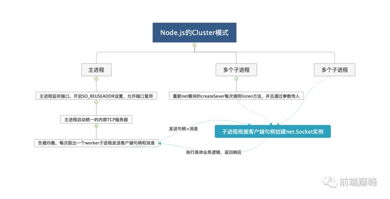
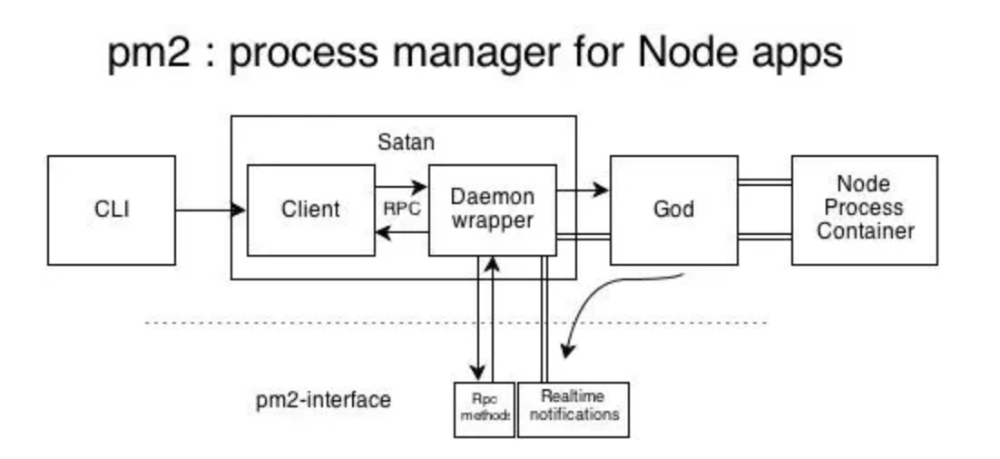
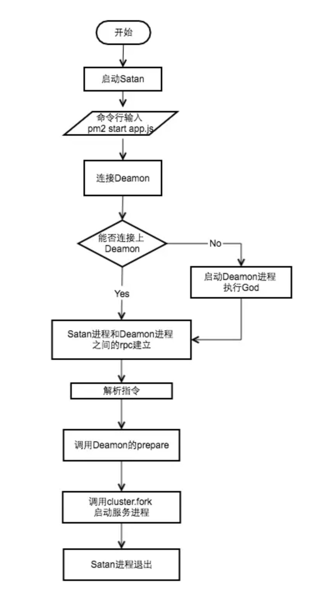

# PM2工作机制

[pm2](http://pm2.keymetrics.io/) 是我们在使用 Node 开发时常用的服务托管工具，功能很强大。所以我们需要了解其工作机制


## 前置知识

### Node Cluster

熟悉 js 的人都知道，js 是单线程的，在 Node 中，采用的是 **多进程单线程** 的模型。由于单线程的限制，在多核服务器上，我们需要启动多个进程才能最大化利用服务器性能。

Node 在 V0.8 版本之后引入了 [cluster模块](http://nodejs.cn/api/cluster.html#cluster_cluster)，通过一个主进程 (master) 管理多个子进程 (worker) 的方式实现集群。

以下是官网上的一个示例，运行代码，则工作进程会共享 8000 端口：

```js
const cluster = require('cluster');
const http = require('http');
const numCPUs = require('os').cpus().length;

if (cluster.isMaster) {
  console.log(`主进程 ${process.pid} 正在运行`);

  // 衍生工作进程。
  for (let i = 0; i < numCPUs; i++) {
    cluster.fork();
  }

  cluster.on('exit', (worker, code, signal) => {
    console.log(`工作进程 ${worker.process.pid} 已退出`);
  });
} else {
  // 工作进程可以共享任何 TCP 连接。
  // 在本例子中，共享的是 HTTP 服务器。
  http.createServer((req, res) => {
    res.writeHead(200);
    res.end('你好世界\n');
  }).listen(8000);

  console.log(`工作进程 ${process.pid} 已启动`);
}
```

### 通信

Node中主进程和子进程之间通过**进程间通信** (IPC) 实现进程间的通信，进程间通过 send 方法发送消息，监听 message 事件收取信息，这是 `cluster模块` 通过集成 `EventEmitter` 实现的。还是一个简单的官网的**进程间通信**例子

```js
const cluster = require('cluster');
const http = require('http');

if (cluster.isMaster) {

  // Keep track of http requests
  let numReqs = 0;
  setInterval(() => {
    console.log(`numReqs = ${numReqs}`);
  }, 1000);

  // Count requests
  function messageHandler(msg) {
    if (msg.cmd && msg.cmd === 'notifyRequest') {
      numReqs += 1;
    }
  }

  // Start workers and listen for messages containing notifyRequest
  const numCPUs = require('os').cpus().length;
  for (let i = 0; i < numCPUs; i++) {
    cluster.fork();
  }

  for (const id in cluster.workers) {
    cluster.workers[id].on('message', messageHandler);
  }

} else {

  // Worker processes have a http server.
  http.Server((req, res) => {
    res.writeHead(200);
    res.end('hello world\n');

    // Notify master about the request
    process.send({ cmd: 'notifyRequest' });
  }).listen(8000);
}
```

### 负载均衡

了解 `cluster` 的话会知道，子进程是通过 `cluster.fork()` 创建的。在 linux 中，系统原生提供了 `fork` 方法，那么为什么 Node 选择自己实现 `cluster模块` ，而不是直接使用系统原生的方法？主要的原因是以下两点：

1. fork的进程监听同一端口会导致端口占用错误

2. fork的进程之间没有负载均衡，容易导致**惊群现象**

 > 惊群现象：所有的工作进程都在等待一个socket，当socket客户端连接时，所有工作线程都被唤醒，但最终有且仅有一个工作线程去处理该连接，其他进程又要进入睡眠状态。

在 `cluster模块` 中，针对第一个问题，通过判断当前进程是否为 `master进程`，若是，则监听端口，若不是则表示为 fork 的 `worker进程`，不监听端口。

针对第二个问题，`cluster模块` 内置了负载均衡功能，`master进程` 负责监听端口接收请求，然后通过调度算法（默认为 [Round-Robin](https://en.wikipedia.org/wiki/Round-robin_scheduling)，可以通过环境变量 `NODE_CLUSTER_SCHED_POLICY` 修改调度算法）分配给对应的 `worker进程`。

实现原理如下：

**由于net.Server实例的listen方法，最终会调用自身_handle属性下listen方法来完成监听动作，故在代码中修改之：此时的listen方法已经被hack ，每次调用只能发挥return 0 ,并不会监听端口**

```js
// lib/net.js
// ...
function listen(self, address, port, addressType, backlog, fd, exclusive) {
  // ...
  
  if (cluster.isMaster || exclusive) {
    self._listen2(address, port, addressType, backlog, fd);
    return; // 仅在worker环境下改变
  }

  cluster._getServer(self, {
    address: address,
    port: port,
    addressType: addressType,
    fd: fd,
    flags: 0
  }, cb);

  function cb(err, handle) {
    // ...
    self._handle = handle;
    // ...
  }
}
```





## pm2的实现

[pm2](https://github.com/Unitech/pm2) 基于 `cluster模块` 进行了封装，它能自动监控进程状态、重启进程、停止不稳定进程、日志存储等。利用 `pm2` 时，可以在不修改代码的情况下实现负载均衡集群。

### 架构



这篇文章我们要关注的是 `pm2` 的 `Satan进程`、`God Deamon守护进程` 以及 两者之间的 `进程间远程调用RPC`。

如果不知道点西方文化，还真搞不清他的文件名为啥是 `Satan` 和 `God`：

> 撒旦（Satan），主要指《圣经》中的堕天使（也称堕天使撒旦），被看作与上帝的力量相对的邪恶、黑暗之源，是God的对立面。

1、其中 Satan.js 提供程序的退出、杀死等方法，God.js 负责维持进程的正常运行，God进程启动后一直运行，相当于 cluster 中的 Master进程，维持 worker 进程的正常运行。

> **rpc（Remote Procedure Call Protocol）是指远程过程调用，也就是说两台服务器A，B，一个应用部署在A服务器上，想要调用B服务器上应用提供的函数/方法，由于不在一个内存空间，不能直接调用，需要通过网络来表达调用的语义和传达调用的数据。同一机器不同进程间的方法调用也属于rpc的作用范畴。**

PM2代码中采用了axon-rpc 和 axon 两个库，基本原理是提供服务的server绑定到一个域名和端口下，调用服务的client连接端口实现rpc连接。后续新版本采用了pm2-axon-rpc 和 pm2-axon两个库，绑定的方法也由端口变成.sock文件，因为采用port可能会和现有进程的端口产生冲突。

### 执行流程



每次命令行的输入都会执行一次`satan`程序。如果God进程不在运行，首先需要启动`God`进程。然后根据指令，`satan`通过rpc调用God中对应的方法执行相应的逻辑。

以 `pm2 start app.js -i 4`为例，`God`在初次执行时会配置`cluster`，同时监听`cluster`中的事件

```js
// 配置cluster
cluster.setupMaster({
  exec : path.resolve(path.dirname(module.filename), 'ProcessContainer.js')
});

// 监听cluster事件
(function initEngine() {
  cluster.on('online', function(clu) {
    // worker进程在执行
    God.clusters_db[clu.pm_id].status = 'online';
  });

  // 命令行中 kill pid 会触发exit事件，process.kill不会触发exit
  cluster.on('exit', function(clu, code, signal) {
    // 重启进程 如果重启次数过于频繁直接标注为stopped
    God.clusters_db[clu.pm_id].status = 'starting';

    // 逻辑
    ...
  });
})();
```

**在God启动后， 会建立Satan和God的rpc链接，然后调用prepare方法。prepare方法会调用cluster.fork，完成集群的启动**

```js
God.prepare = function(opts, cb) {
  ...
  return execute(opts, cb);
};
function execute(env, cb) {
  ...
  var clu = cluster.fork(env);
  ...
  God.clusters_db[id] = clu;

  clu.once('online', function() {
    God.clusters_db[id].status = 'online';
    if (cb) return cb(null, clu);
    return true;
  });

  return clu;
}
```


#### 参考

https://cloud.tencent.com/developer/article/1625697