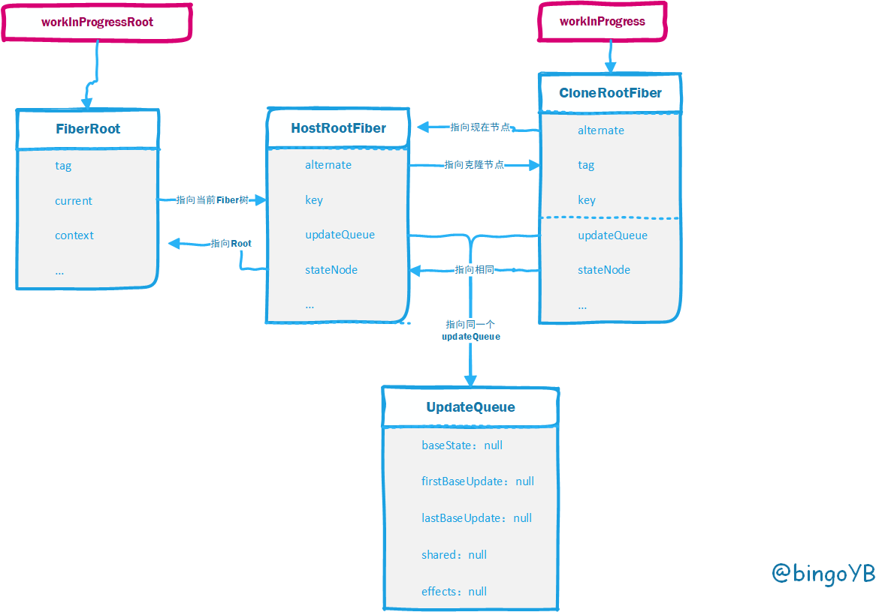

# 源码分析（1）

## React.createElement

可以看到 内部对config,childArray 做完一些基本检测判断后,返回 一个 **ReactElement** 方法来创建 Element, 我们去看看 **ReactElement** 方法

```js
export function createElement(type, config, children) {
  let propName;
  // Reserved names are extracted
  const props = {};

  let key = null;
  let ref = null;
  let self = null;
  let source = null;

  if (config != null) {
    // ref和key是两个特殊的属性，要单独处理
    if (hasValidRef(config)) {
      ref = config.ref;

      if (__DEV__) {
        warnIfStringRefCannotBeAutoConverted(config);
      }
    }
    if (hasValidKey(config)) {
      key = '' + config.key;
    }

    self = config.__self === undefined ? null : config.__self;
    source = config.__source === undefined ? null : config.__source;
    // Remaining properties are added to a new props object
    // 遍历config得到props
    for (propName in config) {
      if (
        hasOwnProperty.call(config, propName) &&
        !RESERVED_PROPS.hasOwnProperty(propName)
      ) {
        props[propName] = config[propName];
      }
    }
  }

  // Children can be more than one argument, and those are transferred onto
  // the newly allocated props object.
  // createElement可以传递N个参数，N-2就是子元素的个数
  const childrenLength = arguments.length - 2;
  if (childrenLength === 1) {
    props.children = children;
  } else if (childrenLength > 1) {
    const childArray = Array(childrenLength);
    for (let i = 0; i < childrenLength; i++) {
      childArray[i] = arguments[i + 2];
    }
    props.children = childArray;
  }

  // Resolve default props
  // 赋值为default
  if (type && type.defaultProps) {
    const defaultProps = type.defaultProps;
    for (propName in defaultProps) {
      if (props[propName] === undefined) {
        props[propName] = defaultProps[propName];
      }
    }
  }
  // 创建一个ReactElement
  return ReactElement(
    type,
    key,
    ref,
    self,
    source,
    ReactCurrentOwner.current,
    props,
  );
}
```

## ReactElement

ReactElement构造函数，返回一个ReactElement对象 

```js
const ReactElement = function(type, key, ref, self, source, owner, props) {
  // reactElement在内部就是这么一个object
  const element = {
    // This tag allows us to uniquely identify this as a React Element
    $$typeof: REACT_ELEMENT_TYPE,

    // Built-in properties that belong on the element
    type: type,
    key: key,
    ref: ref,
    props: props,

    // Record the component responsible for creating this element.
    _owner: owner,
  };
  return element;
};
```

## ReactChildren.map

### 总体流程图



### 代码分析

##### mapChildren

```js
function mapChildren(children, func, context) {
  if (children == null) {
    return children;
  }
  const result = [];
  mapIntoWithKeyPrefixInternal(children, result, null, func, context);
  return result;
}
```

##### mapIntoWithKeyPrefixInternal

```js
function mapIntoWithKeyPrefixInternal(children, array, prefix, func, context) {
  let escapedPrefix = '';
  if (prefix != null) {
    escapedPrefix = escapeUserProvidedKey(prefix) + '/';
  }
  const traverseContext = getPooledTraverseContext(
    array,
    escapedPrefix,
    func,
    context,
  );
  // 将嵌套的数组展平
  traverseAllChildren(children, mapSingleChildIntoContext, traverseContext);
  releaseTraverseContext(traverseContext);
}
```

这段代码有意思的部分是引入了对象重用池的概念，分别对应 `getPooledTraverseContext` 和 `releaseTraverseContext` 中的代码。当然这个概念的用处其实很简单，就是维护一个大小固定的对象重用池，每次从这个池子里取一个对象去赋值，用完了就将对象上的属性置空然后丢回池子。维护这个池子的用意就是提高性能，毕竟频繁创建销毁一个有很多属性的对象会消耗性能，也就是防止内存抖动。

##### getPooledTraverseContext

```js
const POOL_SIZE = 10;
const traverseContextPool = [];
// 维护一个对象最大为10的池子，从这个池子取到对象去赋值，用完了清空， 防止内存抖动
// 可以循环使用，创建太多的话，也会占据内存
function getPooledTraverseContext(
  mapResult,
  keyPrefix,
  mapFunction,
  mapContext,
) {
  if (traverseContextPool.length) {
    const traverseContext = traverseContextPool.pop();
    traverseContext.result = mapResult;
    traverseContext.keyPrefix = keyPrefix;
    traverseContext.func = mapFunction;
    traverseContext.context = mapContext;
    traverseContext.count = 0;
    return traverseContext;
  } else {
    return {
      result: mapResult,
      keyPrefix: keyPrefix,
      func: mapFunction,
      context: mapContext,
      count: 0,
    };
  }
}
```

getPooledTraverseContext 就是从 pool 里面找一个对象，releaseTraverseContext 会把当前的context对象清空然后放回到pool中。

```js
function releaseTraverseContext(traverseContext) {
  if (traverseContextPool.length < POOL_SIZE) {
    traverseContextPool.push(traverseContext);
  }
}
```

releaseTraverseContext 的作用就是会把当前的 context 对象清空然后放回到pool中。

##### traverseAllChildren

接下来是traverseAllChildren，其主要功能就是调用下具体实现方法traverseAllChildrenImpl

```js
function traverseAllChildren(children, callback, traverseContext) {
  if (children == null) {
    return 0;
  }

  return traverseAllChildrenImpl(children, '', callback, traverseContext);
}
```

##### traverseAllChildrenImpl

```js
function traverseAllChildrenImpl(
  children,
  nameSoFar,
  callback,
  traverseContext,
) {
  const type = typeof children;

  if (type === 'undefined' || type === 'boolean') {
    // All of the above are perceived as null.
    children = null;
  }
  // invokeCallback=true,才触发callBack执行
  let invokeCallback = false;

  if (children === null) {
    invokeCallback = true;
  } else {
    switch (type) {
      case 'string':
      case 'number':
        invokeCallback = true;
        break;
      case 'object':
        switch (children.$$typeof) {
          //如果props.children是单个ReactElement/PortalElement的话 必会触发invokeCallback=true
          case REACT_ELEMENT_TYPE:
          case REACT_PORTAL_TYPE:
            invokeCallback = true;
        }
    }
  }
  // 处理非数组的情况
  if (invokeCallback) {
    callback(
      traverseContext,
      children,
      // If it's the only child, treat the name as if it was wrapped in an array
      // so that it's consistent if the number of children grows.
      nameSoFar === '' ? SEPARATOR + getComponentKey(children, 0) : nameSoFar,
    );
    return 1;
  }

  let child;
  let nextName;
  let subtreeCount = 0; // Count of children found in the current subtree.
  const nextNamePrefix =
    nameSoFar === '' ? SEPARATOR : nameSoFar + SUBSEPARATOR;

  if (Array.isArray(children)) {
    for (let i = 0; i < children.length; i++) {
      child = children[i];
      nextName = nextNamePrefix + getComponentKey(child, i);
      // 是数组就递归执行
      subtreeCount += traverseAllChildrenImpl(
        child,
        nextName,
        callback,
        traverseContext,
      );
    }
  } else {
    // 迭代器处理
    const iteratorFn = getIteratorFn(children);
    if (typeof iteratorFn === 'function') {
      if (disableMapsAsChildren) {
        invariant(
          iteratorFn !== children.entries,
          'Maps are not valid as a React child (found: %s). Consider converting ' +
          'children to an array of keyed ReactElements instead.',
          children,
        );
      }

      const iterator = iteratorFn.call(children);
      let step;
      let ii = 0;
      while (!(step = iterator.next()).done) {
        child = step.value;
        nextName = nextNamePrefix + getComponentKey(child, ii++);
        // 遍历
        subtreeCount += traverseAllChildrenImpl(
          child,
          nextName,
          callback,
          traverseContext,
        );
      }
    } else if (type === 'object') {
      let addendum = ''
      const childrenString = '' + children;
      // 类型判断不正确 抛出错误
      invariant(
        false,
        'Objects are not valid as a React child (found: %s).%s',
        childrenString === '[object Object]'
          ? 'object with keys {' + Object.keys(children).join(', ') + '}'
          : childrenString,
        addendum,
      );
    }
  }

  return subtreeCount;
}
```


**invokeCallback** 为 **true** 的时候 执行 callback, 也就是传入的 **mapSingleChildIntoContext** 方法

```js
function mapSingleChildIntoContext(bookKeeping, child, childKey) {
  const { result, keyPrefix, func, context } = bookKeeping;
  // func 就是我们在 React.Children.map(this.props.children, c => c)中传入的第二个函数参数
  let mappedChild = func.call(context, child, bookKeeping.count++);
  if (Array.isArray(mappedChild)) {
    // 数组递归展平
    // React.Children.map(this.props.children, c => [c, [c, [c]]])
    mapIntoWithKeyPrefixInternal(mappedChild, result, childKey, c => c);
  } else if (mappedChild != null) {
    if (isValidElement(mappedChild)) {
      // 创建一个新的ReactElement
      mappedChild = cloneAndReplaceKey(
        mappedChild,
        // Keep both the (mapped) and old keys if they differ, just as
        // traverseAllChildren used to do for objects as children
        keyPrefix +
        (mappedChild.key && (!child || child.key !== mappedChild.key)
          ? escapeUserProvidedKey(mappedChild.key) + '/'
          : '') +
        childKey,
      );
    }
    result.push(mappedChild);
  }
}
```

