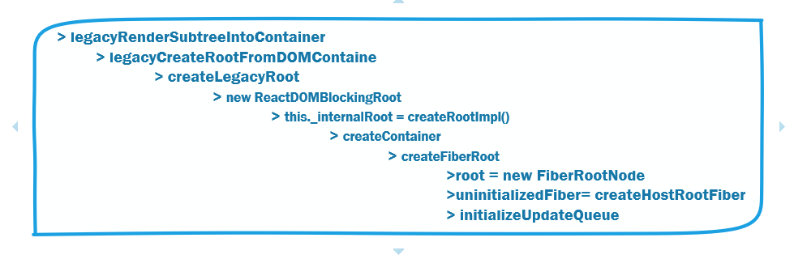
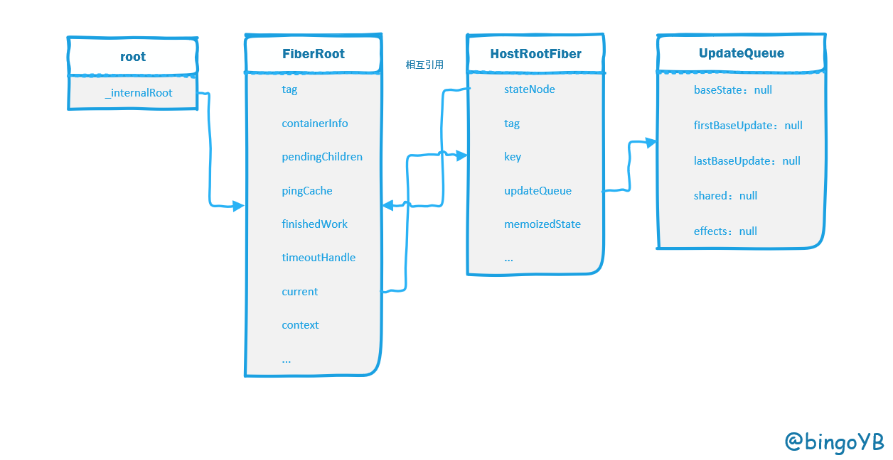
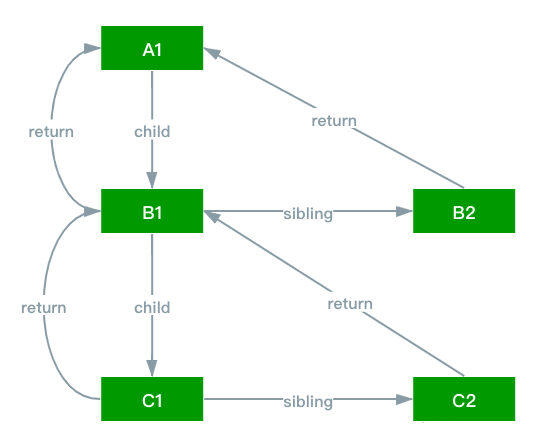
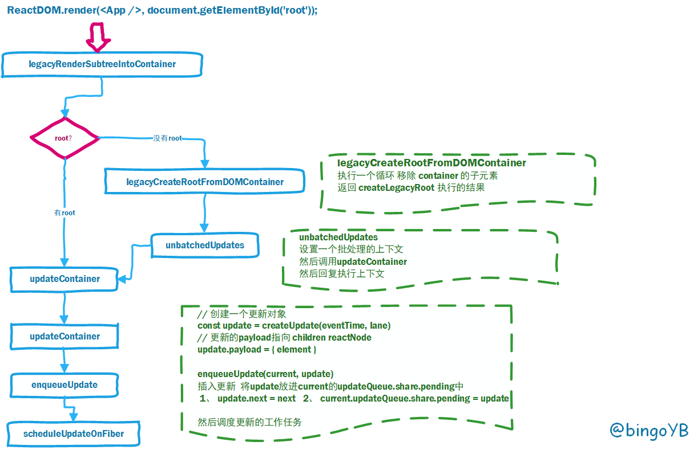

# 源码分析（2）

## ReactDOM.render

React 创建更新的三种方式

- ReactDOM.render || hydrate
- setState
- forceUpdate

先来讲入口函数 ReactDOM.render

```js
export function render(
  element: React$Element<any>,
  container: Container,
  callback: ?Function,
) {
  invariant(
    isValidContainer(container),
    'Target container is not a DOM element.',
  );
  return legacyRenderSubtreeIntoContainer(
    null,
    element,
    container,
    false,
    callback,
  );
}
```

可以看到直接是调用返回了一个 **legacyRenderSubtreeIntoContainer** 执行的结果

其中第四参数写死成false，这个值为true指的是服务端渲染，服务端渲染暂时不分析

### legacyRenderSubtreeIntoContainer

```js
function legacyRenderSubtreeIntoContainer(
  parentComponent: ?React$Component<any, any>,
  children: ReactNodeList,
  container: Container,
  forceHydrate: boolean,
  callback: ?Function,
) {
  // TODO: Without `any` type, Flow says "Property cannot be accessed on any
  // member of intersection type." Whyyyyyy.
  let root: RootType = (container._reactRootContainer: any);
  let fiberRoot;
  if (!root) {
    // Initial mount
    root = container._reactRootContainer = legacyCreateRootFromDOMContainer(
      container,
      forceHydrate,
    );
    fiberRoot = root._internalRoot;
    // 封装了callBack函数
    if (typeof callback === 'function') {
      const originalCallback = callback;
      callback = function() {
        const instance = getPublicRootInstance(fiberRoot);
        originalCallback.call(instance);
      };
    }
    // Initial mount should not be batched.
    // 初始化不走批处理逻辑,为了快
    unbatchedUpdates(() => {
      updateContainer(children, fiberRoot, parentComponent, callback);
    });
  } else {
    fiberRoot = root._internalRoot;
    if (typeof callback === 'function') {
      const originalCallback = callback;
      callback = function() {
        const instance = getPublicRootInstance(fiberRoot);
        originalCallback.call(instance);
      };
    }
    // Update
    updateContainer(children, fiberRoot, parentComponent, callback);
  }
  return getPublicRootInstance(fiberRoot);
}
```

这个函数首先会判断是否有root，

- 如果没有root就创建root，然后通过unbatchedUpdates（批处理更新操作）调用updateContainer，创建更新，
- 如果有root，则直接调用updateContainer创建更新

创建root (legacyCreateRootFromDOMContainer)主要就是做一个初始化创建FiberRoot的工作，经过了多层的递归，创建FiberRoot、HostFiberRoot，初始化更新队列（UpdateQueue）等等操作。

整个调用过程如下：



下面是执行完legacyCreateRootFromDOMContainer后的产生数据结构：



`root` 对象被挂载在了 `container._reactRootContainer` 上，也就是我们的 DOM 容器上。
如果你手边有 React 项目的话，在控制台键入如下代码就可以看到这个 `root` 对象了。

```js
document.querySelector('#root')._reactRootContainer
```

**`FiberRoot` 就是整个 `fiber` 树的根节点**

HostRootFiber就是Fiber节点宿主节点，也就Fiber节点的开端，其本身就是一个Fiber节点

```js

function FiberNode(
  tag: WorkTag,
  pendingProps: mixed,
  key: null | string,
  mode: TypeOfMode,
) {
  // Instance
  this.tag = tag;
  this.key = key;
  this.elementType = null;
  this.type = null;
  this.stateNode = null;

  // Fiber
  this.return = null;
  this.child = null;
  this.sibling = null;
  this.index = 0;

  this.ref = null;

  this.pendingProps = pendingProps;
  this.memoizedProps = null;
  this.updateQueue = null;
  this.memoizedState = null;
  this.dependencies = null;

  this.mode = mode;

  // Effects
  this.flags = NoFlags;
  this.subtreeFlags = NoFlags;
  this.deletions = null;

  this.lanes = NoLanes;
  this.childLanes = NoLanes;

  this.alternate = null;

}
```

#### Fiber结构

从上面的代码可看到Fiber节点的大致结构，`return`、`child`、`sibling` 这三个属性很重要，它们是构成 `fiber` 树的主体数据结构。`fiber` 树其实是一个链表树结构，`return` 及 `child` 分别对应着树的父子节点，并且父节点只有一个 `child` 指向它的第一个子节点，即便是父节点有好多个子节点。那么多个子节点如何连接起来呢？答案是 `sibling`，每个子节点都有一个 `sibling` 属性指向着下一个子节点，都有一个 `return` 属性指向着父节点。



### unbatchedUpdates

```js
// 执行非批量更新的操作
// 主题逻辑： 保存初始上下文，增加非批量上下文，删除批量更新上下文， 执行函数， 重置上下文，重置时间和执行同步队列
//  unbatchedUpdates 存储当前上下文，去除批量上下文，增加非批量更新上下文，执行函数fn, 结束后，还原上下文，当无上下文，重置渲染时间和清空同步回调函数。
export function unbatchedUpdates<A, R>(fn: (a: A) => R, a: A): R {
  // 原来的执行上下文
  // BatchedContext = 0b000001
  // LegacyUnbatchedContext = 0b001000
  // executionContext = 0b001000 = 8
  // 0b000000 & 0b111110
  const prevExecutionContext = executionContext; // 获取当前上下文 // 0b000000 
  executionContext &= ~BatchedContext;  // 去除批量更新的标记 1
  executionContext |= LegacyUnbatchedContext;  // 增加非批量执行上下文 8
  try {
    return fn(a); // 执行函数 updateContainer(children, fiberRoot, parentComponent, callback);
  } finally {
    executionContext = prevExecutionContext; // 保存原来的执行参数
    if (executionContext === NoContext) { // 无上下文时
      // Flush the immediate callbacks that were scheduled during this batch
      resetRenderTimer();  // 重置渲染时间
      // 首次执行不会进入flushSyncCallbackQueue先不展开
      // 刷新次批调度任务中的立即回调函数
      // 首次执行不会进入flushSyncCallbackQueue先不展开
      // 刷新次批调度任务中的立即清空函数
      flushSyncCallbackQueue();
    }
  }
}
```


### updateContainer

```js
// 主体逻辑： 新建lane 和eventTime， 获取context, 开始进行调度
export function updateContainer(
  element: ReactNodeList,  // children 
  container: OpaqueRoot,   // fiberRoot 节点
  parentComponent: ?React$Component<any, any>,  // null 
  callback: ?Function,  // 回调函数
): Lane {
  // RootFiber 节点
  const current = container.current;
  // 获取eventTime 时间  // deferRenderPhaseUpdateToNextBatch
  const eventTime = requestEventTime();
  // 获取lane 优先级
  const lane = requestUpdateLane(current);

  // 可以忽略
  if (enableSchedulingProfiler) {
    markRenderScheduled(lane);
  }
  // parentComponent  ：  null
  // 获取当前节点和子节点的上下文
  const context = getContextForSubtree(parentComponent);
  if (container.context === null) {
    container.context = context;
    // fiberRoot.context = {}
  } else {
    container.pendingContext = context;
  }

  // 创建更新 // 创建一个更新对象
  const update = createUpdate(eventTime, lane);
  // Caution: React DevTools currently depends on this property
  // being called "element".
  update.payload = { element };  // 更新的payload children reactNode

  // 回调函数
  callback = callback === undefined ? null : callback;
  if (callback !== null) {
    // 设置回调函数
    update.callback = callback;
  }

  // 插入更新  将update放进current的updateQueue.share.pending中
  //  1、 update.next = next   2、 current.updateQueue.share.pending = update
  enqueueUpdate(current, update);
  // 进行调度
  // 当前的fiber, lane 时间
  // 没有在 非（commit  render） 或在 commit , 才需要进行调度
  scheduleUpdateOnFiber(current, lane, eventTime);

  return lane;
}
```

设置当前事件时间

```js
// executionContext = 0b001000
// RenderContext = 0b010000;
// CommitContext = 0b100000;
// 主体逻辑： 1,为render, commit阶段，获取当前时间， 2 .其他阶段时间为，统一的时间，批量更新  
// 3  初始化阶段， 初次获取的时候，获取当前时间
export function requestEventTime() {
  // 执行的上下文是render或者commit，在执行阶段获取真实时间, 当正在 处于render 或者commit 阶段的时候, 就是当前水岸i
  // 情况 1
  if ((executionContext & (RenderContext | CommitContext)) !== NoContext) {
    // We're inside React, so it's fine to read the actual time.
    return now();
  }
  // We're not inside React, so we may be in the middle of a browser event.
  // 非commit  或render 时间啊， 当不为空。 取当前event 时间
  // 如果我们没在react内部更新中，可能是在执行浏览器的任务中
  // 我们不在React内部，因此我们可能处于浏览器事件的中间。
  // 情况2
  if (currentEventTime !== NoTimestamp) {
    // Use the same start time for all updates until we enter React again.
    return currentEventTime;
  }
  // This is the first update since React yielded. Compute a new start time.
  // 第一次更新的时候
  // 之前的任务已经执行完，开启新的任务时候需要重新计算时间
  // 情况3
  // This is the first update since React yielded. Compute a new start time.
  currentEventTime = now();
  return currentEventTime;
}
```

设置优先级

```js
// 获取请求更新的Lane
// 主体逻辑： 当普通初始化，为同步，其次
// 情况1 非BlockingMode 模式， 同步
// 情况2 非BlockingMode 且非ConcurrentMode模式， 通过getCurrentPriorityLevel 判断，
// 是同步还是批量同步
// 情况3 
export function requestUpdateLane(fiber: Fiber): Lane {
  // Special cases
  // Special cases
  // fiber de mode格式
  const mode = fiber.mode;
  // 旧模式中lane只为SyncLane = 1
  // 当与 BlockingMode   BlockingMode = 0b00010;
  // 当为 非BlockingMode 模式， 就是同步
  if ((mode & BlockingMode) === NoMode) {
     // 同步的  旧模式中lane只为SyncLane = 1
    return (SyncLane: Lane);
  } else if ((mode & ConcurrentMode) === NoMode) {
     // 模式为非 ConcurrentMode 模式
    return getCurrentPriorityLevel() === ImmediateSchedulerPriority
      ? (SyncLane: Lane)
        : (SyncBatchedLane: Lane);
  } else if (
    !deferRenderPhaseUpdateToNextBatch &&
    (executionContext & RenderContext) !== NoContext &&
    workInProgressRootRenderLanes !== NoLanes
  ) {
    // 渲染阶段
    // This is a render phase update. These are not officially supported. The
    // old behavior is to give this the same "thread" (expiration time) as
    // whatever is currently rendering. So if you call `setState` on a component
    // that happens later in the same render, it will flush. Ideally, we want to
    // remove the special case and treat them as if they came from an
    // interleaved event. Regardless, this pattern is not officially supported.
    // This behavior is only a fallback. The flag only exists until we can roll
    // out the setState warning, since existing code might accidentally rely on
    // the current behavior.
    // Arbitrary 任意的
    return pickArbitraryLane(workInProgressRootRenderLanes);
  }

  // The algorithm for assigning an update to a lane should be stable for all
  // updates at the same priority within the same event. To do this, the inputs
  // to the algorithm must be the same. For example, we use the `renderLanes`
  // to avoid choosing a lane that is already in the middle of rendering.
  //
  // However, the "included" lanes could be mutated in between updates in the
  // same event, like if you perform an update inside `flushSync`. Or any other
  // code path that might call `prepareFreshStack`.
  //
  // The trick we use is to cache the first of each of these inputs within an
  // event. Then reset the cached values once we can be sure the event is over.
  // Our heuristic for that is whenever we enter a concurrent work loop.
  //
  // We'll do the same for `currentEventPendingLanes` below.
  if (currentEventWipLanes === NoLanes) {
    currentEventWipLanes = workInProgressRootIncludedLanes;
  }

  const isTransition = requestCurrentTransition() !== NoTransition;
  if (isTransition) {
    if (currentEventPendingLanes !== NoLanes) {
      currentEventPendingLanes =
        mostRecentlyUpdatedRoot !== null
          ? mostRecentlyUpdatedRoot.pendingLanes
          : NoLanes;
    }
    return findTransitionLane(currentEventWipLanes, currentEventPendingLanes);
  }
```

通过`const update = createUpdate(eventTime, lane);`将前面获取的时间与优先级作为参数，创建更新对象，更新对象结果如下：

```js
const update: Update<*> = {
    eventTime, // 事件时间
    lane,
    // export const UpdateState = 0;
 // export const ReplaceState = 1;
 // export const ForceUpdate = 2;
 // export const CaptureUpdate = 3;  // 渲染出现问题，被捕获后， 渲染新的状态
 // 指定更新的类型，值为以上几种

    tag: UpdateState, // 普通的更新， 更新类型
    // 更新内容，比如`setState`接收的第一个参数
    payload: null,
    callback: null,
    // 指向下一个更新
    next: null,
  };
```

updateContainer 做了以下几件事情

1. 拿到 FiberNode
2. 设置 eventTime,设置lane优先级
3. 新建一个 uodate 并添加到 enqueueUpdate 里面
4. 执行调度 scheduleWork


### 总结




