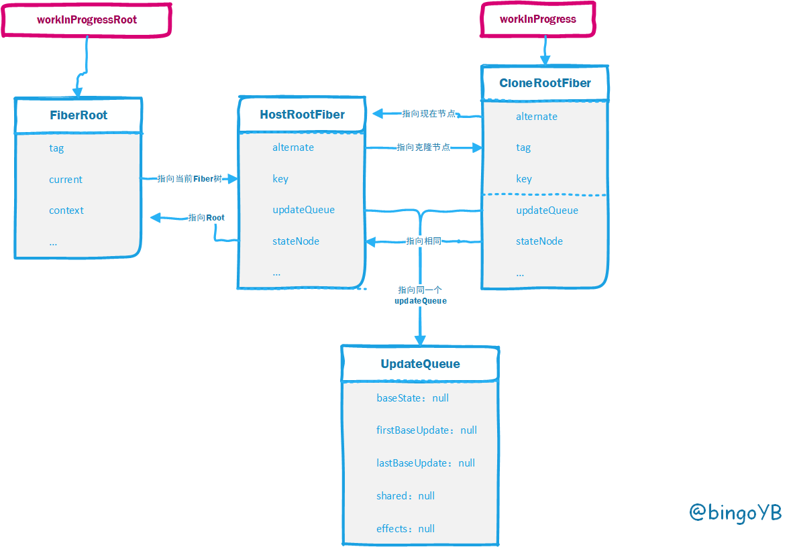

# 源码分析（3）

## scheduleUpdateOnFiber

在前面流程中 render 后会执行 **updateContainer**，最后调用 **scheduleUpdateOnFiber**

执行调度工作在fiber ， 调度模块

- 逻辑：

  1 更新触发点fiber的lanes, 对应所有父节点fiber 的childLanes, 

  2 在fiberRoot 上增加lans 和eventTime, 

  3 当在render时，直接合并 

  4 逻辑分支， 当更新为同步，非同步更新，

- 且非render,commit 阶段，直接performSyncWorkOnRoot ，同步，其他情况， flushSyncCallbackQueue

- 异步更新时 ensureRootIsScheduled

```js

export function scheduleUpdateOnFiber(
  fiber: Fiber,
  lane: Lane,
  eventTime: number, //触发更新的时间
) {
  // update 中数量控制
  // 检查最大update的数量是否超过了最大值
  checkForNestedUpdates();
  // 找到 rootFiber 并遍历更新子节点的 lane
  const root = markUpdateLaneFromFiberToRoot(fiber, lane);
  if (root === null) {// root 不存在时， 开发报错  fiberRoot 
    warnAboutUpdateOnUnmountedFiberInDEV(fiber);
    return null;
  }

  // Mark that the root has a pending update.
  markRootUpdated(root, lane, eventTime);

  // 如果当前是workInProget
  // 已经在进行调度
  if (root === workInProgressRoot) { // 存在数据的时候
    // 在渲染过程中收到一个更新，标识有个交叉更新工作在root上，除非·推迟渲染阶段更新下个批处理·标志为false 
    // 在这种情况下，由于向后兼容的原因，我们不会将渲染阶段更新视为交错处理。 
    if ( 
      deferRenderPhaseUpdateToNextBatch ||
      (executionContext & RenderContext) === NoContext
    ) {
       // 在commit 的阶段吗？
      // 在render 阶段， 或者 deferRenderPhaseUpdateToNextBatch
      // 当前的环境
      // 没有在 非（commit  render） 或在 commit , 才需要进行调度？ 16.6
      // 对lanes 进行合并
      workInProgressRootUpdatedLanes = mergeLanes(
        workInProgressRootUpdatedLanes,
        lane,
      );
      // 优先级合并
    }
    if (workInProgressRootExitStatus === RootSuspendedWithDelay) {
       // 推测时suspend
      //  标识root为暂停
      markRootSuspended(root, workInProgressRootRenderLanes);
    }
  }

  // 获取当前环境的优先级
  const priorityLevel = getCurrentPriorityLevel();

  // executionContext  执行环境  同步更新时
 // 同步更新的时候
  if (lane === SyncLane) {
    // 非批量更新 ，且 未进行render 或commit
    if (
      // Check if we're inside unbatchedUpdates
      (executionContext & LegacyUnbatchedContext) !== NoContext &&
      // Check if we're not already rendering
      (executionContext & (RenderContext | CommitContext)) === NoContext
    ) {
       // 非同步更新， 且在非render commit 阶段
      // 处于非LegacyUnbatchedContext 批量， 且不处于render和commit
      // Register pending interactions on the root to avoid losing traced interaction data.
       // 第一次不执行
      schedulePendingInteractions(root, lane);

      // 执行同步的更新
      performSyncWorkOnRoot(root);
    } else { // 其他情况
        
      ensureRootIsScheduled(root, eventTime);
      // 注册或更新pendingInteractions——update的集合
      schedulePendingInteractions(root, lane);
      // 没有上下文的情况
      if (executionContext === NoContext) {
           // 立即更新同步队列
          // 马上清空同步任务，除非我们已经进入batch。
        // 故意将其放在scheduleUpdateOnFiber而不是scheduleCallbackForFiber中，以保留安排回调的功能无需立即清空。
        // 我们仅针对用户发起的操作更新，以保留旧版模式的历史行为。
        resetRenderTimer();
        // 同步的更新
        flushSyncCallbackQueue();
      }
    }
  } else {
     // 异步的更新的时候
    // Schedule a discrete update but only if it's not Sync.
    if (
      (executionContext & DiscreteEventContext) !== NoContext && // 执行上下文为离散事件
      //  优先级为UserBlockingSchedulerPriority 或ImmediateSchedulerPriority
      (priorityLevel === UserBlockingSchedulerPriority ||
        priorityLevel === ImmediateSchedulerPriority)
    ) {
      // This is the result of a discrete event. Track the lowest priority
      // discrete update per root so we can flush them early, if needed.
      if (rootsWithPendingDiscreteUpdates === null) {
        rootsWithPendingDiscreteUpdates = new Set([root]);
        // 在rootsWithPendingDiscreteUpdates 添加root , 暂不理解
      } else {
        rootsWithPendingDiscreteUpdates.add(root);
      }
    }
    // Schedule other updates after in case the callback is sync.
    ensureRootIsScheduled(root, eventTime);
    schedulePendingInteractions(root, lane);
  }

  mostRecentlyUpdatedRoot = root;
}
```

这个方法分支很多，很复杂，因为首次执行肯定是同步任务，所以先分析同步任务执行，所以抛开其他暂时不想关的，简化一下

```js
export function scheduleUpdateOnFiber(
  fiber: Fiber,
  lane: Lane,
  eventTime: number, //触发更新的时间
) {
  // update 中数量控制
  // 检查最大update的数量是否超过了最大值
  checkForNestedUpdates();
  // 实现警告， render 中调用setState
  warnAboutRenderPhaseUpdatesInDEV(fiber);

  // 找到 rootFiber 并遍历更新子节点的 lane
  const root = markUpdateLaneFromFiberToRoot(fiber, lane);

  // Mark that the root has a pending update. 打标记
  markRootUpdated(root, lane, eventTime);
  // 获取当前环境的优先级
  const priorityLevel = getCurrentPriorityLevel();
  
  // 第一次不执行
  schedulePendingInteractions(root, lane);
  // 传入FiberRoot对象, 执行同步更新
  performSyncWorkOnRoot(root);
   
  mostRecentlyUpdatedRoot = root;
 }
```

其主要核心就是执行performSyncWorkOnRoot

## performSyncWorkOnRoot


```js
function performSyncWorkOnRoot(root) {
  // 初次渲染不进入
  flushPassiveEffects();
  let lanes;
  let exitStatus;
  // 初次渲染不进入， workInProgressRoot  为null 
   // 已经进入workInProgressRoot有值， 且， 过期
  if (
    root === workInProgressRoot &&
    includesSomeLane(root.expiredLanes, workInProgressRootRenderLanes)
  ) {
    // There's a partial tree, and at least one of its lanes has expired. Finish
    // rendering it before rendering the rest of the expired work.
    // 这是一颗不完整的树，并且最少其中一条lane已经过期，完成渲染
 	// 在渲染其余过期工作之前，请完成渲染
    lanes = workInProgressRootRenderLanes;
    exitStatus = renderRootSync(root, lanes);
    if (
      includesSomeLane(
        workInProgressRootIncludedLanes,
        workInProgressRootUpdatedLanes,
      )
    ) {
      // 渲染包括在渲染阶段更新的lanes。
      // 例如，当取消隐藏隐藏的树时，我们包括所有lanes
      // 隐藏树时先前已跳过的内容。该lanes是我们开始渲染时使用的lanes的超集。
      // 请注意，这仅在部分树被渲染时发生
      // 同时。如果整个树是同步呈现的，则没有交错事件。
      lanes = getNextLanes(root, lanes);
      // 处理更新
      exitStatus = renderRootSync(root, lanes);
    }
  } else {
    // 首次渲染进入这里
    lanes = getNextLanes(root, NoLanes); // 当前lanes
    exitStatus = renderRootSync(root, lanes); // lanes ： 1
  }

  // root.tag 为有其他模式, 有错误的情况
  if (root.tag !== LegacyRoot && exitStatus === RootErrored) {
    executionContext |= RetryAfterError;
    // If an error occurred during hydration,
    // discard server response and fall back to client side render.
    if (root.hydrate) {
      root.hydrate = false;
      clearContainer(root.containerInfo);
    }

    // If something threw an error, try rendering one more time. We'll render
    // synchronously to block concurrent data mutations, and we'll includes
    // all pending updates are included. If it still fails after the second
    // attempt, we'll give up and commit the resulting tree.
    lanes = getLanesToRetrySynchronouslyOnError(root);
    if (lanes !== NoLanes) {
      exitStatus = renderRootSync(root, lanes);
    }
  }
    // 致命错误
  if (exitStatus === RootFatalErrored) {
    const fatalError = workInProgressRootFatalError;
    prepareFreshStack(root, NoLanes);
    markRootSuspended(root, lanes);
    ensureRootIsScheduled(root, now());
    throw fatalError;
  }

  // We now have a consistent 一致的 tree. Because this is a sync render, we
  // will commit it even if something suspended.
  // 标示完成的工作
  const finishedWork: Fiber = (root.current.alternate: any);
  root.finishedWork = finishedWork;
  root.finishedLanes = lanes;
  // 开始commitRoot的部分
  commitRoot(root);

  // Before exiting, make sure there's a callback scheduled for the next
  // pending level.
  
  ensureRootIsScheduled(root, now());

  return null;
}
```


这个方法主要工作分为两部分

- render    renderRootSync

  render阶段以一个Fibe节点为单元，采用递归的方式，实现workInprogress的树的快速搭建。 搭建过程中还会实现如下功能：

  - 更新 state和props
  - 调用部分生命周期钩子函数
  - 新旧children diff，标记更新
  - 找出DOM需要更新的属性，并标记更新
  - 预生成新增的Dom对象，先挂载在fiber上

- commit    commitRoot

  这个阶段相比第一个阶段，任务很轻，就是遍历effect list， 执行side effects，将数据的更新体现到UI上，这个阶段会涉及UI的更新。

  - 执行所有的effect list 节点的生命周期函数getSnapshotBeforeUpdate
  - 执行所有的effect list 节点Dom 更新，ref 删除，以及componentWillUnmount 生命周期函数的调用
  - 将workFinished tree设置为current tree
  - 执行所有的effect list 节点的mutation 生命周期函数，ref的添加

## renderRootSync

```js
// 逻辑： 开始同步更新
function renderRootSync(root: FiberRoot, lanes: Lanes) {
  const prevExecutionContext = executionContext;
  // 切换到渲染执行上下文
  executionContext |= RenderContext;
  // 初始上下文为8 ，非批量同步： 8 ， RenderContext： render: 16
  // hooks相关 
  const prevDispatcher = pushDispatcher();

  // If the root or lanes have changed, throw out the existing stack
  // and prepare a fresh one. Otherwise we'll continue where we left off.
  // 如果root或者lanes改变，丢弃现有的栈
  // 而且准备一个新的，否则我们会继续离开我们所在的地方
  if (workInProgressRoot !== root || workInProgressRootRenderLanes !== lanes) {
     // 准备一个当前fiber节点的克隆 放在全局变量workInProgress中
    prepareFreshStack(root, lanes);
    // 不处理
    startWorkOnPendingInteractions(root, lanes);
  }

  const prevInteractions = pushInteractions(root);

  if (__DEV__) {
    if (enableDebugTracing) {
      logRenderStarted(lanes);
    }
  }

  if (enableSchedulingProfiler) {
    markRenderStarted(lanes);
  }

  do {
    try {
      // 进行更新， workLook 
      // 循环处理workInProgress
      workLoopSync();
      break;
    } catch (thrownValue) {
      handleError(root, thrownValue);
    }
  } while (true);
  resetContextDependencies();
  if (enableSchedulerTracing) {
    popInteractions(((prevInteractions: any): Set<Interaction>));
  }
   // render 过程结束，还原上下文
  executionContext = prevExecutionContext;
  popDispatcher(prevDispatcher);

  if (workInProgress !== null) {
    // This is a sync render, so we should have finished the whole tree.
    invariant(
      false,
      'Cannot commit an incomplete root. This error is likely caused by a ' +
      'bug in React. Please file an issue.',
    );
  }

  if (enableSchedulingProfiler) {
    markRenderStopped();
  }

  // Set this to null to indicate there's no in-progress render.
  // 清空  workInProgressRoot   设置为null,比送啊hi没有正在进行的render
  workInProgressRoot = null;  // 清空  workInProgressRoot 
  workInProgressRootRenderLanes = NoLanes;

  return workInProgressRootExitStatus;  // 返回执行结果
}
```

在这里，prepareFreshStack会为接下来工作做一些准备，这个方法会准备一个当前fiber节点的克隆 放在全局变量workInProgress中，执行完后的结构如下



```js
function prepareFreshStack(root: FiberRoot, lanes: Lanes) {
  root.finishedWork = null;
  root.finishedLanes = NoLanes;

  const timeoutHandle = root.timeoutHandle;  // 获取当前的timeoutHander
  if (timeoutHandle !== noTimeout) {
    // The root previous suspended and scheduled a timeout to commit a fallback
    // state. Now that we have additional work, cancel the timeout.
    root.timeoutHandle = noTimeout; // 清空
    // $FlowFixMe Complains noTimeout is not a TimeoutID, despite the check above
    cancelTimeout(timeoutHandle);  // 取消
  }
  // 如果workInProgress 不为空， 有任务没有完成
  if (workInProgress !== null) {
    let interruptedWork = workInProgress.return;
    while (interruptedWork !== null) {
      unwindInterruptedWork(interruptedWork);
      interruptedWork = interruptedWork.return;
    }
  }
  workInProgressRoot = root; // 赋值 fiberRoot
  workInProgress = createWorkInProgress(root.current, null);
   // 我们使用双重缓冲池技术
      // 因为我们知道我们最多需要一颗数的两个版本
      // 我们将"其他"未使用的资源合并这样我们就可以自由的重用其他节点
      // 这个懒创建是为了避免分配额外的一些永不更新的对象
      // 如果需要，这也允许我们回收额外的内存
  // 更新lanes    
  workInProgressRootRenderLanes = subtreeRenderLanes = workInProgressRootIncludedLanes = lanes;
  workInProgressRootExitStatus = RootIncomplete;
  workInProgressRootFatalError = null;
  workInProgressRootSkippedLanes = NoLanes;
  workInProgressRootUpdatedLanes = NoLanes;
  workInProgressRootPingedLanes = NoLanes;

  if (enableSchedulerTracing) {
    spawnedWorkDuringRender = null;
  }

  if (__DEV__) {
    ReactStrictModeWarnings.discardPendingWarnings();
  }
}
```


## workLoopSync

```js
function workLoopSync() {
  // Already timed out, so perform work without checking if we need to yield.
  while (workInProgress !== null) {
    performUnitOfWork(workInProgress);
  }
}
```

## performUnitOfWork 

performUnitOfWork 方法调用 beginWork 找到处理对应组件的 hander 方法
采用深度优先（先序优先）的方式遍历创建子节点，遇到同级节点下有多个子节点时，会为每
个节点创建一个 sibling 属性指向下一个同级节点
当遍历到某个分支的最深节点（没有子节点）时调用 completeUnitOfWork 方法
completeUnitOfWork 方法判断如果有 sibling（下一个同级节点）则返回给 performUnitOfWork
没有 sibling 则寻找 return（父节点），如果父节点有 sibling 继续返回给 performUnitOfWork
从而实现深度优先遍历去创建整个 Fiber tree

```js
function performUnitOfWork(unitOfWork: Fiber): void {
  // The current, flushed, state of this fiber is the alternate. Ideally
  // nothing should rely on this, but relying on it here means that we don't
  // need an additional field on the work in progress.
  // 创建一个备份的fiber
    // 最理想的情况是不依靠current fiber, 创建一个workInProgress
    // 创建一个workInProgress的alternate属性指向current fiber
  const current = unitOfWork.alternate;
  setCurrentDebugFiberInDEV(unitOfWork);

  let next;
   // ProfileMode 模式问题， ProfileMode 模式下
  if (enableProfilerTimer && (unitOfWork.mode & ProfileMode) !== NoMode) {
    startProfilerTimer(unitOfWork);
    next = beginWork(current, unitOfWork, subtreeRenderLanes);
    stopProfilerTimerIfRunningAndRecordDelta(unitOfWork, true);
  } else {
    // 正常的流程
    // 已经使用的fiber, 更新的fiber,  subtreeRenderLanes: 当前的的lane
    next = beginWork(current, unitOfWork, subtreeRenderLanes);
  }

  resetCurrentDebugFiberInDEV();
  unitOfWork.memoizedProps = unitOfWork.pendingProps;
  if (next === null) {
    // If this doesn't spawn new work, complete the current work.
    completeUnitOfWork(unitOfWork);
    // 定义completeUnitOfWork 
  /*
  功能:
  ① 协助 workLoopSync 深度优先（先序优先）遍历生成 Fiber 树，原理：
  当 workLoopSync 遍历到当前分支最深的节点时向上寻找父节点并判断父节点有无同级节点，
  有的话将 workInProgress 其设置为此节点，从而实现寻找下一个节点
  ② 判断 effectTag 创建副作用链表（由子结点往上指向父节点）
  ③ 调用 completeWork 方法
  
  疑问 ① 为什要创建副作用链表 答：当项目复杂时 Fiber 树拥有很多很多的节点，
  如果通过遍历每个节点的方式去运行当前节点副作用的话时间复杂度会上升，
  所以在构建树的时候通过判断每个节点的 effectTag
  将副作用关联起来生成一个链表可以有效的降低时间复杂度提升程序效率。
  
  疑问 ② 为什么子结点的副作用要排在父节点的副作用之前：
  答：副作用处理 componentDidMount 生命周期和 ref，
  根据生命周期 componentDidMount 的定义可以知道只有当子组件渲染完成时，
  父组件的 componentDidMount 生命周期才会被调用，所以子组件的 componentDidMount
   生命周期运行一定在父组件之前，因此副作用链表排序是符合功能实现的，ref 方法也同理，
   父组件通过子组件的 ref 获取实例时应该确保子组件的 ref 已经被处理。
  */
  } else {
    workInProgress = next;
  }

  ReactCurrentOwner.current = null;
}
```


