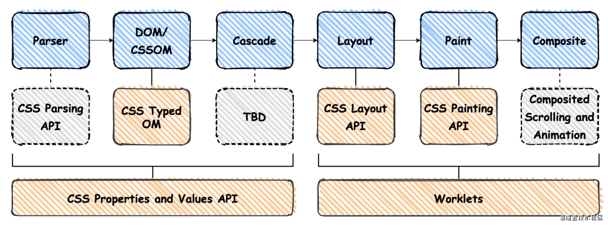
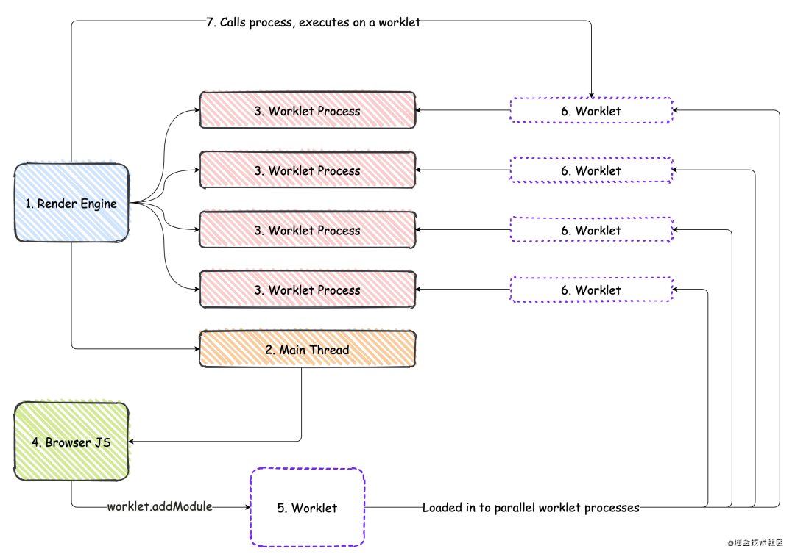
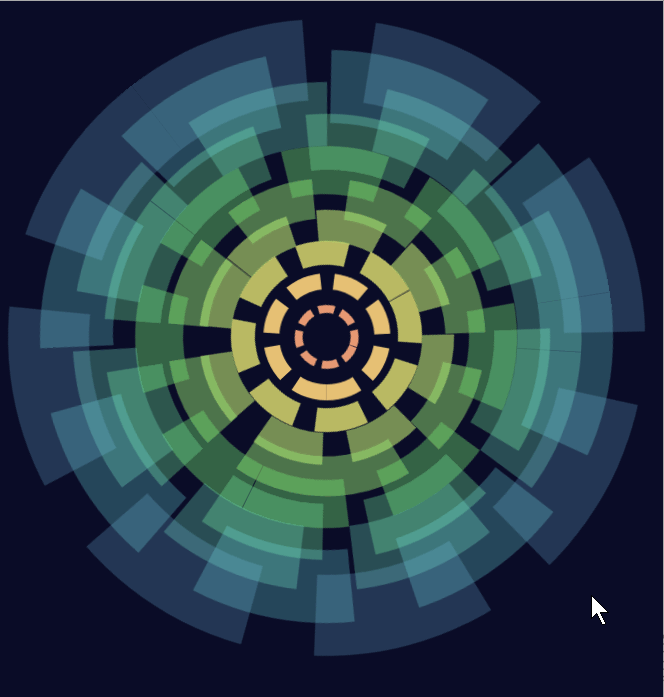

# 现代化css

## CSS 的发展历史

#### CSS的版本

CSS1.0版本发布于1996年12月，只提供了一些基本的样式属性
CSS2.0版本发布于1998年5月，提供了更为强大的功能
CSS2.1版本发布于2007年，并于2011年6月正式成为标准，也是目前使用最广泛的版本
CSS3.0版本于1999年开始制定，2001年完成工作草案，是目前CSS最新的版本。它的最大特点是将CSS3的规范内容分成一系列独立的模块，更有利于浏览器厂商的逐步支持

#### css发展

- 手写**源生 CSS**

  > 行内样式、内嵌样式、link引入外部样式、@import导入样式

- 使用**预处理器 Sass/Less**，与**后处理器PostCSS**

  > 由于源生的 css 不支持变量，不支持嵌套等功能，催生出了sass、less、stylus这种预处理器，为css扩充语法功能。
  >
  > 而后处理器则可以接受css文件，实现校验css语法，进行自动加前缀等功能。

- 现代化 [PostCss](https://www.postcss.com.cn/) 前后通吃

  > 随着技术的发展，CSS也增加了less/sass的一些功能，比如嵌套、变量等一些功能；PostCss强大的插件机制，使得其可以处理css全部处理过程，且能够使用最新的css语法功能；
  >
  > 其中能让你使用最新的 CSS 语法插件就是：
  >
  >  [postcss-preset-env](https://preset-env.cssdb.org/)：PostCSS Preset Env使您可以将现代CSS转换为大多数浏览器可以理解的内容，并使用cssdb根据目标浏览器或运行时环境确定所需的polyfill。

postcss常用插件地址：https://www.postcss.parts/

## CSS-IN-JS

CSS in JS是一种解决css问题想法的集合，而不是一个指定的库。从CSS in JS的字面意思可以看出，它是将css样式写在JavaScript文件中，而不需要独立出.css、.less之类的文件。将css放在js中使我们更方便的使用js的变量、模块化、tree-shaking。还解决了css中的一些问题，譬如：更方便解决基于状态的样式，更容易追溯依赖关系，生成唯一的选择器来锁定作用域。尽管CSS in JS不是一个很新的技术，但国内的普及程度并不高。由于Vue和Angular都有属于他们自己的一套定义样式的方案，React本身也没有管用户怎样定义组件的样式，所以CSS in JS在React社区的热度比较高。

目前为止实现CSS in JS的第三方库有很多:点击这里。像JSS、styled-components等。

关于css-in-js的多种库，你可以在[cssinjs-playground](https://www.cssinjsplayground.com/)快速体验不同css-in-js的实现的网站。

## JS IN CSS

在上面我们提到`CSS in JS`就是把CSS写在JavaScript中，那么`JS in CSS`我们可以推断出就是可以在CSS中使用JavaScript脚本，如下所示。可以在CSS中编写Paint API的功能。还可以访问：ctx，geom。甚至我们还可以编写自己的css自定义属性等。这些功能的实现都基于[CSS Houdini](https://developer.mozilla.org/zh-CN/docs/Web/Houdini)。

```css
.el {  
  --color: cyan;  
  --multiplier: 0.24;  
  --pad: 30;  
  --slant: 20;  
  --background-canvas: (ctx, geom) => {  
    let multiplier = var(--multiplier);  
    let c = `var(--color)`;  
    let pad = var(--pad);  
    let slant = var(--slant);  
  
    ctx.moveTo(0, 0);  
    ctx.lineTo(pad + (geom.width - slant - pad) * multiplier, 0);  
    ctx.lineTo(pad + (geom.width - slant - pad) * multiplier + slant, geom.height);  
    ctx.lineTo(0, geom.height);  
    ctx.fillStyle = c;  
    ctx.fill();  
  };  
  background: paint(background-canvas);  
  transition: --multiplier .4s;  
}  
.el:hover {  
  --multiplier: 1;  
}  
```

## Houdini 解决了什么问题

开发者们能操作的就是通过JS去控制`DOM`与`CSSOM`来影响页面的变化，但是对于接下來的`Layout`、`Paint`与`Composite`就几乎没有控制权了。为了解决上述问题，为了让CSS的魔力不在受到浏览器的限制，`Houdini`就此诞生。

## Houdini API

Houdini是一组底层API，它公开了CSS引擎的各个部分，如下图所示展示了每个环节对应的新API（灰色部分各大浏览器还未实现），从而使开发人员能够通过加入浏览器渲染引擎的样式和布局过程来扩展CSS。Houdini是一群来自Mozilla，Apple，Opera，Microsoft，HP，Intel和Google的工程师组成的工作小组设计而成的。它们使开发者可以直接访问CSS对象模型（CSSOM），使开发人员可以编写浏览器可以解析为CSS的代码，从而创建新的CSS功能，而无需等待它们在浏览器中本地实现。



### Properties & Values API

尽管当前已经有了CSS变量，可以让开发者控制属性值，但是无法约束类型或者更严格的定义，CSS Houdini新的API，我们可以扩展css的变量，我们可以定义CSS变量的`类型`,`初始值`,`继承`。它是css变量更强大灵活。

CSS变量现状：

```css
.dom {  
  --my-color: green;  
  --my-color: url('not-a-color'); // 它并不知道当前的变量类型  
  color: var(--my-color);  
}  
  
```

Houdini提供了两种自定义属性的注册方式，分别是在js和css中。

```js
CSS.registerProperty({  
  name: '--my-prop', // String 自定义属性名  
  syntax: '<color>', // String 如何去解析当前的属性，即属性类型，默认 *  
  inherits: false, // Boolean 如果是true，子节点将会继承  
  initialValue: '#c0ffee', // String 属性点初始值  
});  
```


我们还可以在css中注册，也可以达到上面的效果

```css
@property --my-prop {  
  syntax: '<color>';  
  inherits: false;  
  initial-value: #c0ffee;  
}  
```

这个API中最令人振奋人心的功能是自定义属性上添加动画，像这样：`transition: --multiplier 0.4s;`，这个功能我们在前面介绍什么是js in css那个demo[8]用使用过。我们还可以使用`+`使`syntax`属性支持一个或多个类型，也可以使用`|`来分割。更多`syntax`属性值：

| 属性值                | 描述                                        |
| --------------------- | ------------------------------------------- |
| `<length>`            | 长度值                                      |
| `<number>`            | 数字                                        |
| `<percentage>`        | 百分比                                      |
| `<length-percentage>` | 长度或百分比,calc将长度和百分比组成的表达式 |
| `<color>`             | 颜色                                        |
| `<image>`             | 图像                                        |
| `<url>`               | 网址                                        |
| `<integer>`           | 整数                                        |
| `<angle>`             | 角度                                        |
| `<time>`              | 时间                                        |
| `<resolution>`        | 分辨率                                      |
| `<transform-list>`    | 转换函数                                    |
| `<custom-ident>`      | ident                                       |

### Worklets

[`Worklets`](https://developer.mozilla.org/en-US/docs/Web/API/Worklet)是渲染引擎的扩展，从概念上来讲它类似于Web Workers，但有几个重要的区别：

1. 设计为并行，每个`Worklets`必须始终有两个或更多的实例，它们中的任何一个都可以在被调用时运行
2. 作用域较小，限制不能访问全局作用域的API（Worklet的函数除外）
3. 渲染引擎会在需要的时候调用他们，而不是我们手动调用

Worklet是一个JavaScript模块，通过调用worklet的addModule方法（它是个Promise）来添加。比如`registerLayout`, `registerPaint`, `registerAnimator` 我们都需要放在Worklet中

```js
//加载单个  
await demoWorklet.addModule('path/to/script.js');  
  
// 一次性加载多个worklet  
Promise.all([  
  demoWorklet1.addModule('script1.js'),  
  demoWorklet2.addModule('script2.js'),  
]).then(results => {});  
  
registerDemoWorklet('name', class {  
  
  // 每个Worklet可以定义要使用的不同函数  
  // 他们将由渲染引擎在需要时调用  
  process(arg) {  
    return !arg;  
  }  
});  
  
```


**Worklets的生命周期**



Worklets lifecycle

1. Worklet的生命周期从渲染引擎内开始
2. 对于JavaScript，渲染引擎启动JavaScript主线程
3. 然后他将启动多个worklet进程，并且可以运行。这些进程理想情况下是独立于主线程的线程，这样就不会阻塞主线程(但它们也不需要阻塞)
4. 然后在主线程中加载我们浏览器的JavaScript
5. 该JavaScript调用 `worklet.addModule` 并异步加载一个worklet
6. 加载后，将worklet加载到两个或多个可用的worklet流程中
7. 当需要时，渲染引擎将通过从加载的Worklet中调用适当的处理函数来执行Worklet。该调用可以针对任何并行的Worklet实例。

### Typed OM

`Typed OM`是对现有的`CSSOM`的扩展，并实现 `Parsing API` 和 `Properties & Values API`相关的特性。它将css值转化为有意义类型的JavaScript的对象，而不是像现在的字符串。如果我们尝试将字符串类型的值转化为有意义的类型并返回可能会有很大的性能开销，因此这个API可以让我们更高效的使用CSS的值。

现在读取CSS值增加了新的基类`CSSStyleValue`，他有许多的子类可以更加精准的描述css值的类型：

| 子类              | 描述                                                         |
| ----------------- | ------------------------------------------------------------ |
| CSSKeywordValue   | CSS关键字和其他标识符（如inherit或grid）                     |
| CSSPositionValue  | 位置信息 (x,y)                                               |
| CSSImageValue     | 表示图像的值属性的对象                                       |
| CSSUnitValue      | 表示为具有单个单位的单个值（例如50px），也可以表示为没有单位的单个值或百分比 |
| CSSMathValue      | 比较复杂的数值，比如有calc，min和max。这包括子类 `CSSMathSum`, `CSSMathProduct`, `CSSMathMin`, `CSSMathMax`, `CSSMathNegate` 和 `CSSMathInvert` |
| CSSTransformValue | 由`CSS transforms`组成的`CSSTransformComponent`列表，其中包括`CSSTranslate`, `CSSRotate`, `CSSScale`, `CSSSkew`, `CSSSkewX`, `CSSSkewY`, `CSSPerspective` 和 `CSSMatrixComponent` |

使用`Typed OM`主要有两种方法：

1. 通过`attributeStyleMap`设置和获取有类型的行间样式
2. 通过`computedStyleMap`获取元素完整的`Typed OM`样式

**使用attributeStyleMap设置并获取**

```js
myElement.attributeStyleMap.set('font-size', CSS.em(2));  
myElement.attributeStyleMap.get('font-size'); // CSSUnitValue { value: 2, unit: 'em' }  
  
myElement.attributeStyleMap.set('opacity', CSS.number(.5));  
myElement.attributeStyleMap.get('opacity'); // CSSUnitValue { value: 0.5, unit: 'number' };  
```


**使用computedStyleMap**

```css
.foo {  
  transform: translateX(1em) rotate(50deg) skewX(10deg);  
  vertical-align: baseline;  
  width: calc(100% - 3em);  
}  
```


```js
const cs = document.querySelector('.foo').computedStyleMap();  
  
cs.get('vertical-align');  
// CSSKeywordValue {  
//  value: 'baseline',  
// }  
  
cs.get('width');  
// CSSMathSum {  
//   operator: 'sum',  
//   length: 2,  
//   values: CSSNumericArray {  
//     0: CSSUnitValue { value: -90, unit: 'px' },  
//     1: CSSUnitValue { value: 100, unit: 'percent' },  
//   },  
// }  
  
cs.get('transform');  
// CSSTransformValue {  
//   is2d: true,  
//   length: 3,  
//   0: CSSTranslate {  
//     is2d: true,  
//     x: CSSUnitValue { value: 20, unit: 'px' },  
//     y: CSSUnitValue { value: 0, unit: 'px' },  
//     z: CSSUnitValue { value: 0, unit: 'px' },  
//   },  
//   1: CSSRotate {...},  
//   2: CSSSkewX {...},  
// }  
```


### Layout API

开发者可以通过这个API实现自己的布局算法，我们可以像原生css一样使用我们自定义的布局（像`display:flex`, `display:table`）。在 Masonry layout library[11] 上我们可以看到开发者们是有多想实现各种各样的复杂布局，其中一些布局光靠 CSS 是不行的。虽然这些布局会让人耳目一新印象深刻，但是它们的页面性能往往都很差，在一些低端设备上性能问题犹为明显。

CSS Layout API 暴露了一个`registerLayout`方法给开发者，接收一个布局名（layout name）作为后面在 CSS中使用的属性值，还有一个包含有这个布局逻辑的JavaScript类。

```css
my-div {  
  display: layout(my-layout);  
}  
```


```js
// layout-worklet.js  
registerLayout('my-layout', class {  
  static get inputProperties() { return ['--foo']; }  
    
  static get childrenInputProperties() { return ['--bar']; }  
    
  async intrinsicSizes(children, edges, styleMap) {}  
  
  async layout(children, edges, constraints, styleMap) {}  
});  
```

```js
await CSS.layoutWorklet.addModule('layout-worklet.js');  
```

目前浏览器大部分还不支持

### Painting API

我们可以在CSS `background-image`中使用它，我们可以使用Canvas 2d上下文，根据元素的大小控制图像，还可以使用自定义属性。

```js
await CSS.paintWorklet.addModule('paint-worklet.js');  
```

```js
registerPaint('sample-paint', class {  
  static get inputProperties() { return ['--foo']; }  
  
  static get inputArguments() { return ['<color>']; }  
  
  static get contextOptions() { return {alpha: true}; }  
  
  paint(ctx, size, props, args) { }  
});  
```


### Animation API

这个API让我们可以控制基于用户输入的关键帧动画，并且以非阻塞的方式。还能更改一个 DOM 元素的属性，不过是不会引起渲染引擎重新计算布局或者样式的属性，比如 transform、opacity 或者滚动条位置（scroll offset）。`Animation API`的使用方式与 `Paint API` 和 `Layout API`略有不同我们还需要通过`new`一个`WorkletAnimation`来注册worklet。

```js
// animation-worklet.js  
registerAnimator('sample-animator', class {  
  constructor(options) {  
  }  
  animate(currentTime, effect) {  
    effect.localTime = currentTime;  
  }  
});  
```


```js
await CSS.animationWorklet.addModule('animation-worklet.js');  
  
// 需要添加动画的元素  
const elem = document.querySelector('#my-elem');  
const scrollSource = document.scrollingElement;  
const timeRange = 1000;  
const scrollTimeline = new ScrollTimeline({  
  scrollSource,  
  timeRange,  
});  
  
const effectKeyframes = new KeyframeEffect(  
  elem,  
  // 动画需要绑定的关键帧  
  [  
    {transform: 'scale(1)'},  
    {transform: 'scale(.25)'},  
    {transform: 'scale(1)'}  
  ],  
  {  
    duration: timeRange,  
  },  
);  
new WorkletAnimation(  
  'sample-animator',  
  effectKeyframes,  
  scrollTimeline,  
  {},  
).play();  
```


关于此API的更多内容：(https://github.com/w3c/css-houdini-drafts/tree/main/css-animation-worklet-1)

### Parser API

允许开发者自由扩展 CSS 词法分析器。

解析规则：

```js
const background = window.cssParse.rule("background: green");  
console.log(background.styleMap.get("background").value) // "green"  
  
const styles = window.cssParse.ruleSet(".foo { background: green; margin: 5px; }");  
console.log(styles.length) // 5  
console.log(styles[0].styleMap.get("margin-top").value) // 5  
console.log(styles[0].styleMap.get("margin-top").type) // "px"  
```


解析CSS：

```js
const style = fetch("style.css")  
        .then(response => CSS.parseStylesheet(response.body));  
style.then(console.log);  
```


### Font Metrics API

它将提供一些方法来测量在屏幕上呈现的文本元素的尺寸，将允许开发者控制文本元素在屏幕上呈现的方式。使用当前功能很难或无法测量这些值，因此该API将使开发者可以更轻松地创建与文本和字体相关的CSS特性。例如：

- flex布局: `align-items` baseline特性。需要知道每一个flex盒子中第一个元素的基线位置。
- 首字母: 需要知道每个字母的基线高度和字母最大的高度，以及换行内容的基线长度。
- 单个字形的前进和后退。
- 换行: 需要访问字体数据，文本的所有样式输入以及布局信息（可用的段落长度等）。
- 元素中的每一个`line boxes`都需要一个基线。(`line boxes`代表包含众多`inline boxes`的这行)

## CSS Doodle

[css-doodle](https://github.com/css-doodle/css-doodle) 是一个用来绘制css图案的WEB组件， 其基于Shadow DOM V1和Custom Elements V1来构建的。该组件可以帮助轻松的使用Custom Elements、Shadow DOM和css Grid创建任何你想要的图案（css 图案）。创建出来的图案你可以运用于Web页面中。


该组件通过其内部的规则（纯css）会生成一系列的div构建的css Grid。你可以使用css轻松地操作这些div（单元格，每个div就是一个单元格）来生成图案。生成的图案既可以是静态的，也可以是动态的。而其限制仅限于css本身的限制。

示例

```HTML
<!DOCTYPE html>
<html lang="en">
  <head>
    <meta charset="UTF-8" />
    <meta name="viewport" content="width=device-width, initial-scale=1.0" />
    <title>Document</title>
    <style>
      :root {
        --customUnit: 100%;
        --initBg: () => {
          console.log(123);
        }
      }
      @supports (display: flex) {
        html,
        body {
          display: flex;
          align-items: center;
          justify-self: center;
        }
      }
      html,
      body {
        width: var(--customUnit);
        height: var(--customUnit);
        background: #0a0c27;
      }
    </style>
    <script src="https://unpkg.com/css-doodle@0.8.5/css-doodle.min.js"></script>
  </head>
  <body>
    <css-doodle>
      :doodle{ @grid : 1 x 10 / 61.8vmax; } @place-cell:center; @size:calc(
      @index() * 10%); border-width:calc(@index() * 1vmin); border-style:
      dashed; border-radius: 50%; border-color: hsla(calc(20*@index()), 70%,
      68%, calc(3/@index()*.8)); --d:@rand(20s,40s); --rf:@rand(360deg);
      --rt:calc(var(--rf) + @pick(1turn,-1turn)); animation: spin var(--d)
      cubic-bezier(.13,.69,1,-0.01) infinite; @keyframes spin { from{ transform:
      rotate(var(--rf)); } to{ transform: rotate(var(--rt)); } }
    </css-doodle>
  </body>
</html>
```




## ACSS--原子css

 在Atomic CSS系统中，您可以知道类名的作用； 但是类名称(至少不是样式表中使用的名称)与内容类型之间没有关系。

### Tailwind CSS

> 原子css的实现的一个极致

[Tailwind CSS](https://www.tailwindcss.cn/) 是一个功能类优先的 CSS 框架，它集成了诸如 `flex`, `pt-4`, `text-center` 和 `rotate-90` 这样的的类，它们能直接在脚本标记语言中组合起来，构建出任何设计。

下面可以参考一下书写风格

```html
<div class="flex-none w-48 relative">     
       
</div>
```

> 个人觉得有种写行内样式的感觉

### BEM与原子CSS **(**BEM versus Atomic CSS**)**

当您有大量的开发人员并行构建CSS和HTML模块时，BEM效果最佳。 它有助于防止由规模较大的团队造成的那种错误和错误。 它的扩展性很好，部分原因是命名约定具有描述性和可预测性。 BEM不仅*适用*于大型团队。 但是对于大型团队来说*确实很好* 。

如果有一个小型团队或一个工程师负责开发一组CSS规则，并且由一个较大的团队构建完整HTML组件，则原子CSS会更好地工作。 使用Atomic CSS，开发人员只需查看样式指南(或CSS源代码)，即可确定特定模块所需的类名称集。