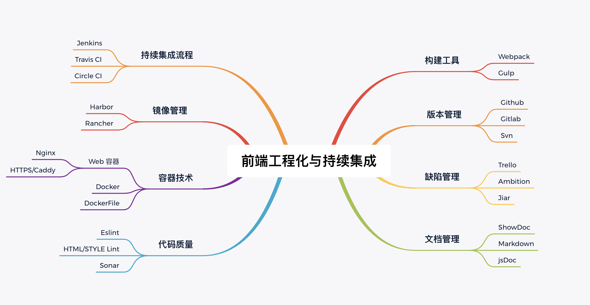
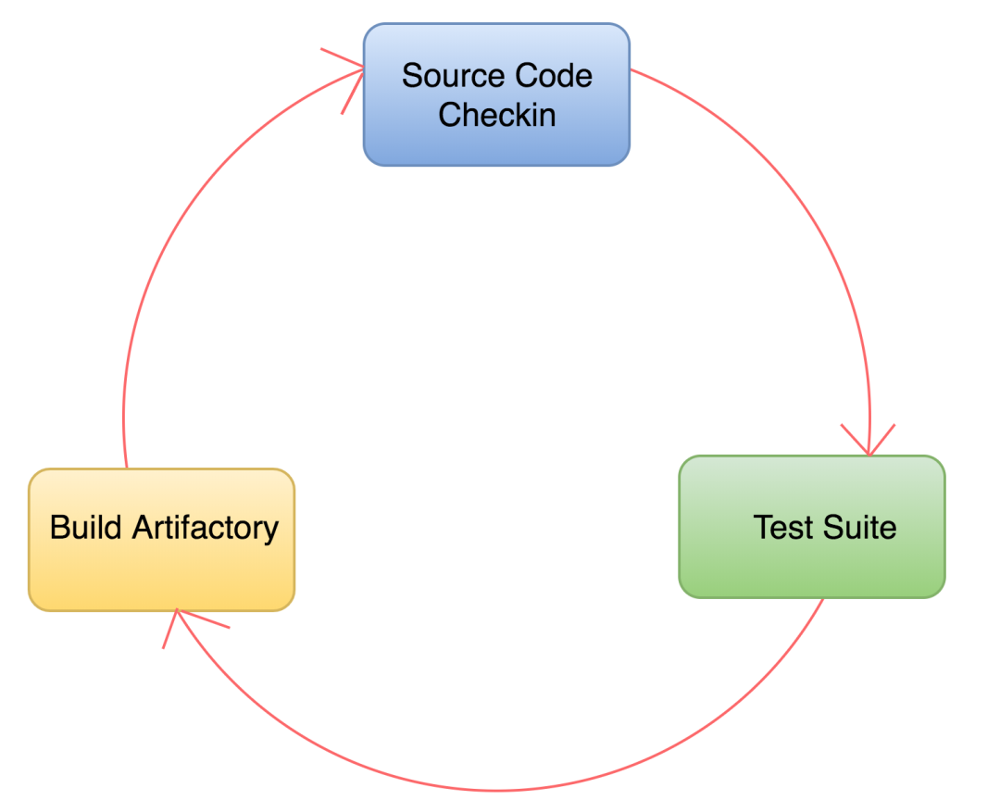
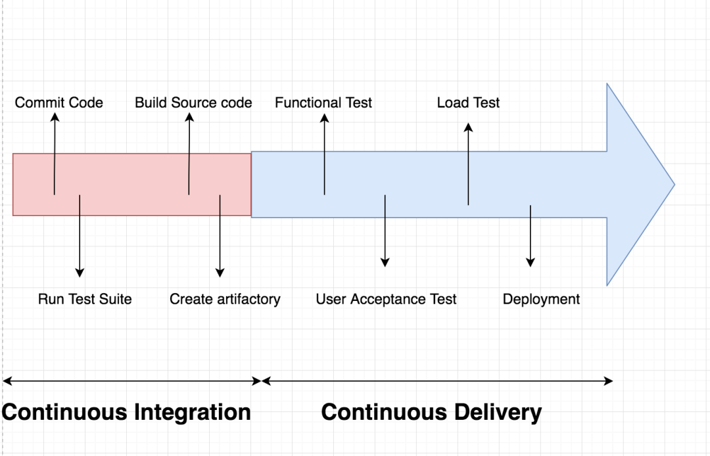
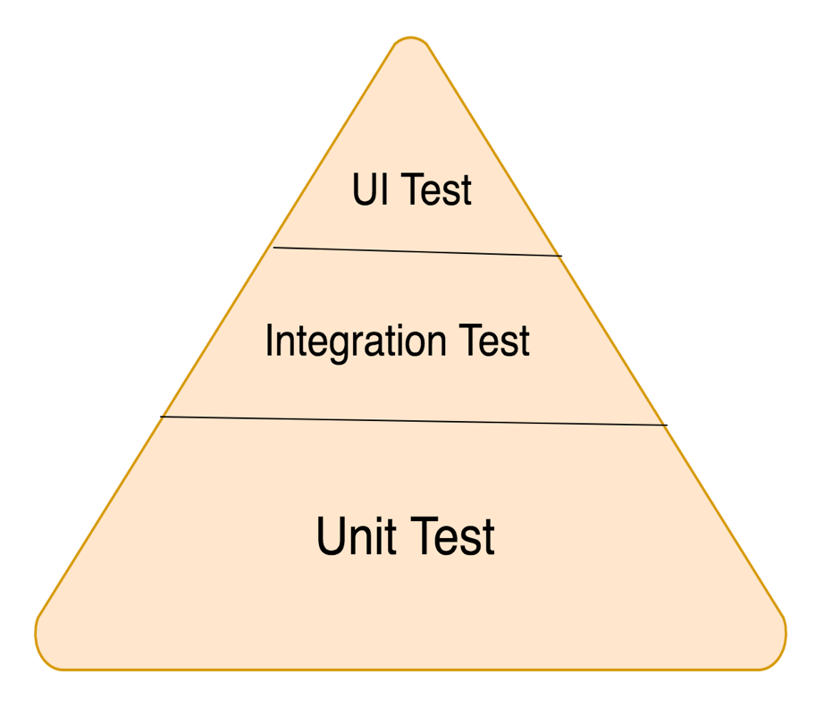
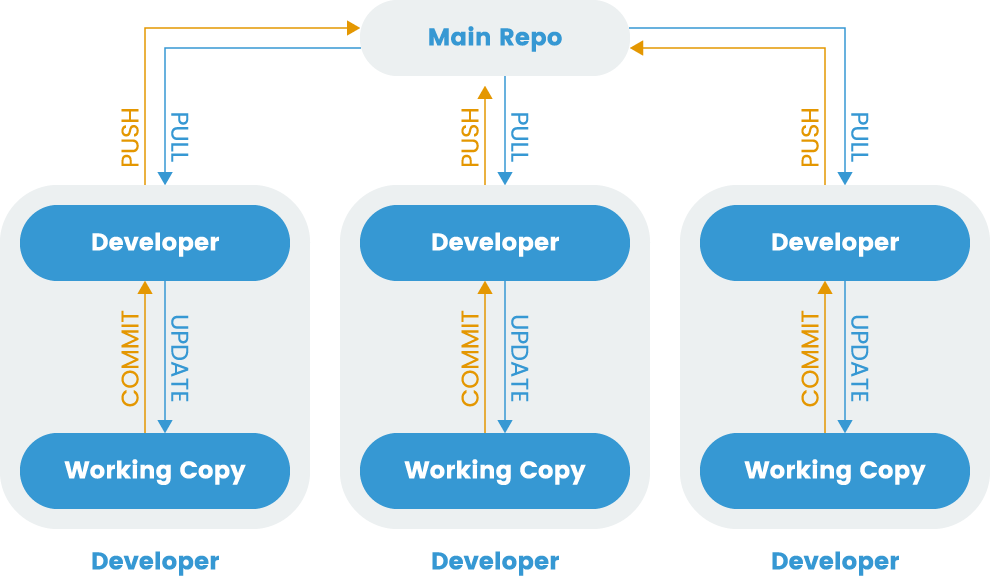
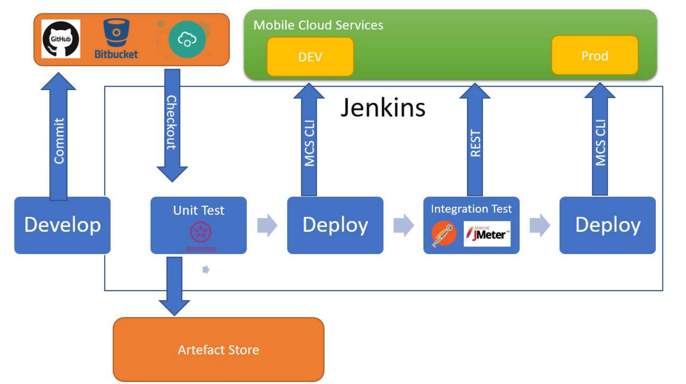

# CI & CD 

本文摘录于：[CI & CD | 前端工程化初探 | TRAVIS (hondrytravis.github.io)](https://hondrytravis.github.io/docs/ci_with_cd/ci_cd)

## 思维导图

## CI/CD

### 持续集成/CI

**持续集成(CI):** 是一个让开发人员将工作集成到共享分支中的过程，从而增强了协作开发。频繁的集成有助于解决隔离，减少每次提交的大小，以降低合并冲突的可能性。

### 持续交付和持续部署

**持续交付和持续部署(CD):** 是在构建持续集成的基础之上的两种策略。

**持续交付:** 是持续集成的扩展，它将构建从集成测试套件部署到预生产环境。这使得它可以直接在类生产环境中评估每个构建，因此开发人员可以在无需增加任何工作量的情况下，验证bug修复或者测试新特性。一旦部署到staging环境中，就可能需要进行额外的手动和自动测试。

**持续部署:** 持续部署则更进一步。一旦构建在staging环境中通过了自动测试，持续部署系统将会自动将它部署到生产服务器上。换言之，每个通过测试的构建都是实时的，可供用户及早反馈。这使得团队可以不断发布新特性和修复bug，并以其测试流程提供的保证为后盾。

### 优点

持续集成、交付和部署对软件开发过程有显著的改进。主要优势：

1.**快速反馈回路**

对于一个快速的开发周期，快速反馈回路显得尤为重要。为了能够实时接收反馈，软件必须迅速触达终端用户。而CI / CD可以通过简化更新生产部署来提供实现此目标的平台。通过要求每个更改都经过严格的测试，CI可以帮助降低每个构建的相关风险并因此使得团队可以便捷地向用户发布有价值的特性。

2.**增加可见度**

CI/CD通常是指将IT流程的各个步骤按序列组成一条流水线，且该流水线对整个IT团队（包括开发、测试、运维等团队）均可见。因此，每个团队成员可以跟踪系统中的构建状态并且可以确定任何导致测试失败的构建。团队成员通过深入了解代码库的当前状态，可以更轻松地规划最佳行动方案。这样的可见度为这一问题提供了一个明确的答案——“我提交的更改是否破坏了构建？”

3.**简化故障排除**

尽管CI的目标是集成并测试每个发生在代码库中的更改，但是更安全的方式是每次提交都是小型的并尽早将它们合并到共享代码存储库中。如此，当找到bug时，确定和问题相关的更改会更加容易。毕竟，根据问题的严重程度，团队可以选择回滚或编写并提交修复，从而减少生产中解决问题的时间。

4.**软件质量更高**

自动化构建和部署流程不仅缩短了开发周期，而且帮助团队开发出品质更好的软件。因为每个更改都会经过充分的测试并且至少会部署在一个预生产环境中，因此团队可以毫无顾虑地将更改部署到生产中。不过，只有当代码库的所有级别，从单元测试到更复杂的系统测试，都有良好的测试覆盖率时，才能实现这一点。

5.**集成问题更少**

因为自动化测试套件在每次提交时自动生成的构建上运行，所以可以尽早检测并修复集成问题。这使开发人员能够及早了解当前正在进行的工作是否可能影响其代码。它会在一开始就测试由不同贡献者编写的代码是否兼容，而不是在之后可能出现其他问题的时候才开始测试。

6.**有更多的时间专注于开发**

CI/CD系统依赖自动化来生产构建并且通过流水线来迁移新的更改。由于不需要手动干预，因此构建和测试不再占用开发团队大块的时间。进而开发人员可以心无旁骛地对代码库进行有效的更改，因为如果构建过程中出现任何问题，自动化系统会通知他们

### 持续集成和交付的最佳实践

1.**对CI / CD流水线负责**

开发者直到更改被部署到预生产环境中，才无需对其提交的代码负责。这意味着开发者必须确保他们的代码集成正确并且随时可以部署。如果提交的更改违反了这些要求，则开发人员有责任快速提交修复以避免影响其他人的工作。构建失败应该暂停流水线并阻止不参与修复故障的提交，这使得快速解决构建问题变得至关重要。

2.**确保部署一致**

部署过程不需要手动操作，反而流水线需要自动部署流程以确保一致性和可重复性。这减少了将破坏性构建推向生产的可能性，并有助于避免出现一些难以重现的、未经测试的配置。

3.**将代码库提交到版本控制**

将每次更改提交到版本控制是十分重要的。这会帮助团队审核所有提交的变更并且让团队可以简单地还原出现问题的提交。同时，也可以保持配置、脚本、数据库和文档的完整性。如果没有版本控制，特别是当多人使用同一个代码库时，会非常容易丢失配置和代码更改或对其处理不当。

4。**提交小的、渐进的更改**

开发人员一定要牢记：更改必须是小的。因为等待引入更大批量的更改会延迟测试反馈，会更难以确定问题的根本原因。

5.**良好的测试覆盖率**

由于CI / CD的目的是减少手动测试，因此整个代码库应该有一个良好的自动化测试覆盖率，以确保软件按预期运行。此外，还应该定期清理冗余或过时的测试以避免影响流水线。

测试套件中不同类型测试的比例应和“测试金字塔”模型相似。大多数测试应该是单元测试，因为它们拥有基本功能的同时还可以快速执行。此外，还要有较少数量的集成测试，以确保组件可以一起成功运行。最后，应在测试周期结束时包含少量回归、UI、系统和端到端测试，以确保构建满足项目的所有行为要求。可以使用像JaCoCo这样的工具来确定测试套件涵盖了多少代码库。

## 自动构建概述

在软件开发过程中，构建流程会将开发⼈员⽣成的代码转换为可执⾏的可⽤软件。

- 对于Go或者C语⾔等编译语⾔，此阶段需要通过编译器运⾏源代码以⽣成独⽴的⼆进制⽂件。
- 对于JavaScript或PHP等解释性语⾔，没有编译的步骤，但是代码依旧需要在特定的时间内冻结、绑定依赖项、打包以便于分发。
- 这些过程通常称为“构建”或“发布”的⼯件。

虽然开发⼈员可以⼿动构建，但这样操作有诸多不利。

- ⾸先，从主动开发到创建构建的转变中引⼊了上下⽂转换，使得开发⼈员不得不停⽌⽣产效率更⾼的⼯作来专注于构建过程。
- 其次，每个开发⼈员都在制作⾃⼰的⼯件，这可能导致构建过程不⼀致。

为了解决这些顾虑，许多开发团队配置了⾃动构建流⽔线。这些系统监视源代码存储库，并在检测到更改时 ⾃动启动预配置的构建过程。这⼀配置⽆需牵涉过多的⼈⼒在其中并且确保了每个构建过程⼀致。

## 版本控制

大部分现代软件开发需要在共享的代码库中进行频繁协作。版本控制系统（VCS）用于帮助维护项目历史记录，并行处理离散特征，以及解决存在冲突的更改。VCS允许项目轻松采用更改并在出现问题时回滚。开发人员可以在本地计算机上处理项目，并使用VCS来管理不同的开发分支。

记录在VCS中的每个更改都称为提交。每个提交都对代码库的更改进行编目分类，元数据也包含在其中，例如关于查看提交历史记录或合并更新的描述。

## 流水线

