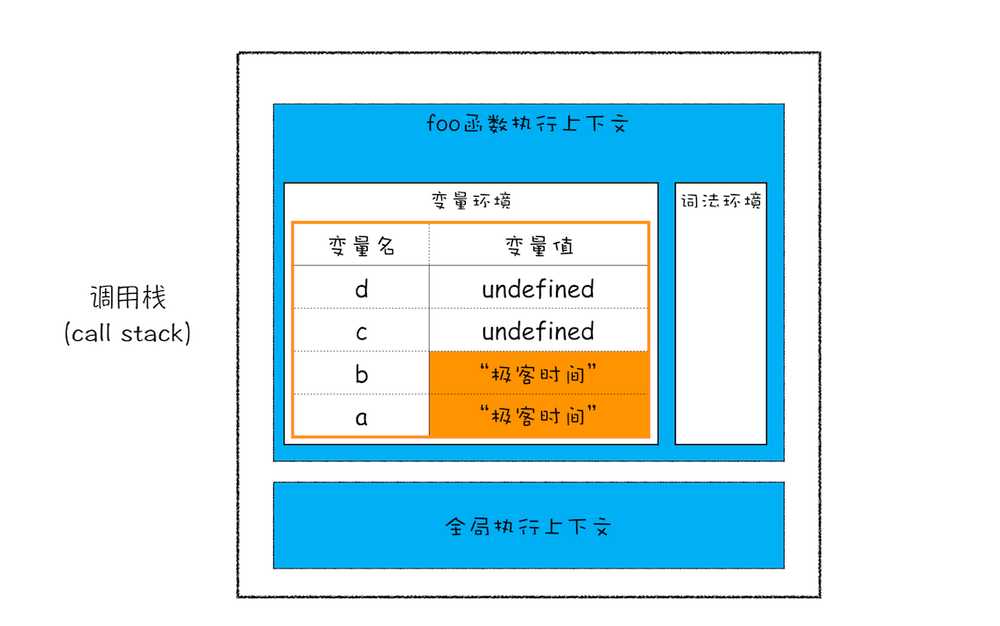
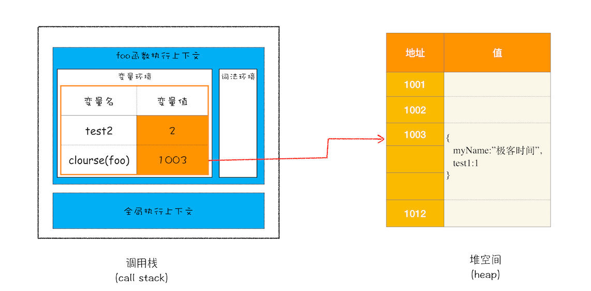

# Javascript 执行上下文

## 概念

执行上下文就是当前 JavaScript 代码被解析和执行时所在环境的抽象概念， JavaScript 中运行任何的代码都是在执行上下文中运行。

## 类型

执行上下文主要分三种类型，如下所示

**1.全局执行上下文**

-   js代码开始运行后。首先进入全局执行上下文环境中，不在任何函数中的js代码都会在全局执行上下文
-   一个js程序中只存在一个全局执行上下文。创建时会压人栈底，只有当程序结束时才会弹出
-   全局执行上下文会做两件事。1.创建全局对象，2.将this指向这个全局对象
-   浏览器环境中全局对象是window, 在node环境中全局对象是global

**2.函数执行上下文**

-   函数每次调用都会产生一个新的函数执行上下文，每个函数都拥有自己的执行上下文，但是只有调用的时候才会被创建
-   函数执行上下文的生命周期分为两个阶段。创建和执行

**3.Eval执行上下文**

-   eval函数执行时产生的执行上下文。

## 调用栈|执行上下文栈

执行上下文栈|调用栈是一个后进先出的数据结构, 具体执行流程如下

-   首先创建全局执行上下文， 压入栈底
-   每当调用一个函数时，创建函数的函数执行上下文。并且压入栈顶
-   当函数执行完成后，会从执行上下文栈中弹出，js引擎继续执行栈顶的函数。

> **注意：**
> 在ES3中使用的是AO/VO来管理作用域的
> 在ES5中使用lexical environment 来管理静态作用域,而不再是ES3中的AO/VO
> 下面先介绍ES3的AO/VO


## ES3的AO/VO
JS 执行环境（EC），变量对象（VO），活动对象（AO），作用域链（scope chain）

VO(G)（全局变量对象）是用来存储执行上下文中可以被访问的变量。
AO  (活动对象)   私有变量对象
	 叫法不同，实质相同。
	 而在【函数执行上下文EC中】，因为【私有变量对象 AO】 是要保存当前私有上下文中所有的变量，**而一个函数内的变量包括：形参变量、局部变量、自身函数对象引用变量、arguments、this。** 为了保存这些变量，所以特意创建了一个对象，称它为【活动对象(私有变量对象)AO】，函数内所需的变量就都保存在 【私有变量对象AO】 中，所以在函数执行上下文中，变量对象 VO 的具体表现也就是【私有变量对象AO】。


**对于VAR创建的变量来说**

在【全局执行上下文EC(G)中】，全局变量对象 VO(G) 的具体表现就是【全局对象(GO)】，因为【所有VAR创建的全局变量】其实都会映射给【全局对象(GO)】一份，作为其属性，【而变量对象 VO 的作用是要保存当前上下文中的所有变量，所以此时的变量对象 VO 实际上是指向的全局对象】。【所以会映射给window一份】，则全局对象(GO)就是 window，

>**【这里理解为VAR创建对象时VO(G)和全局对象有映射关系】**

**对于LET/CONST创建的变量来说**

只是在VO(G)中创建了一个变量，并不会映射给全局一份。

**带VAR和不带VAR的区别**

1.  带VAR相当于给VO(G)添加一个变量，同时映射给window【GO】设置一个属性
2.  不带VAR相当于只给window【GO】设置一个属性


## GO(Global Object)全局对象

-   与VO和AO没有什么太大关系，是预定义的对象，【浏览器把所有后期需要供JS调取使用的属性和方法(内置)，都放置在了GO当中。并且在全局当中创建一个叫做window的变量指向它。】通过使用全局对象，可以访问所有其他所有预定义的对象、函数和属性。【`window.xxx`什么都是去GO当中找。】

> **VO(G)【全局变量对象】和GO【全局对象】的关系：**
> 两者之间存在映射机制【创建一个全局变量，也相当于给GO设置一个属性】
>     **这个关系是单向的！！！！不存在给GO设置一个属性会映射给Vo(G)的情况**，
>     **【不包括基于let/const创建的变量】**
>  直接输出window.a也不会报错，因为是成员访问，若不存在a，则会返回undefined


## ES6的 词法环境和变量环境



在ES6中提出词法环境和变量环境两个概念。主要是执行上下文创建过程。

### 上下文的创建

在任意的 JavaScript 代码被执行前，执行上下文处于创建阶段。在创建阶段中总共发生了三件事情：

1.  确定 **this** 的值，也被称为 **This Binding**。
2.  **LexicalEnvironment（词法环境）** 组件被创建。
3.  **VariableEnvironment（变量环境）** 组件被创建。
```
ExecutionContext = { 
	ThisBinding = <this value>, 
	LexicalEnvironment = { ... }, 
	VariableEnvironment = { ... }, 
}
```

#### **This Binding:**
在全局执行上下文中，`this` 的值指向全局对象，在浏览器中，`this` 的值指向 window 对象。

在函数执行上下文中，`this` 的值取决于函数的调用方式。如果它被一个对象引用调用，那么 `this` 的值被设置为该对象，否则 `this` 的值被设置为全局对象或 `undefined`（严格模式下）。例如：

```javascript
let person = {  
  name: 'peter',  
  birthYear: 1994,  
  calcAge: function() {  
    console.log(2018 - this.birthYear);  
  }  
}

person.calcAge();   
// 'this' 指向 'person', 因为 'calcAge' 是被 'person' 对象引用调用的。

let calculateAge = person.calcAge;  
calculateAge();  
// 'this' 指向全局 window 对象,因为没有给出任何对象引用
```


### 词法环境(LexicalEnvironment)

[官方 ES6](https://link.juejin.cn/?target=http%3A%2F%2Fecma-international.org%2Fecma-262%2F6.0%2F "http://ecma-international.org/ecma-262/6.0/") 文档将词法环境定义为：

> 词法环境是一种规范类型，基于 ECMAScript 代码的词法嵌套结构来定义标识符与特定变量和函数的关联关系。词法环境由环境记录（environment record）和可能为空引用（null）的外部词法环境组成。

在词法环境中有两个组成部分：

-   环境记录(EnvironmentRecord)： 储存变量和函数声明的实际位置
-   对外部环境的引用(Outer)：当前可以访问的外部词法环境

词法环境分为两种类型：

-   **全局环境**： 全局执行上下文，他没有外部环境的引用，拥有一个全局对象window和关联的方法和属性eg: Math,String,Date等。还有用户定义的全局变量，并将this指向全局对象。
-   **函数环境**： 用户在函数定义的变量将储存在环境记录中。对外部环境的引用可以是全局环境，也可以是包含内部函数的外部函数环境。环境记录中包含。用户声明的变量。函数。还有arguments对象。

### 变量环境（VariableEnvironment）

变量环境也是一个词法环境。他具有词法环境中所有的属性 在ES6中，LexicalEnvironment和VariableEnvironment 的区别在于前者用于存储函数声明和变量let 和 const 绑定，而后者仅用于存储变量 var 绑定。

用以下代码举例：

```text
let a = 20;  
const b = 30;  
var c;

function add(e, f) {  
 var g = 20;  
 function c(){}
 return e + f + g;  
}

c = add(20, 30);
```

在预编译阶段。生成的词法环境和变量环境如下

```ts
GlobalExectionContent = {
  LexicalEnvironment: {
    EnvironmentRecord: {
      Type: "Object",
      a: <uninitialied>,
      b: <uninitialied>,
      add: <func>
      // 剩余标识符
    },
    Outer: null,
  },

  VariableEnvironment: {
    EnvironmentRecord: {
      Type: "Object",
      c: undefined,
      // 剩余标识符
    },
    Outer: null,
  }
}

FunctionExectionContent = {
  LexicalEnvironment: {
    EnvironmentRecord: {
      Type: "Declarative",
      arguments: {
        0: 20,
        1: 30,
        length: 2,
      },
      e: 20,
      f: 30,
      c: reference to function c(){}
      // 剩余标识符
    },
    Outer: GlobalLexicalEnvironment,
  },
  VariableEnvironment: {
    EnvironmentRecord: {
      Type: "Declarative",
      g: undefined,
      // 剩余标识符
    },
    Outer: GlobalLexicalEnvironment,
  }
}
```

我们发现使用let和const声明的变量在词法环境创建时是未赋值初始值。而使用var定义的变量在变量环境创建时赋值为undefined。这也就是为什么const、let声明的变量在声明钱调用会报错，而var声明的变量不会。

这就是面试中容易提到的【变量提升】【暂时性死区】

### 闭包

现在你知道了作用域内的原始类型数据都被存储到栈空间，引用类型会被存储到堆空间，基于这两个点的认知，我们再深入一步，探讨下闭包的内存模型。

```js
function foo() {
    var myName = "极客时间"
    let test1 = 1
    const test2 = 2
    var innerBar = { 
        setName:function(newName){
            myName = newName
        },
        getName:function(){
            console.log(test1)
            return myName
        }
    }
    return innerBar
}
var bar = foo()
bar.setName("极客邦")
bar.getName()
console.log(bar.getName())
```

当执行这段代码的时候，你应该有过这样的分析：由于变量 myName、test1、test2 都是原始类型数据，所以在执行 foo 函数的时候，它们会被压入到调用栈中；当 foo 函数执行结束之后，调用栈中 foo 函数的执行上下文会被销毁，其内部变量 myName、test1、test2 也应该一同被销毁。

当 foo 函数的执行上下文销毁时，由于 foo 函数产生了闭包，所以变量 myName 和 test1 并没有被销毁，而是保存在内存中，那么应该如何解释这个现象呢？

要解释这个现象，我们就得站在内存模型的角度来分析这段代码的执行流程。

1、当 JavaScript 引擎执行到 foo 函数时，首先会编译，并创建一个空执行上下文。

2、在编译过程中，遇到内部函数 setName ，JavaScript 引擎还要对内部函数做一次快速的词法扫描，发现该内部函数引用了 foo 函数中的 myName 变量，由于是内部函数引用了外部函数的变量，所以 JavaScript 引擎判断这是一个闭包，于是在堆空间创建换一个 ”closure(foo)“ 的对象（这是一个内部对象，JavaScript 是无法访问的），用来保存 myName 变量。

3、接着继续扫描到 getName 方法时，发现该函数内部还引用变量 test1，于是 JavaScript 引擎又将 test1 添加到 ”closure(foo)“ 对象中。这时候堆中的 ”closure(foo)“ 对象中就包含了 myName 和 test1 两个变量了。

4、由于 test2 并没有被内部函数引用，所以 test2 依然保存着调用栈中。

通过上面的分析，我们可以画出执行到 foo 函数中的 ”return innerBar“ 语句时的调用栈状态，如下图所示：



闭包的产生过程

从上图你可以清晰地看出，当执行到 foo 函数时，闭包就产生了；当 foo 函数执行结束之后，返回的 getName 和 setName 方法都引用 ”clourse(foo)“ 对象，所以即使 foo 函数退出了， ”clourse(foo)“ 依然被其内部的 getName 和 setName 方法引用。所以在下次调用 bar.setName 或者 bar.getName 时，创建的执行上下文中就包含了 "clourse(foo)"。 　　 　　总的来说，产生闭包的核心有两步：第一步是需要预扫描内部函数；第二部是把内部函数引用的外部变量保存到堆中。

参考

[前端系统化学习【JS篇】:（九）EC、STACK、VO、AO、GO浏览器底层运行机制 (juejin.cn)](https://juejin.cn/post/6874592740395450376 "https://juejin.cn/post/6874592740395450376")
[图解JS词法环境(Lexical environment)_public class Me的博客-CSDN博客](https://blog.csdn.net/dhassa/article/details/70945016?utm_medium=distribute.pc_relevant.none-task-blog-2~default~BlogCommendFromMachineLearnPai2~default-2.control&depth_1-utm_source=distribute.pc_relevant.none-task-blog-2~default~BlogCommendFromMachineLearnPai2~default-2.control "https://blog.csdn.net/dhassa/article/details/70945016?utm_medium=distribute.pc_relevant.none-task-blog-2~default~BlogCommendFromMachineLearnPai2~default-2.control&depth_1-utm_source=distribute.pc_relevant.none-task-blog-2~default~BlogCommendFromMachineLearnPai2~default-2.control")
[V8 工作原理：12 | 栈空间和堆空间：数据是如何存储的？ - bala001 - 博客园 (cnblogs.com)](https://www.cnblogs.com/bala/p/12188441.html)