# V8底层——数组

> V8编译调试相关的可以参考这边文章：[V8系统解读(一): V8 在 Chrome 中的位置&编译调试V8 - 云+社区 - 腾讯云 (tencent.com)](https://cloud.tencent.com/developer/article/1800229)

## 什么是数组

> 数组是在内存中连续存储的具有相同类型的一组数据的集合

**相同类型、连续内存**。


## JavaScript 中的数组

JavaScript 中的数组有很多特性：存放不同类型元素、数组长度可变等等

从V8源码上看数组的实现：

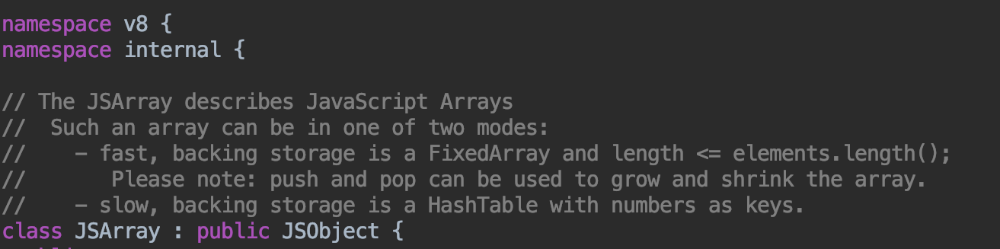

首先，我们可以看到JSArray 是继承自JSObject，也就是说，数组是一个特殊的对象。

那这就好解释为什么JS的数组可以存放不同的数据类型，它是个对象嘛，内部也是key-value的存储形式。

我们使用这段代码来验证一下：

```js
const arr = [1,'hello',function(){console.log(123)}]
```

通过jsvu来调试这段代码


从注释上可以看出：在`Js`中数组存在两种形式，一种是与`C/C++`等相同的在连续内存中存放数据的快数组，另一种是`HashTable`结构的慢数组，是一种典型的字典形式。

> HashTable，维基百科中解释的很好：
>
> 散列表（Hash table，也叫哈希表），是根据键（Key）而直接访问在内存存储位置的数据结构。也就是说，它通过计算一个关于键值的函数，将所需查询的数据映射到表中一个位置来访问记录，这加快了查找速度。这个映射函数称做散列函数，存放记录的数组称做散列表。


### 快数组

快数组是一种线性的存储方式。新创建的空数组，默认的存储方式是快数组，快数组长度是可变的，可以根据元素的增加和删除来动态调整存储空间大小，内部是通过扩容和收缩机制实现，那来看下源码中是怎么扩容和收缩的。

源码中**扩容**的实现方法（C++）：

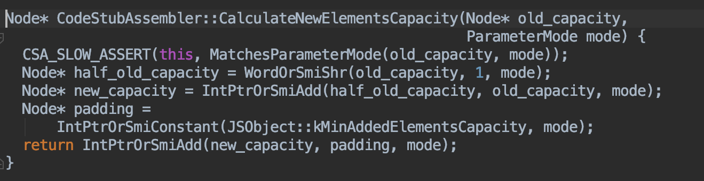

新容量的的计算方式：

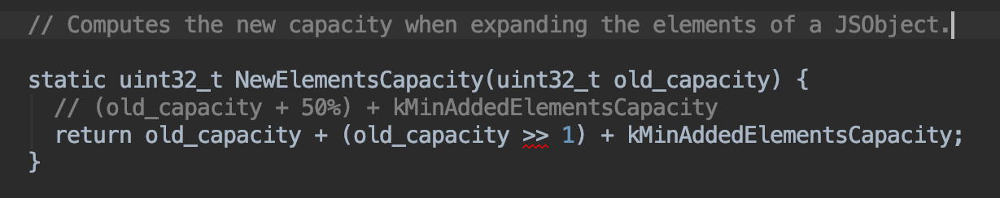

即：**new_capacity = old_capacity /2 + old_capacity + 16**

**扩容后的新容量 = 旧容量的1.5倍 + 16**

扩容后会将数组拷贝到新的内存空间中，源码：

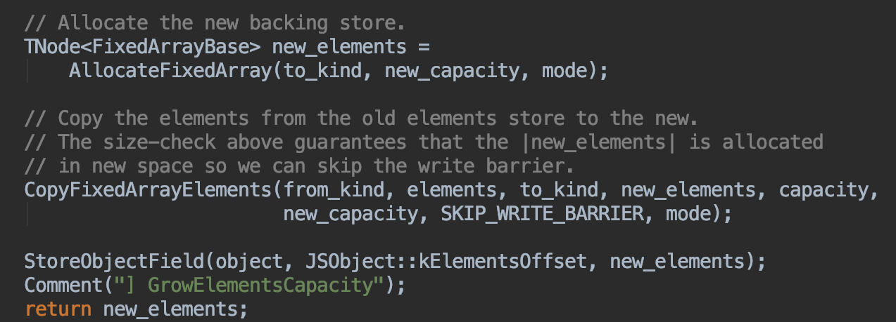


看完了扩容，再来看看当空间多余时如何收缩数组空间。

源码中**收缩**的实现方法（C++）:


可以看出收缩数组的判断是：
如果容量 >= length的2倍 + 16，则进行收缩容量调整，否则用holes对象（什么是holes对象？下面来解释）填充未被初始化的位置。

如果收缩，那收缩到多大呢？

看上面图中的这段代码：

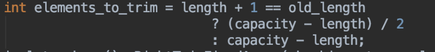

这个elements_to_trim就是需要收缩的大小，需要根据 length + 1 和 old_length 进行判断，是将空出的空间全部收缩掉还是只收缩二分之一。

解释完了扩容和减容，来看下刚刚提到的holes对象。

holes （空洞）对象指的是数组中分配了空间，但是没有存放元素的位置。对于holes，快数组中有个专门的模式，在 Fast Elements 模式中有一个扩展，是**Fast Holey Elements**模式。

Fast Holey Elements 模式适合于数组中的 holes （空洞）情况，即只有某些索引存有数据，而其他的索引都没有赋值的情况。

那什么时候会是Fast Holey Elements 模式呢？

当数组中有空洞，没有赋值的数组索引将会存储一个特殊的值，这样在访问这些位置时就可以得到 undefined。这种情况下就会是 Fast Holey Elements 模式。

Fast Holey Elements 模式与Fast Elements 模式一样，会动态分配连续的存储空间，分配空间的大小由最大的索引值决定。

新建数组时，如果没有设置容量，V8会默认使用 Fast Elements 模式实现。

如果要对数组设置容量，但并没有进行内部元素的初始化，例如let a = new Array(10);，这样的话数组内部就存在了空洞，就会以Fast Holey Elements 模式实现。

使用jsvu调用v8-debug版本的底层实现来验证一下：

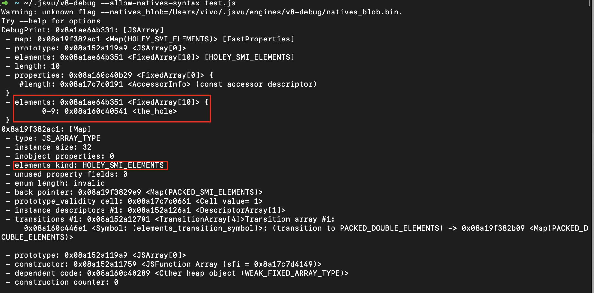

一目了然，**HOLEY_SMI_ELEMENTS** 就是Fast Holey Elements 模式 。

如果对数组进行了初始化，比如let a = new Array(1,2,3);，这种就不存在空洞，就是以Fast Elements 模式实现。

验证：

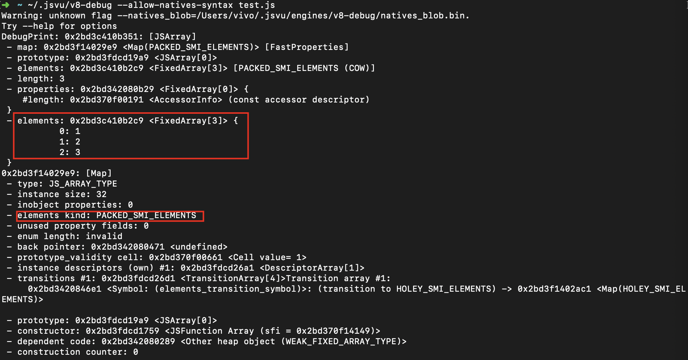

这个**PACKED_SMI_ELEMENTS**就是Fast Elements 模式。

快数组先到这，再来看下慢数组：

### 慢数组

慢数组是一种字典的内存形式。不用开辟大块连续的存储空间，节省了内存，但是由于需要维护这样一个 HashTable，其效率会比快数组低。

源码中 Dictionary 的结构

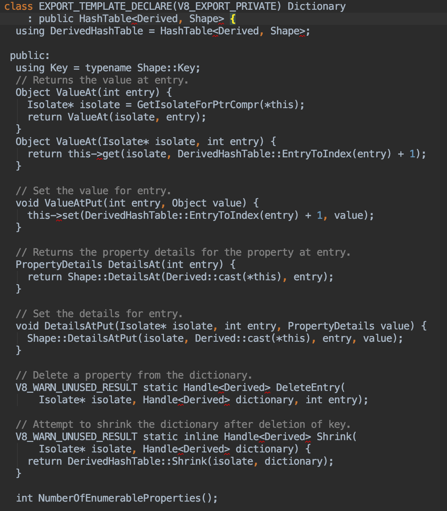

可以看到，内部是一个HashTable，然后定义了一些操作方法，和 Java 的 HashMap类似，没有什么特别之处。

了解了数组的两种实现方式，我们来总结下两者的区别。

### 快数组、慢数组的区别

1. **存储方式方面：**快数组内存中是连续的，慢数组在内存中是零散分配的。
2. **内存使用方面：**由于快数组内存是连续的，可能需要开辟一大块供其使用，其中还可能有很多空洞，是比较费内存的。慢数组不会有空洞的情况，且都是零散的内存，比较节省内存空间。
3. **遍历效率方面：**快数组由于是空间连续的，遍历速度很快，而慢数组每次都要寻找 key 的位置，遍历效率会差一些。

既然有快数组和慢数组，两者的也有各自的特点，每个数组的存储结构不会是一成不变的，会有具体情况下的快慢数组转换，下面来看一下什么情况下会发生转换。

### 快数组慢数组之间的转换

#### **1、快 -> 慢**

首先来看 V8 中判断快数组是否应该转为慢数组的源码：

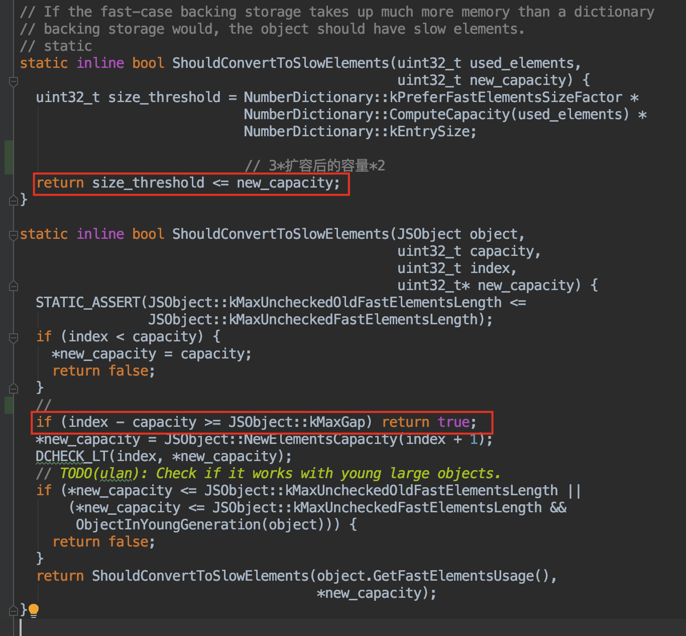

关键代码：

1. 新容量 >= 3 * 扩容后的容量 * 2 ，会转变为慢数组。
2. 当加入的 index- 当前capacity >= kMaxGap（1024） 时（也就是至少有了 1024 个空洞），会转变为慢数组。

我们主要来看下第二种关键代码的情况。

kMaxGap 是源码中的一个常量，值为1024。

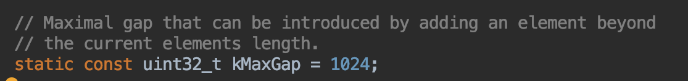

也就是说，当对数组赋值时使用远超当前数组的容量+ 1024时（这样出现了大于等于 1024 个空洞，这时候要对数组分配大量空间则将可能造成存储空间的浪费，为了空间的优化，会转化为慢数组。

代码实锤：

```
let a = [1, 2]
a[1030] = 1;
```


数组中只有三个元素，但是却在 1030 的位置存放了一个值，那么中间会有多于1024个空洞，这时就会变为慢数组。

来验证一下：

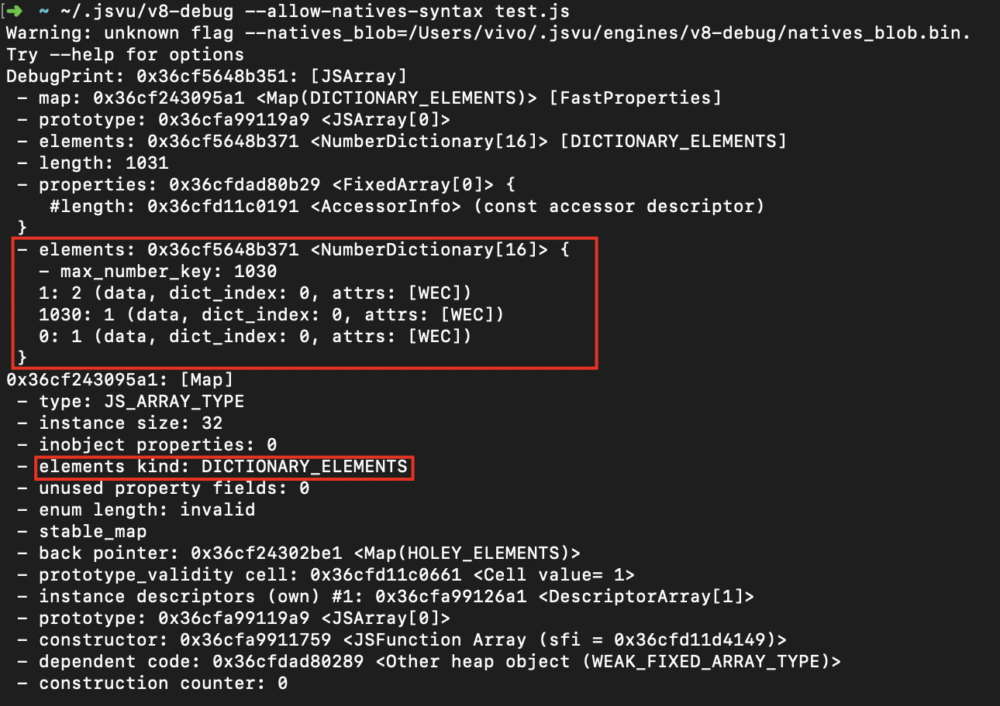

可以看到，此时的数组确实是字典类型了，成功！

好了，看完了快数组转慢数组，再反过来看下慢数组转换为快数组。

#### **2、慢 -> 快**

处于哈希表实现的数组，在每次空间增长时， V8 的启发式算法会检查其空间占用量， 若其空洞元素减少到一定程度，则会将其转化为快数组模式。

V8中是否应该转为快数组的判断源码：

关键代码：

当慢数组的元素可存放在快数组中且长度在 smi 之间且仅节省了50%的空间,则会转变为快数组

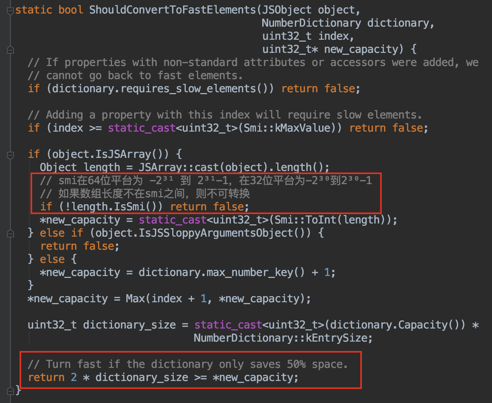

来写代码验证一下：

```
let a = [1,2];
a[1030] = 1;
for (let i = 200; i < 1030; i++) {
    a[i] = i;
}
```


上面我们说过的，在 1030 的位置上面添加一个值，会造成多于 1024 个空洞，数组会使用为 Dictionary 模式来实现。

那么我们现在往这个数组中再添加几个值来填补空洞，往 200-1029 这些位置上赋值，使慢数组不再比快数组节省 50% 的空间，会发生什么神奇的事情呢？

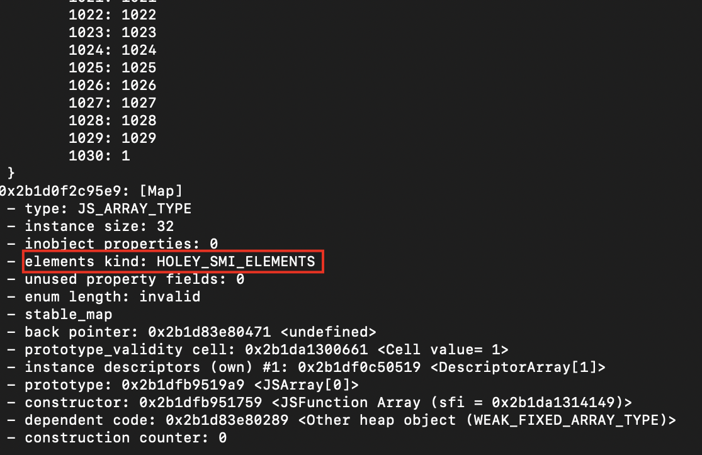

可以看到，数组变成了快数组的 Fast Holey Elements 模式，验证成功。

那是不是快数组存储空间连续，效率高，就一定更好呢？其实不然。

#### **3、各有优势**

快数组就是以空间换时间的方式，申请了大块连续内存，提高效率。
慢数组以时间换空间，不必申请连续的空间，节省了内存，但需要付出效率变差的代价。

## 扩展：ArrayBuffer

JS在ES6也推出了可以按照需要分配连续内存的数组，这就是ArrayBuffer。

ArrayBuffer会从内存中申请设定的二进制大小的空间，但是并不能直接操作它，需要通过ArrayBuffer构建一个视图，通过视图来操作这个内存。

```
let buffer = new ArrayBuffer(1024);
```


这行代码就申请了 1kb 的内存区域。但是并不能对 arrayBuffer 直接操作，需要将它赋给一个视图来操作内存。

```
let intArray = new Int32Array(bf);
```


这行代码创建了有符号的32位的整数数组，每个数占 4 字节，长度也就是 1024 / 4 = 256 个。

代码验证：

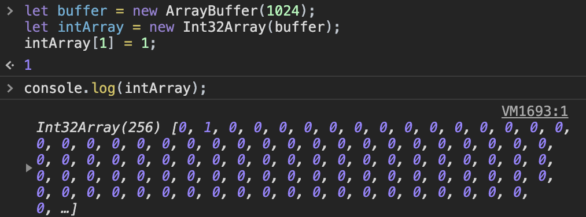


# 文章参考

[探究JS V8引擎下的“数组”底层实现 - vivo互联网技术 - 博客园 (cnblogs.com)](https://www.cnblogs.com/vivotech/p/12029196.html)

[深入理解Js数组 - WindrunnerMax - 博客园 (cnblogs.com)](https://www.cnblogs.com/WindrunnerMax/p/13121840.html)

