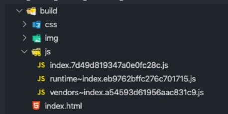
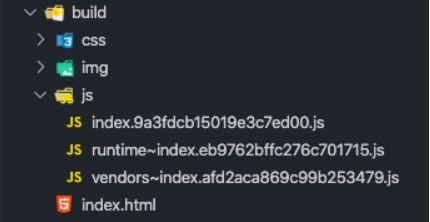
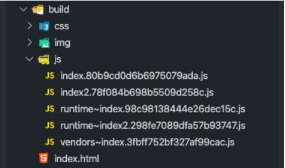

# webpack5 新变化与对应的优化措施

在使用webpack的时候，我们常常会做一些优化，比如：

1. 构建速度优化： 增加了cache
2. 代码体积优化：SplitChunks与treeShaking加强
3. 持久化缓存优化 ：文件hash变动优化
4. Module Federation：模块联邦制

到了webpack5，这些优化措施都变得更加的简单和效果显著了。先从构建速度的优化说起：

## 构建速度优化

在webpack4中，为了让我们的构建速度更快，我们通常需要借助一些插件或一些额外的配置来达到目的。

1. cache-loader，针对一些耗时的工作进行缓存。比如缓存babel-loader的工作。
2. terser-webpack-plugin 或 uglifyjs-webpack-plugin的cache以及parallel。（默认开启）

比如我们会借助 cache-loader 去对我们构建过程中消耗性能比较大的部分进行缓存，缓存会存放到硬盘中`node_modules/.cache/cache-loader`，缓存的读取和存储是会消耗性能的，所以只推荐用在性能开销大的地方。

``` js
// 对babel-loader的工作进行缓存
module.exports = {
  module: {
    rules: [
      {
        test: /\.js$/,
        use: ['cache-loader', 'babel-loader'],
        include: path.resolve('src'),
      },
    ],
  },
};
```


terserPlugin继承自uglifyjsPlugin，我们可以开启插件的cache以及parallel特性来加快压缩。（terserPlugin是webpack推荐及内置的压缩插件，cache与parallel默认为开启状态）缓存路径在`node_modules/.cache/terser-webpack-plugin`

```js
optimization: {
  minimizer: [
    new TerserPlugin({
      cache: true,   // 开启该插件的缓存，默认缓存到node_modules/.cache中
      parallel: true,  // 开启“多线程”，提高压缩效率
      exclude: /node_modules/
    })
  ],
},
```


到了webpack5，可以通过cache 特性来将webpack工作缓存到硬盘中。存放的路径为`node_modules/.cache/webpack`

1. 开发环境默认值为 cache.type = "memory"。
2. 生产环境可手动设为 cache.type = "filesystem"。

```js
module.exports = {
  //...
  cache: {
    type: 'filesystem',
    version: 'your_version'
  }
};
```


| cache措施                                     | webpack v4                                 | webpack v5                                   |
| --------------------------------------------- | ------------------------------------------ | -------------------------------------------- |
| 默认配置（只有TerserPlugin的cache与parallel） | 第一次打包： 26000+ms；第二次打包：7000+ms | 第一次打包：23000+ms；第二次打包：6000+ms    |
| 使用cache-loader缓存babel-loader的工作        | 第一次打包：6000+ms；第二次打包：4000+ms   |                                              |
| 开启cache.type = 'filesystem'                 |                                            | 第一次打包：6000+ms；**第二次打包：1000+ms** |

## 包代码体积的优化 - SplitChunks

为了让我们的打出来的包体积更加小，颗粒度更加明确。我们经常会用到webpack的代码分割splitchunk以及tree shaking。在webpack5中，这两者也得到了优化与加强。比如

```js
splitChunks: {
  chunks: 'all',
  minSize: {
     javascript: 30000,
     style: 50000,
   }
},
// 默认配置
module.exports = {
  //...
  // https://github.com/webpack/changelog-v5#changes-to-the-configuration
  // https://webpack.js.org/plugins/split-chunks-plugin/
  optimization: {
    splitChunks: {
      chunks: 'async',  // 只对异步加载的模块进行处理
      minSize: {
        javascript: 30000, // 模块要大于30kb才会进行提取
        style: 50000, // 模块要大于50kb才会进行提取
      },
      minRemainingSize: 0, // 代码分割后，文件size必须大于该值    （v5 新增）
      maxSize: 0,
      minChunks: 1,  // 被提取的模块必须被引用1次
      maxAsyncRequests: 6, // 异步加载代码时同时进行的最大请求数不得超过6个
      maxInitialRequests: 4, // 入口文件加载时最大同时请求数不得超过4个
      automaticNameDelimiter: '~', // 模块文件名称前缀
      cacheGroups: {
     // 分组，可继承或覆盖外层配置
        // 将来自node_modules的模块提取到一个公共文件中 （又v4的vendors改名而来）
        defaultVendors: {                                                                      
          test: /[\\/]node_modules[\\/]/,
          priority: -10
        },
       // 其他不是node_modules中的模块，如果有被引用不少于2次，那么也提取出来
        default: {
          minChunks: 2,
          priority: -20,
          reuseExistingChunk: true
        }
      }
    }
  }
};
```


## 包代码体积的优化 - Tree Shaking

同时tree shaking也得到了加强，可以覆盖更到负责的场景。

1. Nested tree-shaking
2. Inner-module tree-shaking

## 包代码体积的优化 - Node.js Polyfills

在webpack5之前，webpack会自动的帮我们项目引入Node全局模块polyfill。我们可以通过node配置

```js
// false: 不提供任何方法（可能会造成bug），'empty':  引入空模块, 'mock': 引入一个mock模块，但功能很少
module.exports = {
  // ...
  node: {
    console: false,
    global: false,
    process: false,
    // ...
  }
}
```

但是webpack团队认为，现在大多数工具包多是为前端用途而编写的，所以不再自动引入polyfill。我们需要自行判断是否需要引入polyfill，当我们用weback5打包的时候，webpack会给我们类似如下的提示：

```shell
// 在项目中我使用到了 crypto 模块，webpack5会询问是否引入对应的 polyfill。
Module not found: Error: Can't resolve 'crypto' in '/Users/xxx/Documents/private-project/webpack/ac_repair_mobile_webpack_5/node_modules/sshpk/lib/formats'

BREAKING CHANGE: webpack < 5 used to include polyfills for node.js core modules by default.
This is no longer the case. Verify if you need these module and configure a polyfill for it.

If you want to include a polyfill, you need to:
        - add an alias 'resolve.alias: { "crypto": "crypto-browserify" }'
        - install 'crypto-browserify'
If you don't want to include a polyfill, you can use an empty module like this:
        resolve.alias: { "crypto": false }
```

webpack5中，增加了resolve.alias配置项来告诉webpack是否需要引入对应polyfill。node配置项也做了调整。

```js
module.exports = {
  // ...
  resolve: {
    alias: {
      crypto: 'crypto-browserify',
      // ..
    }
  },  
  node: {
    // https://webpack.js.org/configuration/node/#root
    // 只能配置这三个
    global: false,
    __filename: false,
    __dirname: false,
  }
}
```


也就是说到了webpack5，我们需要清楚自己的项目需要引入哪些node polyfill。**更加了配置的门槛，但是减少了代码的体积**。

webpack5中将path、crypto、http、stream、zlib、vm的node polyfill取消后

|      | webpack v4                                            | webpack v5                                                   |
| ---- | ----------------------------------------------------- | ------------------------------------------------------------ |
| 行为 | webpack尝试自动引入各个node模块的polyfill             | webpack默认不主动引入node模块的polyfill                      |
| 措施 | 开发者可以使用 `node: {}`配置项来改成mock或不提供模块 | 开发者可以使用 `resolve.alias`配置项决定每个node模块是否引入polyfill |
| 体验 | 一般不会主动配置                                      | 在打包前必须确定好用到的所有node模块是否需要引入polyfill，否则打包会被中断。同时难以提前确定哪些node模块可以省略polyfill |
| 效果 | 最终js代码体积2.78M                                   | 最终js代码体积：2.17M                                        |

## 持久化缓存的优化

在日常开发中我们会尽量减少文件hash发生变化的情况，以最大化的利用缓存，节省流量。这就是我们常说的“优化持久化缓存”。首先最简单的措施就是使用contenthash来作为文件哈希后缀，只有当文件内容发生变化的时候，哈希才会发生改变。但是这样并不够。我们还是会遇到这样的问题：



1. 当我们新增一个模块时：

```js
// 在入口文件index.js新增了模块demo
// ...
import {a} from './demo'
console.log(a);
// ... 
```




所有文件的哈希后缀都发生了改变，不符合期望，**vender～xxx.js的hash不应发生变化**。

1. 继续当我们新增一个入口的时候：

```js
entry: {
   index: ['./src/index.js'],
   index2: ['./src/index2.js']
},
```



同样的所有文件的哈希后缀都发生了改变，不符合期望，**原有文件hash不应发生变化**。

#### 问题原因

在webpack4 中，chunkId与moduleId都是自增id。也就是只要我们新增一个模块，那么代码中module的数量就会发生变化，从而导致moduleId发生变化，于是文件内容就发生了变化。chunkId也是如此，新增一个入口的时候，chunk数量的变化造成了chunkId的变化，导致了文件内容变化。

#### 解决方法

webpack4可以通过设置optimization.moduleIds = 'hashed'与optimization.namedChunks=true来解决这写问题，但都有性能损耗等副作用。

```js
optimization: {
  moduleIds: 'hashed',
  namedChunks: true,
  // ...
}
```


而webpack5 在production模式下optimization.chunkIds和optimization.moduleIds默认会设为'deterministic'，webpack会采用新的算法来计算确定性的chunkI和moduleId。**默认即可避免上述情况发生**。

| 稳定ModuleIDs    | webpack v4                                                   | webpack v5                                      |
| ---------------- | ------------------------------------------------------------ | ----------------------------------------------- |
| 措施             | optimization.moduleIds = 'hashed'                            | 默认的 optimization.moduleIds = 'deterministic' |
| 添加新模块时表现 | 只有index.xxx.js文件的hash发变化，符合预期                   | 同左，符合预期                                  |
| 优缺点           | 将模块路径进行hash作为moduleId，该过程有一定的性能损耗（感知小） |                                                 |

| 稳定ChunkIDs     | webpack v4                                                   | webpack v5                                                   |
| ---------------- | ------------------------------------------------------------ | ------------------------------------------------------------ |
| 措施             | optimization.namedChunks=true                                | 默认的 optimization.chunkIds = 'deterministic'; namedChunks在生产模式下被禁用 |
| 新增入口时的表现 | 原有文件哈希没有发生变化，符合预期（moduleIds = 'hashed'也要同时开启） | 同左，符合预期                                               |
| 优缺点           | 基于NamedChunksPlugin将chunk名称作为chunkId，本意是为了开发环境更方便调试 |                                                              |

## Module Federation

模块联邦制，使 JavaScript 应用得以从另一个 JavaScript 应用中动态地加载代码 —— 同时共享依赖。项目分为Host（消费者），remote（被消费者）。功能实现主要依靠 `ModuleFederationPlugin` 插件。

```js
new ModuleFederationPlugin({
       name: ''， // 名称，唯一id
       library: {},  // 以什么形式暴露，比如umd 
       filename: '',  // 输出的入口文件名称
       exposes: {}, // 要输出的组件或方法
       shared: []  // 要共享的依赖
})
```


比如 app1， 输出log方法

```js
new ModuleFederationPlugin({
       name: 'app1',
       library: {type: 'var', name: 'app1'},
       filename: 'appOneEntry.js',
       exposes: {
           './log': './util/logSomething'
        },
        shared: []
})
```


app2， 使用app1中的logSomething 方法

```js
new ModuleFederationPlugin({
       name: "app2",
       remotes: {
           app1: 'app1@http://127.0.0.1:8887/demo-federation-1/dist/appOneEntry.js'
       },
       shared: []
})
```

