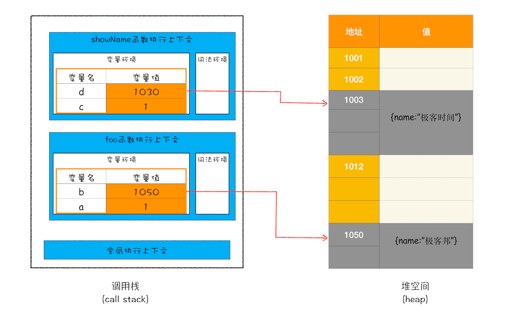
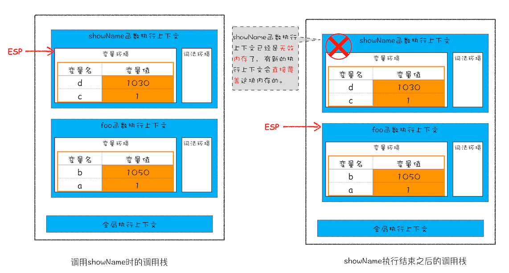
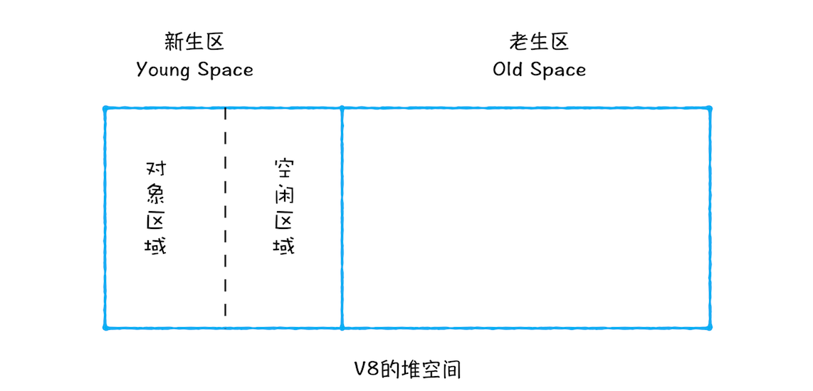

# 垃圾回收机制

垃圾回收（garbage collection）简称为GC

## 为何要垃圾回收？

JavaScript程序每次创建字符串、数组或对象时，解释器都必须分配内存来存储那个实体。只要像这样动态地分配了内存，最终都要释放这些内存以便他们能够被再用，否则，JavaScript的解释器将会消耗完系统中所有可用的内存，造成系统崩溃。

## 不同语言的垃圾回收策略

### 手动回收

何时分配内存、何时销毁内存都是由代码控制的，如 C/C++。

### 自动回收

垃圾数据是由垃圾回收器来释放的，并不需要手动通过代码来释放，如 JavaScript、Java、Python 等语言

## 垃圾回收的方式

### 标记清除（mark and sweep）

  大部分浏览器以此方式进行垃圾回收，当变量进入执行环境（函数中声明变量,执行时）的时候，垃圾回收器将其标记为“进入环境”，当变量离开环境的时候（函数执行结束）将其标记为“离开环境”，在离开环境之后还有的变量则是需要被删除的变量。标记方式不定，可以是某个特殊位的反转或维护一个列表等。

  垃圾收集器给内存中的所有变量都加上标记，然后去掉环境中的变量以及被环境中的变量引用的变量的标记。在此之后再被加上的标记的变量即为需要回收的变量，因为环境中的变量已经无法访问到这些变量。

### 引用计数

  另一种不太常见的垃圾回收策略是引用计数。引用计数的含义是跟踪记录每个值被引用的次数。当声明了一个变量并将一个引用类型赋值给该变量时，则这个值的引用次数就是1。相反，如果包含对这个值引用的变量又取得了另外一个值，则这个值的引用次数就减1。当这个引用次数变成0时，则说明没有办法再访问这个值了，因而就可以将其所占的内存空间给收回来。这样，垃圾收集器下次再运行时，它就会释放那些引用次数为0的值所占的内存。 该方式会引起内存泄漏的原因是它不能解决循环引用的问题。

低版本IE中有一部分对象并不是原生JS对象。例如，其BOM和DOM中的对象就是使用C++以COM(Component Object Model)对象的形式实现的，而COM对象的垃圾收集机制采用的就是引用计数策略。

因此即使IE的js引擎是用的标记清除来实现的，但是js访问COM对象如BOM,DOM还是基于引用计数的策略的，也就是说只要在IE中设计到COM对象，也就会存在循环引用的问题。


## JS里的垃圾回收机制

首先我们要明确JS里的数据存储分为栈存储和堆存储，这两者采用的垃圾回收机制是不同的。

### 栈的垃圾回收机制

通过移动ESP指针(记录当前执行状态的指针)实现垃圾回收。执行栈中当一个函数执行完毕，JavaScript 引擎会通过向下移动 ESP 来销毁该函数保存在栈中的执行上下文。

例：

```
function foo(){ 
  var a = 1;
  var b = {name:"极客邦"}
  function showName() { 
    var c = "极客时间";
    var d = {name:"极客时间"};
  } 
  showName()
    }
foo()
```

当代码执行到第六行时堆栈状态



当 showName 函数执行完成之后，函数执行流程就进入了 foo 函数，那这时就需要销毁 showName 函数的执行上下文了。ESP 这时候就帮上忙了，JavaScript 会将 ESP 下移到 foo 函数的执行上下文，这个下移操作就是销毁 showName 函数执行上下文的过程。

移动 ESP 前后的对比图：



从图中可以看出，当 showName 函数执行结束之后，ESP 向下移动到 foo 函数的执行上下文中，上面 showName 的执行上下文虽然保存在栈内存中，但是已经是无效内存了。比如当 foo 函数再次调用另外一个函数时，这块内容会被直接覆盖掉，用来存放另外一个函数的执行上下文。

### 堆的垃圾回收机制

#### 代际假说（The Generational Hypothesis）

后续垃圾回收的策略都是建立在该假说的基础之上的。

特征：

- 大部分对象在内存中存在的时间很短，简单来说，就是很多对象一经分配内存，很快就变得不可访问
- 不死的对象，会活得更久

#### 新老生代区别

在V8 中会把堆分为**新生代**和**老生代**两个区域，两者的区别主要在一下几点

|                | 新生代               | 老生代                  |
| -------------- | -------------------- | ----------------------- |
| 存储对象       | 生存时间短的对象     | 生存时间久的对象        |
| 内存大小       | 32位下16MB64位下64MB | 32位下700MB64位下1400MB |
| 所用垃圾回收器 | 副垃圾回收器         | 主垃圾回收器            |

#### 垃圾回收器共有的的工作流程

1. **标记空间中活动对象和非活动对象**。所谓活动对象就是还在使用的对象，非活动对象就是可以进行垃圾回收的对象。
2. **回收非活动对象所占据的内存**。其实就是在所有的标记完成之后，统一清理内存中所有被标记为可回收的对象。
3. **内存整理**。一般来说，频繁回收对象后，内存中就会存在大量不连续空间，我们把这些不连续的内存空间称为内存碎片。当内存中出现了大量的内存碎片之后，如果需要分配较大连续内存的时候，就有可能出现内存不足的情况。所以最后一步需要整理这些内存碎片，但这步其实是可选的，因为有的垃圾回收器不会产生内存碎片，比如副垃圾回收器。


#### 副垃圾回收器

**职责：**负责新生区的垃圾回收。

**回收方式：**Scavenge 算法。即把新生代空间对半划分为两个区域，一半是对象区域，一半是空闲区域



**具体步骤：**

1. 对对象区域中的垃圾做标记；
2. 标记完成之后，就进入垃圾清理阶段，副垃圾回收器会把这些存活的对象复制到空闲区域中，同时它还会把这些对象有序地排列起来，所以这个复制过程，也就相当于完成了内存整理操作，复制后空闲区域就没有内存碎片了。
3. 完成复制后，对象区域与空闲区域进行角色翻转，也就是原来的对象区域变成空闲区域，原来的空闲区域变成了对象区域。这样就完成了垃圾对象的回收操作，同时这种角色翻转的操作还能让新生代中的这两块区域无限重复使用下去。

**为什么新生代空间比较小？怎么优化空间小的问题**

由于新生代中采用的 Scavenge 算法，所以每次执行清理操作时，都需要将存活的对象从对象区域复制到空闲区域。但复制操作需要时间成本，如果新生区空间设置得太大了，那么每次清理的时间就会过久，所以为了执行效率，一般新生区的空间会被设置得比较小。

也正是因为新生区的空间不大，所以很容易被存活的对象装满整个区域。为了解决这个问题，JavaScript 引擎采用了**对象晋升策略**，也就是经过两次垃圾回收依然还存活的对象，会被移动到老生区中。


**主垃圾回收器**

**职责：**负责老生区的垃圾回收。

**回收方式：**标记 - 清除（Mark-Sweep），标记 - 整理（Mark-Compact）

**对象特征：**

1. 是对象占用空间大
2. 对象存活时间长

注意⚠️：老生区除了新生区中晋升的对象，一些大的对象会直接被分配到老生区

**具体步骤：**

处理老生代对象时，采用**深度优先扫描**，用**三色标记算法**。

1. **标记阶段**，从一组根元素开始，递归遍历这组根元素，在这个遍历过程中，能到达的元素称为活动对象，没有到达的元素就可以判断为垃圾数据。V8使用每个对象的两个mark-bits和一个标记工作栈来实现标记,两个mark-bits编码三种颜色：白色（00），灰色（10）和黑色（11），白色表示对象可以回收，黑色表示对象不能回收，并且他的所有引用都被便利完毕了，灰色表示不可回收，他的引用对象没有扫描完毕。

具体扫描步骤如下：

- 从已知对象开始，即roots(全局对象和激活函数), 将所有非root对象标记置为白色
- 将root对象的所有直接引用对象入栈（marking worklist）
- 依次pop出对象，出栈的对象标记为黑，同时将他的直接引用对象标记为灰色并push入栈
- 栈空的时候，仍然为白色的对象可以回收

  2.**清除阶段**，清除白色标记的对象。但是进行清除后，内存会出现不连续的状态，对后续的大对象分配地址造成无意义的回收（因为可用内存的不足）,这时就需要Mark-Compact来处理内存碎片了。

  3.**标记 - 整理**，由于对一块内存多次执行标记 - 清除算法后，会产生大量不连续的内存碎片。而碎片过多会导致大对象无法分配到足够的连续内存，所以会执行标记整理，让所有存活的对象都向一端移动，然后直接清理掉端边界以外的内存。