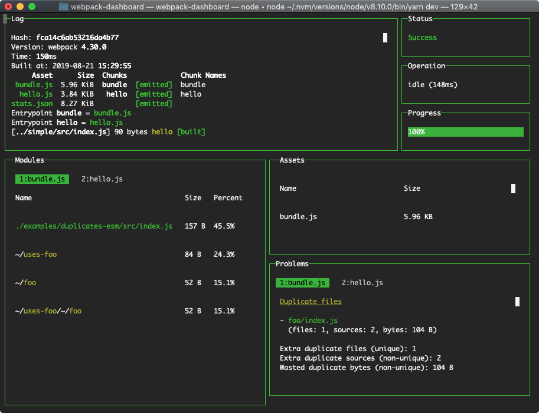
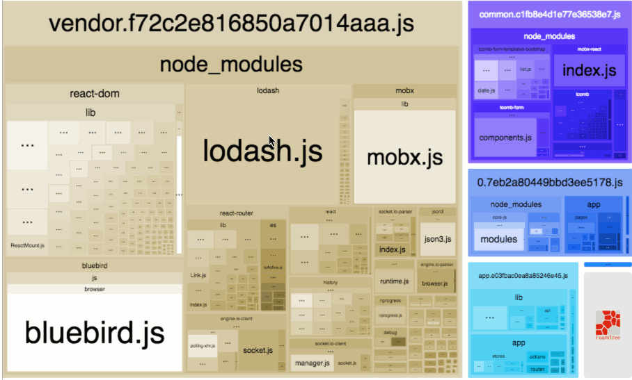

# Webpack | 优化 & 插件


## 目的

webpack 是一款项目模块打包器，为我们项目开发带来很大的便利性，但是同时也会存在打包上的一些问题，为了提升打包体验，我们就需要对打包流程进行优化，主要优化目的有两个：

- 加快打包速度   ----提升开发上线体验
- 减小打包出的文件体积     ----提升网页加载性能


## 思路

- **打包分析**：分析打包出的文件大小，与打包中各个环节的打包速度
- **缓存加速**：利用缓存来加快打包速度
- **静态资源处理**：提取出一些不变的静态代码库，放置外链中
- **多线程、多核加速**：利用计算机多核的优势，进行多核压缩、打包
- html处理：利用H5的一些新特性，加快网页加载速度

...

如果实在还是特别慢，嗯？😑 可以考虑集群编译吧，分模块打包，通过 jenkins 配置自动化，shell 脚本，通过免密登录 scp 到本地


## 分析

### 速度分析

利用插件 [speed-measure-webpack-plugin](https://www.npmjs.com/package/speed-measure-webpack-plugin) 

安装

```
npm install --save-dev speed-measure-webpack-plugin
yarn add -D speed-measure-webpack-plugin
```

使用

```js
const SpeedMeasurePlugin = require("speed-measure-webpack-plugin");

const smp = new SpeedMeasurePlugin();

const webpackConfig = smp.wrap(webpackConfig);
```

使用结果


### 输出文件分析

#### 工具一：[webpack-dashboard](https://www.npmjs.com/package/webpack-dashboard) 

增强了 webpack 的输出，包含依赖的⼤⼩、进度和其他细节。

安装

```
npm install --save-dev webpack-dashboard
# ... or ...
yarn add --dev webpack-dashboard
```

使用

```js
const DashboardPlugin = require("webpack-dashboard/plugin");

// Add it to your webpack configuration plugins.
module.exports = {
  // ...
  plugins: [new DashboardPlugin()];
  // ...
};
```

改变打包脚本

```
"scripts": {
    "dev": "webpack-dashboard -- node index.js", # OR
    "dev": "webpack-dashboard -- webpack-dev-server", # OR
    "dev": "webpack-dashboard -- webpack",
}
```

使用效果




#### 工具二：[webpack-bundle-analyzer](https://www.npmjs.com/package/webpack-bundle-analyzer) 

打包结果分析

安装

```shell
# NPM
npm install --save-dev webpack-bundle-analyzer
# Yarn
yarn add -D webpack-bundle-analyzer
```

使用

```js
const BundleAnalyzerPlugin = require('webpack-bundle-analyzer').BundleAnalyzerPlugin;

module.exports = {
  plugins: [
    new BundleAnalyzerPlugin()
  ]
}
```




#### 工具三：监控文件大小

集成到CI 监控⽂件的⼤⼩ https://github.com/siddharthkp/bundlesize

#### 工具四：其他分析方式

执行以下命令，将输出的文件上传到[webpack-chart](http://alexkuz.github.io/webpack-chart/)或者[analyse](http://webpack.github.io/analyse/)上

```
webpack --profile --json > stats.json
```

## 缓存加速

### 整个工程开启缓存

有时候为了极致性能，可以使用该方法，强缓存，会缓存所有打包结果，慎用

> 就目前自己的使用体验上存在一定情况会抛出异常导致打包缓慢，所以慎用

[hard-source-webpack-plugin](https://www.npmjs.com/package/hard-source-webpack-plugin)

### cache-loader

安装 [cache-loader](https://www.npmjs.com/package/cache-loader)

```
npm install --save-dev cache-loader
```

根据前面的分析，在性能开销大的loader前面添加此loader，以将结果缓存到磁盘里

```js
module.exports = {
  module: {
    rules: [
      {
        test: /\.ext$/,
        use: [
          'cache-loader',
          ...loaders
        ],
        exclude: /node_modules/, // 排除不处理的⽬录
        include: path.resolve('src') // 精确指定要处理的⽬录
      }
    ]
  }
}
```

babel-loader的缓存

loader的缓存 => 'babel-loader?cacheDirectory=true'

### webpack5

到了webpack5，可以通过cache 特性来将webpack工作缓存到硬盘中。存放的路径为`node_modules/.cache/webpack`

1. 开发环境默认值为 cache.type = "memory"。
2. 生产环境可手动设为 cache.type = "filesystem"。

```js
module.exports = {
  //...
  cache: {
    type: 'filesystem',
    version: 'your_version'
  }
};
```

## 静态代码提取

将公共的UI库，框架库等提取处理，放进html中通过script、link标签引入，减少打包时间

因为一般公共库都有压缩版本，可直接引入

> 一般项目中业务代码不多的情况下，这种方式能直接提速80%

## 多核优化与打包压缩

### javascript

##### treeShaking 深度分析

> 用于描述移除 JavaScript 上下文中的未引用代码(dead-code)。它依赖于 ES2015 模块系统中的[静态结构特性](http://exploringjs.com/es6/ch_modules.html#static-module-structure)，例如 [`import`](https://developer.mozilla.org/en-US/docs/Web/JavaScript/Reference/Statements/import) 和 [`export`](https://developer.mozilla.org/en-US/docs/Web/JavaScript/Reference/Statements/export)。这个术语和概念实际上是兴起于 ES2015 模块打包工具 [rollup](https://github.com/rollup/rollup)。

新的 webpack 4 正式版本，扩展了这个检测能力，通过 `package.json` 的 `"sideEffects"` 属性作为标记，向 compiler 提供提示，表明项目中的哪些文件是 "pure(纯的 ES2015 模块)"，由此可以安全地删除文件中未使用的部分。[点击了解](https://www.webpackjs.com/guides/tree-shaking/#%E5%B0%86%E6%96%87%E4%BB%B6%E6%A0%87%E8%AE%B0%E4%B8%BA%E6%97%A0%E5%89%AF%E4%BD%9C%E7%94%A8-side-effect-free-)

相关插件

- [webpack-deep-scope-plugin](https://www.npmjs.com/package/webpack-deep-scope-plugin)  提升treeShaking能力的一款插件；它可以使 webpack 消除与未使用导出相关的未使用导入，解决了 webpack 的6254问题。
- [webpack-parallel-uglify-plugin](https://www.npmjs.com/package/webpack-parallel-uglify-plugin) 这个插件为有许多入口点的项目加快构建速度。带有 webpack 的 UglifyJS 插件按顺序运行每个输出文件。这个插件并行运行 uglify，每个可用的 cpu 都有一个线程。这可以导致显着减少构建时间，因为缩小是非常 CPU 密集。
- [purifycss-webpack-plugin](https://www.npmjs.com/package/purgecss-webpack-plugin) 一个webpack插件用于剔除未使用的css

##### 多线程编译

1. 开启多核压缩 [happypack](https://www.npmjs.com/package/happypack) 多线程编译 
2. webpack 不⽀持的情况下使⽤ [thread-loader](https://www.npmjs.com/package/thread-loader) **请仅在耗时的 loader 上使用**，

##### 多线程压缩

JavaScript的多核压缩可以开启 [terser-webpack-plugin](https://www.npmjs.com/package/terser-webpack-plugin) (多核压缩）

terserPlugin是webpack推荐及内置的压缩插件，cache与parallel默认为开启状态

 [uglifyjs-webpack-plugin](https://www.npmjs.com/package/uglifyjs-webpack-plugin) 官⽅维护插件

 [webpack-parallel-uglify-plugin](https://www.npmjs.com/package/webpack-parallel-uglify-plugin) ⾮官⽅维护

##### WEBPACK 5

> Webpack5 不间断进程（continuous processes）和缓存对于⼤型复杂项⽬应⽤，在开发阶段，开发者⼀般习惯使⽤ Webpack --watch 选项或者webpack devServer 启动⼀个不间断的进程（continuous processes）以达到最佳的构建速度和效率。Webpack --watch 选项和 webpack-dev-server 都会监听⽂件系统，进⽽在必要时，触发持续编译构建动作。

原理其实就是轮询判断⽂件的最后编辑时间是否变化，某个⽂件发⽣了变化，并不会⽴刻告诉监听者，⽽是先缓存起来，等待aggregateTimeout（Webpack 的 --watch 选项内置的类似 batching 的能⼒）https://github.com/paulmillr/chokidar

```js
const TerserJSPlugin = require('terser-webpack-plugin');
module.exports = {
  optimization: {
    minimizer: [new TerserJSPlugin({
      cache: true, // 是否缓存
      parallel: true, // 是否并⾏打包
      sourceMap: true
    })],
  }
}
```


### css

CSS的多核压缩 [optimize-css-assets-webpack-plugin](https://www.npmjs.com/package/optimize-css-assets-webpack-plugin)


## 资源处理

[html-inline-css-webpack-plugin](https://www.npmjs.com/package/html-inline-css-webpack-plugin) 把⼀些核⼼的CSS放到⻚⾯内部 

需要[mini-css-extract-plugin](https://github.com/webpack-contrib/mini-css-extract-plugin)和[html-webpack-plugin](https://github.com/jantimon/html-webpack-plugin)

```
<link rel="stylesheet" /> => <style>...<style/>
```

[html-webpack-inline-source-plugin](https://www.npmjs.com/package/html-webpack-inline-source-plugin)  这是一个扩展插件的 webpack 插件 html-webpack-plugin。它允许你嵌入 javascript 和 css 源代码内嵌。


## 图片压缩

压缩图⽚ [image-webpack-loader](https://www.npmjs.com/package/image-webpack-loader)

## html配置优化

[html-webpack-plugin](https://www.npmjs.com/package/html-webpack-plugin) html

```js
new HtmlWebpackPlugin({
  inlineSource: ".css$",
  template: path.join(__dirname, `src/${pageName}/index.html`),
  filename: `${pageName}.html`,
  chunks: ["vendors", pageName],
  inject: true,
  minify: {
    html5: true,
    collapseWhitespace: true,
    preserveLineBreaks: false,
    minifyCSS: true,
    minifyJS: true,
    removeComments: false,
  },
});
```


## 代码分析

[prepack-webpack-plugin](https://www.npmjs.com/package/prepack-webpack-plugin)  代码求值，静态代码分析

[@babel/plugin-syntax-dynamic-import](https://www.npmjs.com/package/@babel/plugin-syntax-dynamic-import) 动态引⼊


## 错误提示优化

友好错误提示 [friendly-errors-webpack-plugin](https://www.npmjs.com/package/friendly-errors-webpack-plugin)

系统通知，本地 dev使用  [webpack-build-notifier](https://www.npmjs.com/package/webpack-build-notifier)


## 代码拆分

externals 配置去掉不需要编译的，可以抛弃 dll

splitChunks 公⽤库的代码拆分 去除打包
```js
splitChunks: {
  chunks: 'async',
  minSize: 30000,
  minChunks: 1,
  maxAsyncRequests: 5,
  maxInitialRequests: 3,
  name: false,
  cacheGroups: {
    commons: {
      chunks: 'initial',
      minChunks: 2,
      maxInitialRequests: 5,
      minSize: 0,
      name: 'commons',
    },
  },
}
```


分离⻚⾯公⽤包 [html-webpack-externals-plugin](https://www.npmjs.com/package/html-webpack-externals-plugin)

## polyfill引入

js脚本直接引入，不编译

```html
<script src="https://cdn.polyfill.io/v2/polyfill.min.js?feature=Map,Set"></script>
```

使⽤动态 polyfill, 它会根据你的浏览器 UA 头，判断你是否⽀持某些特性，从⽽返回给你⼀个合适的 polyfill
``` html
<script type="module" src="main.js"></script>

<script nomodule src="main.es5.js"></script>
```

### webpack5

在webpack5之前，webpack会自动的帮我们项目引入Node全局模块polyfill。我们可以通过node配置

```js
// false: 不提供任何方法（可能会造成bug），'empty':  引入空模块, 'mock': 引入一个mock模块，但功能很少
module.exports = {
  // ...
  node: {
    console: false,
    global: false,
    process: false,
    // ...
  }
}
```

但是webpack团队认为，现在大多数工具包多是为前端用途而编写的，所以不再自动引入polyfill。我们需要自行判断是否需要引入polyfill，当我们用weback5打包的时候，webpack会给我们类似如下的提示：

```
// 在项目中我使用到了 crypto 模块，webpack5会询问是否引入对应的 polyfill。
Module not found: Error: Can't resolve 'crypto' in '/Users/xxx/Documents/private-project/webpack/ac_repair_mobile_webpack_5/node_modules/sshpk/lib/formats'

BREAKING CHANGE: webpack < 5 used to include polyfills for node.js core modules by default.
This is no longer the case. Verify if you need these module and configure a polyfill for it.

If you want to include a polyfill, you need to:
        - add an alias 'resolve.alias: { "crypto": "crypto-browserify" }'
        - install 'crypto-browserify'
If you don't want to include a polyfill, you can use an empty module like this:
        resolve.alias: { "crypto": false }
```

webpack5中，增加了resolve.alias配置项来告诉webpack是否需要引入对应polyfill。node配置项也做了调整。

```js
module.exports = {
  // ...
  resolve: {
    alias: {
      crypto: 'crypto-browserify',
      // ..
    }
  },  
  node: {
    // https://webpack.js.org/configuration/node/#root
    // 只能配置这三个
    global: false,
    __filename: false,
    __dirname: false,
  }
}
```


## 优秀配置库搜集

构建配置设计成⼀个库

hjs-webpack、Neutrino、webpack-blocks

抽成⼀个⼯具进⾏管理

create-react-app, kyt, nwb

更多的快速构建⼯具

lerna 、brunch、 rome 、snowpack （过往Browserify、Rollup.js、Gulp、Parcel、Microbundle）