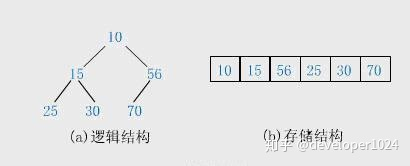
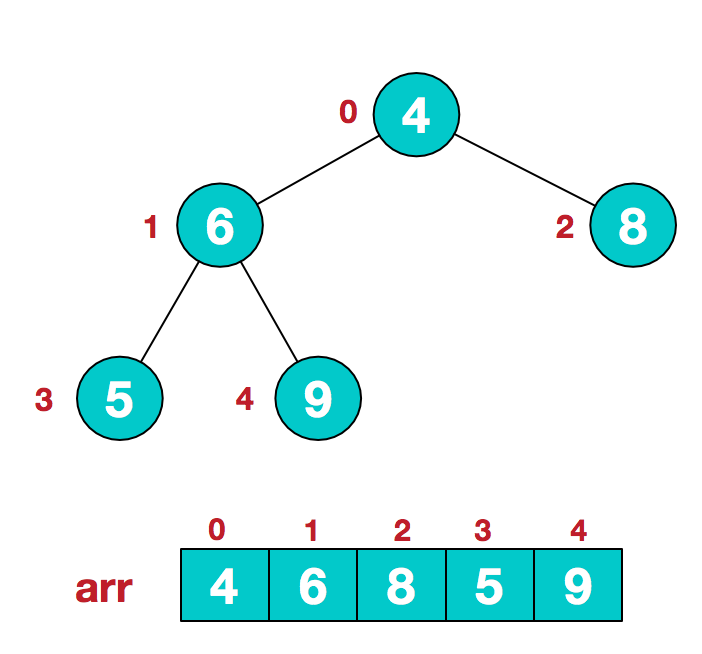
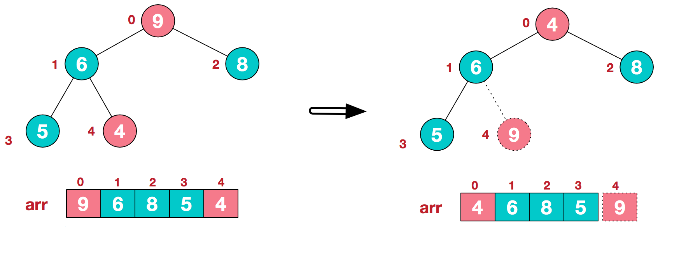
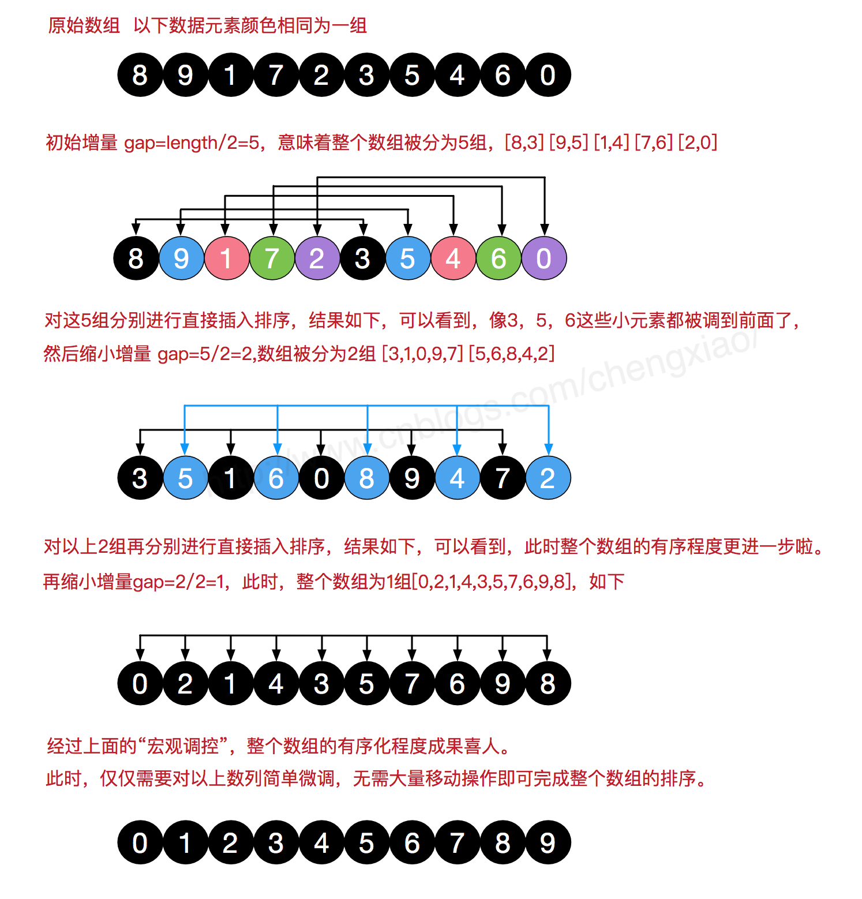
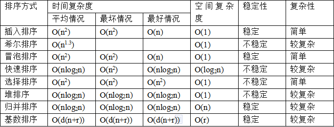

# 排序

## 冒泡排序

冒泡排序（英语：Bubble sort）是一种简单的排序算法。由于在算法的执行过程中，较小的元素像是气泡般慢慢「浮」到数列的顶端，故叫做冒泡排序。

### **原理**

它的工作原理是每次检查相邻两个元素，如果前面的元素与后面的元素满足给定的排序条件，就将相邻两个元素交换。当没有相邻的元素需要交换时，排序就完成了。

经过次 $i$ 次扫描后，数列的末尾 $i$ 项必然是最大的项，因此冒泡排序最多需要扫描$n-1$遍数组就能完成排序。

冒泡排序是一种**稳定的**排序算法。

### **时间复杂度**

冒泡排序的平均时间复杂度为 $O(n^2)$。

实现

```js
function  bubble_sort(nums) {
  let flag = true
  while (flag){
    flag = false
    for (let i = 0; i < nums.length-1; i++) {
      if(nums[i]>nums[i+1]){
        flag = true
        let temp = nums[i]
        nums[i] = nums[i + 1]
        nums[i + 1] = temp
      }
    }
  }
  return nums
}
```
### 外部链接

- [冒泡排序 - 维基百科，自由的百科全书](https://zh.wikipedia.org/wiki/冒泡排序)


## 选择排序

选择排序（英语：Selection sort）是排序算法的一种，它的工作原理是每次找出第 i 小的元素（也就是$A_{i...n}$中最小的元素），然后将这个元素与数组第 i 个位置上的元素交换。

### 原理

它的工作原理是每次检查相邻两个元素，如果前面的元素与后面的元素满足给定的排序条件，就将相邻两个元素交换。当没有相邻的元素需要交换时，排序就完成了。

经过 次扫描后，数列的末尾 项必然是最大的 项，因此冒泡排序最多需要扫描 遍数组就能完成排序。

由于 swap（交换两个元素）操作的存在，选择排序是一种不稳定的排序算法.

### 时间复杂度

选择排序的最优时间复杂度、平均时间复杂度和最坏时间复杂度均为 $O(n^2)$。

### 实现

```js
function selection_sort(nums) {
  for (let i = 0; i < nums.length; i++) {
    let minIndex = i
    for (let j = i+1; j < nums.length; j++) {
      if(nums[j]<nums[minIndex]){
        minIndex = j
      }
    }
    let temp = nums[i]
    nums[i] = nums[minIndex]
    nums[minIndex] = temp
  }
  return nums
}
```
### 外部链接

- [选择排序 - 维基百科，自由的百科全书](https://zh.wikipedia.org/wiki/选择排序)


## 插入排序

插入排序（英语：Insertion sort）是一种简单直观的排序算法。它的工作原理为将待排列元素划分为“已排序”和“未排序”两部分，每次从“未排序的”元素中选择一个插入到“已排序的”元素中的正确位置。

一个与插入排序相同的操作是打扑克牌时，从牌桌上抓一张牌，按牌面大小插到手牌后，再抓下一张牌。

插入排序是一种稳定的排序算法。

### 时间复杂度
插入排序的最优时间复杂度为 $O(n)$ ，在数列几乎有序时效率很高。

插入排序的最坏时间复杂度和平均时间复杂度都为 $O(n^2)$ 。

### 实现

```js
function insertion_sort(nums) {
  for (let i = 1; i < nums.length; ++i) {
    let key = nums[i];
    let j = i - 1;
    // 遍历前面部分
    while (j >= 0 && nums[j] > key) {
      // 往后移1位
      nums[j + 1] = nums[j];
      --j;
    }
    nums[j + 1] = key;
  }
  return nums
}
```
### 外部链接

- [插入排序 - 维基百科，自由的百科全书](https://zh.wikipedia.org/wiki/插入排序)


## 计数排序

计数排序（英语：Counting sort）是一种线性时间的排序算法。不需要进行比较.

### 原理

计数排序的工作原理是使用一个额外的数组 $C$，其中第 $i$个元素是待排序数组 $A$ 中值等于 $i$的元素的个数，然后根据数组 $C$来将 $A$ 中的元素排到正确的位置

它的工作过程分为两个步骤：

- 计算每个数出现了几次；
- 直接遍历数组，输出数组元素的下标值，元素的值是几，就输出几次。

计数排序是一种稳定的排序算法。

### 时间复杂度

计数排序的时间复杂度为 $O(n+w)$，其中 $w$ 代表待排序数据的值域大小.

它**适用于一定范围的整数排序**。**在取值范围不是很大的情况下，它的性能在某些情况甚至快过那些O(nlogn)的排序，例如快速排序、归并排序。**


### 实现

```js
function counting_sort(nums) {
  let countArr = []
  let result =[]
  // 统计数字出现的次数
  for (let i = 0; i < nums.length; ++i) {
    countArr[nums[i]] ? countArr[nums[i]]++ : countArr[nums[i]]=1
  }
  // 根据计数进行排序
  for (let i = 0; i < countArr.length; ++i) {
    while (countArr[i]) {
      result.push(i)
      countArr[i]--
    }
  }
  return result
}
```
### 外部链接

- [计数排序 - 维基百科，自由的百科全书](https://zh.wikipedia.org/wiki/计数排序)

## 快速排序

快速排序（英语：Quicksort），又称分区交换排序（英语：partition-exchange sort），简称快排，是一种被广泛运用的排序算法。

本质上来看，快速排序应该算是在冒泡排序基础上的递归分治法。

### 原理

快速排序的工作原理是通过 分治 的方式来将一个数组排序。

快速排序分为三个过程：

1. 将数列划分为两部分（要求保证相对大小关系）；
2. 递归到两个子序列中分别进行快速排序；
3. 不用合并，因为此时数列已经完全有序。

和归并排序不同，第一步并不是直接分成前后两个序列，而是在分的过程中要保证相对大小关系。具体来说，第一步要是要把数列分成两个部分，然后保证前一个子数列中的数都小于后一个子数列中的数。为了保证平均时间复杂度，一般是随机选择一个数 来当做两个子数列的分界。

之后，维护一前一后两个指针 和 ，依次考虑当前的数是否放在了应该放的位置（前还是后）。如果当前的数没放对，比如说如果后面的指针 遇到了一个比 小的数，那么可以交换 和 位置上的数，再把 向后移一位。当前的数的位置全放对后，再移动指针继续处理，直到两个指针相遇。

其实，快速排序没有指定应如何具体实现第一步，不论是选择 的过程还是划分的过程，都有不止一种实现方法。

第三步中的序列已经分别有序且第一个序列中的数都小于第二个数，所以直接拼接起来就好了。

### 时间复杂度

快速排序的最优时间复杂度和平均时间复杂度为$O(n\log n)$ ，最坏时间复杂度为 $O(n^2)$。

快速排序是一种不稳定的排序算法。

快速排序基本上被认为是相同数量级的所有排序算法中，平均性能最好的。

### 实现

```js
function quick_sort(nums) {
  if (nums.length<2) return nums
  let base = nums[0]
  let part1 = [],part2 = []
  for (let i = 1; i < nums.length; ++i) {
    if (nums[i] > base) part2.push(nums[i])
    else part1.push(nums[i])
  }
  part1 = quick_sort(part1)
  part2 = quick_sort(part2)
  return [...part1,base,...part2]
}
```

### 外部链接

- [快速排序 - 维基百科，自由的百科全书](https://zh.wikipedia.org/wiki/快速排序)

## 归并排序

归并排序（英语：merge sort）是一种采用了 [分治](https://oi-wiki.org/basic/divide-and-conquer/) 思想的排序算法。

### 原理

归并排序分为三个步骤：

1. 将数列划分为两部分；
2. 递归地分别对两个子序列进行归并排序；
3. 合并两个子序列。

不难发现，归并排序的前两步都很好实现，关键是如何合并两个子序列。注意到两个子序列在第二步中已经保证了都是有序的了，第三步中实际上是想要把两个 **有序** 的序列合并起来。

### 时间复杂度

归并排序是一种稳定的排序算法

归并排序的最优时间复杂度、平均时间复杂度和最坏时间复杂度均为$O(n\log n)$ 。

归并排序的空间复杂度为 $O(n)$。

### 实现

```js
function merge_sort(nums,l,r) {
  if(r-l<1) return
  let mid = Math.floor((r+l)/2)
  // 分治
  merge_sort(nums,l,mid)
  merge_sort(nums,mid+1, r)
  // 临时数组
  let temp = []
  // 双指针
  let s = l,p=l,q = mid+1
  // 归并操作
  while(s<=r){
    if (p > mid || (q <= r && nums[p] > nums[q])) temp[s++] = nums[q++]
    else temp[s++] = nums[p++]
  }
  // 替换
  for (let i = l; i <= r; i++) {
    nums[i] = temp[i];
  }
  return nums
}

function sort(nums){
  return merge_sort(nums,0,nums.length-1)
}

```

### 外部链接

- [归并排序 - 维基百科，自由的百科全书](https://zh.wikipedia.org/wiki/归并排序)

## 桶排序

桶排序（英文：Bucket sort）是排序算法的一种，适用于待排序数据值域较大但分布比较均匀的情况。

### 原理

桶排序的思想近乎彻底的分治思想。

桶排序假设待排序的一组数均匀独立的分布在一个范围中，并将这一范围划分成几个子范围（桶）。

然后基于某种映射函数f ，将待排序列的关键字 k 映射到第i个桶中 (即桶数组B 的下标i) ，那么该关键字k 就作为 B[i]中的元素 (每个桶B[i]都是一组大小为N/M 的序列 )。

接着将各个桶中的数据有序的合并起来 : 对每个桶B[i] 中的所有元素进行比较排序 (可以使用快排)。然后依次枚举输出 B[0]….B[M] 中的全部内容即是一个有序序列。

> 补充： 映射函数一般是 f = array[i] / k; k^2 = n; n是所有元素个数

为了使桶排序更加高效，我们需要做到这两点：

> 1、在额外空间充足的情况下，尽量增大桶的数量；
> 2、使用的映射函数能够将输入的 N 个数据均匀的分配到 K 个桶中；

同时，对于桶中元素的排序，选择何种比较排序算法对于性能的影响至关重要。


桶排序以下列程序进行：

1. 设置一个定量的数组当作空桶；
2. 遍历序列，并将元素一个个放到对应的桶中；
3. 对每个不是空的桶进行排序；
4. 从不是空的桶里把元素再放回原来的序列中。

### 稳定性

如果使用稳定的内层排序，并且将元素插入桶中时不改变元素间的相对顺序，那么桶排序就是一种稳定的排序算法。

由于每块元素不多，一般使用插入排序。此时桶排序是一种稳定的排序算法。

桶排序最关键的建桶，如果桶设计得不好的话桶排序是几乎没有作用的。通常情况下，上下界有两种取法，第一种是取一个10^n或者是2^n的数，方便实现。另一种是取数列的最大值和最小值然后均分作桶.

### 时间复杂度

桶排序的平均时间复杂度为 $O(n+n^2/k+k)$（将值域平均分成 $n$ 块 + 排序 + 重新合并元素），当 $k\approx n$ 时为 $O(n)$。

桶排序的最坏时间复杂度为  $O(n^2)$。。

### 实现

```js
function createBucket(arr, bucketSize) {
  let minValue = arr[0];
  let maxValue = arr[0];
  // 找出数据中最大值和最小值，根据桶的大小用来划分桶的个数和区间
  for (let i = 1; i < arr.length; i++) {
    if (arr[i] < minValue) {
      minValue = arr[i];
    } else if (arr[i] > maxValue) {
      maxValue = arr[i];
    }
  }

  // 桶的个数
  const bucketCount = Math.ceil((maxValue - minValue) / bucketSize);

  // 创建桶，用二维数组来存储
  const buckets = [];
  for (let i = 0; i <= bucketCount; i++) {
    buckets[i] = [];
  }

  // 计算把数据放到哪个桶
  for (let i = 0; i < arr.length; i++) {
    let bucketIndex = Math.floor((arr[i] - minValue) / bucketSize);
    buckets[bucketIndex].push(arr[i]);
  }
  return buckets;
}

function insertionSort(arr) {
  if (arr.length < 2) return arr;
  for (let i = 1; i < arr.length; i++) {
    let key = arr[i]; // 第一个元素已排好序，从第二个开始比较插入
    let j = i - 1;
    for (; j >= 0; j--) {
      if (arr[j] > key) {
        arr[j + 1] = arr[j]; // 比较，较大者，往后移
      } else {
        break;
      }
    }
    arr[j + 1] = key; // 插入对应的位置
  }
  return arr;
}

function bucket_sort(arr, bucketSize) {
  buckets = createBucket(arr, bucketSize)
  const sortArray = [];
  for (let i = 0; i < buckets.length; i++) {
    if (buckets[i] != null) {
      const sortBucket = insertionSort(buckets[i]);
      sortArray.push(sortBucket);
    }
  }
  return sortArray;
}

console.log(bucket_sort([8, 3, 2, 6, 3],2));

```

### 外部链接

- [桶排序 - 维基百科，自由的百科全书](https://zh.wikipedia.org/wiki/桶排序)

## 堆排序

堆排序（英语：Heapsort）是指利用 二叉堆 这种数据结构所设计的一种排序算法。堆排序的适用数据结构为数组。

### 原理

本质是建立在堆上的选择排序。

堆一般指的是二叉堆，顾名思义，二叉堆是完全二叉树或者近似完全二叉树

#### 堆的性质

> ① 是一棵完全二叉树
> ② 每个节点的值都大于或等于其子节点的值，为最大堆；反之为最小堆。


#### 堆的存储

一般用数组来表示堆，下标为 i 的结点的父结点下标为(i-1)/2；其左右子结点分别为 (2i + 1)、(2i + 2)



#### 堆的操作

在堆的数据结构中，堆中的最大值总是位于根节点(在优先队列中使用堆的话堆中的最小值位于根节点)。堆中定义以下几种操作：

> ① **最大堆调整（Max_Heapify）**：将堆的末端子节点作调整，使得子节点永远小于父节点
> ② **创建最大堆（Build_Max_Heap）**：将堆所有数据重新排序
> ③ **堆排序（HeapSort）**：移除位在第一个数据的根节点，并做最大堆调整的递归运算


#### 求解逻辑

**步骤一 构造初始堆。将给定无序序列构造成一个大顶堆（一般升序采用大顶堆，降序采用小顶堆)。**

　　a.假设给定无序序列结构如下



2.此时我们从最后一个非叶子结点开始（叶结点自然不用调整，第一个非叶子结点 arr.length/2-1=5/2-1=1，也就是下面的6结点），从左至右，从下至上进行调整。


4.找到第二个非叶节点4，由于[4,9,8]中9元素最大，4和9交换。


这时，交换导致了子根[4,5,6]结构混乱，继续调整，[4,5,6]中6最大，交换4和6。


此时，我们就将一个无需序列构造成了一个大顶堆。

**步骤二 将堆顶元素与末尾元素进行交换，使末尾元素最大。然后继续调整堆，再将堆顶元素与末尾元素交换，得到第二大元素。如此反复进行交换、重建、交换。**

a.将堆顶元素9和末尾元素4进行交换



b.重新调整结构，使其继续满足堆定义


c.再将堆顶元素8与末尾元素5进行交换，得到第二大元素8.


后续过程，继续进行调整，交换，如此反复进行，最终使得整个序列有序


再简单总结下堆排序的基本思路：

首先建立大顶堆，然后将堆顶的元素取出，作为最大值，与数组尾部的元素交换，并维持残余堆的性质；

之后将堆顶的元素取出，作为次大值，与数组倒数第二位元素交换，并维持残余堆的性质；

以此类推，在第$n-1$ 次操作后，整个数组就完成了排序。

### 稳定性

同选择排序一样，由于其中交换位置的操作，所以是不稳定的排序算法。

### 复杂度

堆排序的最优时间复杂度、平均时间复杂度、最坏时间复杂度均为 $O(n\log n)$。

而由于可以在输入数组上建立堆，所以这又是一个原地算法。

### 实现

```js
/* 将最大的元素调整到堆顶*/
/**
pos：调整位置节点
len：调整的范围
*/
function AdjustHeap(arr, pos, len) {
  var swap = arr[pos];      //保存当前节点
  var child = pos * 2 + 1;  //定位到当前节点的左边的子节点
  while (child < len) {       //递归遍历所有的子节点
    //判断当前节点是否有右节点，若右节点较大，就采用右节点和当前节点进行比较
    if (child + 1 < len && arr[child] < arr[child + 1]) {
      child += 1;
    }
    //比较当前节点和最大的子节点，小于就交换，交换后将当前节点定位到子节点上
    if (arr[pos] < arr[child]) {
      arr[pos] = arr[child];
      pos = child;
      child = pos * 2 + 1;
    }
    else {
      break;
    }
    arr[pos] = swap;
  }
}

/* 构建堆：
 * 满足：树中任一非叶子结点的关键字均不大于（或不小于）其左右孩子结点的关键字。
 * 实现：从最后一个拥有子节点的节点开始，将该节点和其他节点进行比较，将最大的数交换给该节点，
 *      交换后再依次向前节点进行相同的交换处理，直到构建出大顶堆。
 */
function BuildHeap(arr) {
  for (var i = arr.length / 2; i >= 0; i--) {  //构建大顶堆
    AdjustHeap(arr, i, arr.length);
  }
}

/*堆排序算法*/
function HeapSort(arr) {
  BuildHeap(arr); //构建堆
  for (var i = arr.length - 1; i > 0; i--) {   //从数组的尾部进行调整
    var swap = arr[i];  //堆顶永远是最大的元素,将堆顶和尾部元素交换，最大元素就保存在尾部，并且不参与后面的调整
    arr[i] = arr[0];
    arr[0] = swap;
    AdjustHeap(arr, 0, i); //将最大的元素进行调整，将最大的元素调整到堆顶
  }
}
```

### 外部链接

- [堆排序 - 维基百科，自由的百科全书](https://zh.wikipedia.org/wiki/堆排序)

## 希尔排序

希尔排序是希尔（Donald Shell）于1959年提出的一种排序算法。希尔排序也是一种插入排序，它是简单插入排序经过改进之后的一个更高效的版本，也称为缩小增量排序，同时该算法是冲破O(n2）的第一批算法之一。本文会以图解的方式详细介绍希尔排序的基本思想及其代码实现。

### 原理

**希尔排序是把记录按下标的一定增量分组，对每组使用直接插入排序算法排序；随着增量逐渐减少，每组包含的关键词越来越多，当增量减至1时，整个文件恰被分成一组，算法便终止。**

　简单插入排序很循规蹈矩，不管数组分布是怎么样的，依然一步一步的对元素进行比较，移动，插入，比如[5,4,3,2,1,0]这种倒序序列，数组末端的0要回到首位置很是费劲，比较和移动元素均需n-1次。而希尔排序在数组中采用跳跃式分组的策略，通过某个增量将数组元素划分为若干组，然后分组进行插入排序，随后逐步缩小增量，继续按组进行插入排序操作，直至增量为1。希尔排序通过这种策略使得整个数组在初始阶段达到从宏观上看基本有序，小的基本在前，大的基本在后。然后缩小增量，到增量为1时，其实多数情况下只需微调即可，不会涉及过多的数据移动。

　　我们来看下希尔排序的基本步骤，在此我们选择增量gap=length/2，缩小增量继续以gap = gap/2的方式，这种增量选择我们可以用一个序列来表示，{n/2,(n/2)/2...1}，称为**增量序列**。希尔排序的增量序列的选择与证明是个数学难题，我们选择的这个增量序列是比较常用的，也是希尔建议的增量，称为希尔增量，但其实这个增量序列不是最优的。此处我们做示例使用希尔增量。



希尔排序中对于增量序列的选择十分重要，直接影响到希尔排序的性能。我们上面选择的增量序列{n/2,(n/2)/2...1}(希尔增量)，其最坏时间复杂度依然为O(n2)，一些经过优化的增量序列如Hibbard经过复杂证明可使得最坏时间复杂度为O(n3/2)

### 稳定性

希尔排序是一种不稳定的排序算法。

### 复杂度

希尔排序的最优时间复杂度为 。

希尔排序的平均时间复杂度和最坏时间复杂度与间距序列的选取（就是间距如何减小到 1）有关，比如「间距每次除以 3」的希尔排序的时间复杂度是$O(n^{3/2})$ 。已知最好的最坏时间复杂度为 $O(n\log ^2n)$。

希尔排序的空间复杂度为 $O(n)$。

### 实现

```js
function shell_sort(nums){
  let gap = Math.floor(nums.length/2)
  while (gap>=1) {
    // 遍历每个区间元素
    for (let i = 0; i < gap; ++i) {
      // 插入排序
      for (let j = gap+i; j < nums.length; j += gap) {
        let key = nums[j];
        let m = j-gap
        // 遍历前面元素
        while (m >= 0 && nums[m] >= key) {
          // 往后移
          nums[m + gap] = nums[m];
          m -= gap;
        }
        // 插入正确位置
        nums[m + gap] = key;
      }
    }
    gap = Math.floor(gap / 2);
  }
  return nums
}

```

## 总结



