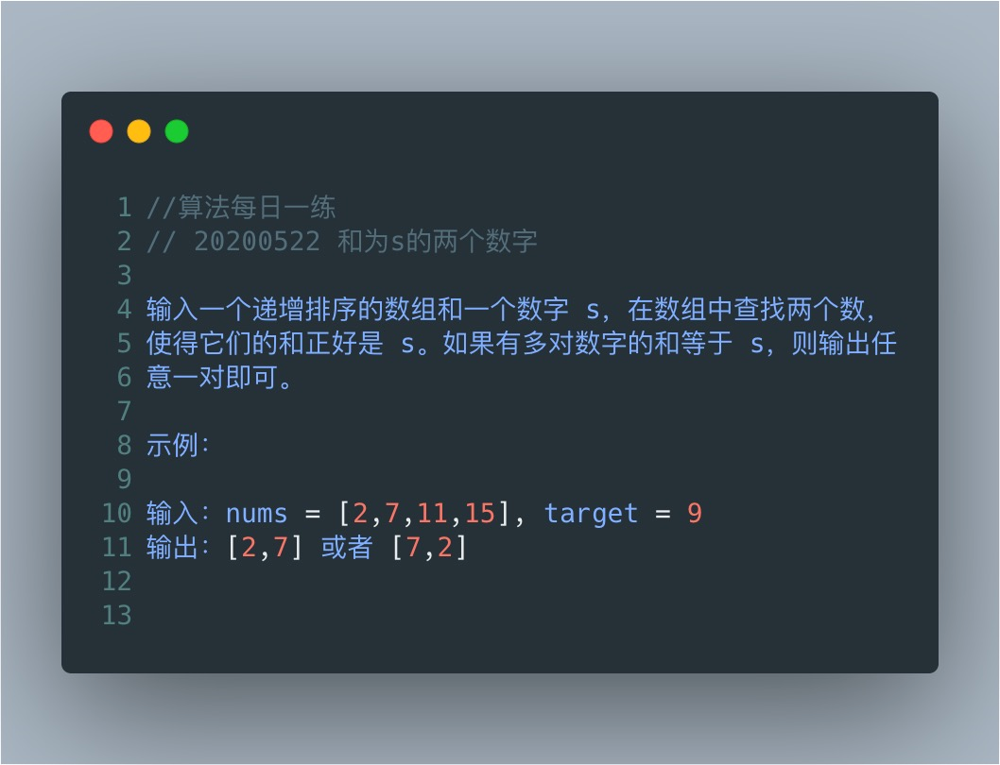

# 两数之和已排序版



一、暴力法

```javascript
var twoSum = function(nums, target) {
    for(let i=0;i<nums.length-1;i++){
        for(let j=i+1;j<nums.length;j++){
            if(target===nums[i]+nums[j]){return [i,j]}
        }
    }
};
```

二、双指针对撞

```js
function twoSum(nums,target){
  let i = {}
  for(let i= 0;i<nums.length;i++){
    map[target - nums[i]] = i;
  }

  for(let i= 0;i<nums.length;i++){
    if(map[nums[i]]!=undefined){
      if(map[nums[i]]！=i) return [i, map[nums[i]]]
    };
  }
}
```

三 Hash法存储键值对优化版  

```js
function twoSum(nums,target){
  let map = []
  for(let i= 0;i<nums.length;i++){
    if (map[nums[i]] != undefined) return [map[nums[i]],i]
    map[target - nums[i]] = i;
  }
}

//经检测数组，对象，Map三种数据类型，所占内存中：数组<对象=Map
```

