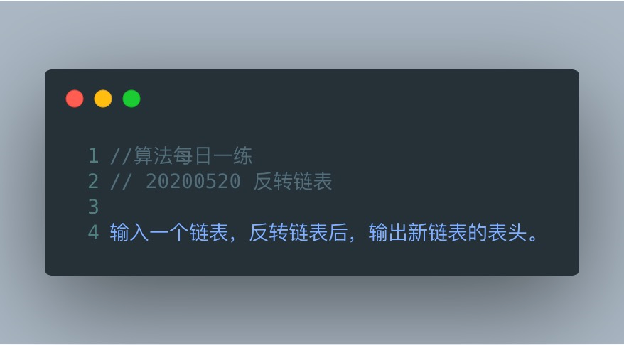
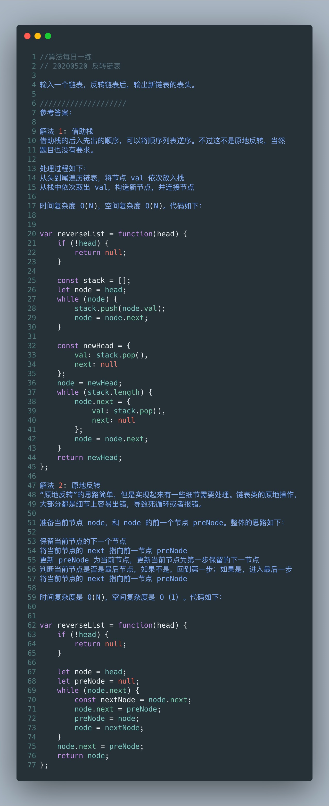

# 翻转链表



```js
//定义个链表节点类型
function LinkNode(val){
    this.val = val
    this.next = null
}
//翻转链表
function reverseLink(linkList){
    let curNode = linkList
    let curParent = linklist.next
    while(curNode.next){
        let temp = curParent.next
        curParent.next = curNode
        curNode = curParent
        curParent = curNode
    }
    return curParent
}

//测试方法
//根据数组生成链表
function generateLinks(arr){
    let root = cur = new LinkNode(0)
    arr.forEach(el=>{
        cur.next = new LinkNode(el)
        cur = cur.next
    })
    return root.next
}
let link1 = generateLinks([1,2,3,4,5])
console.log(reverseLink(link1))


```

参考答案：

