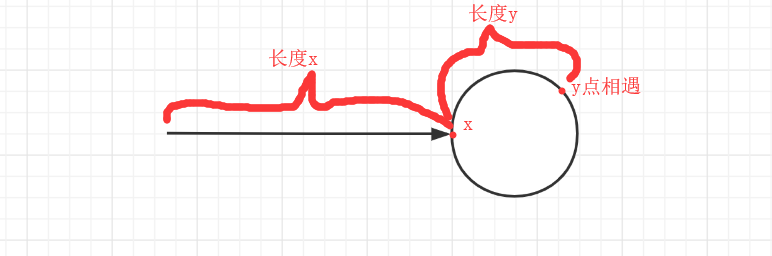

# 环形链表

#### [142. 环形链表 II](https://leetcode-cn.com/problems/linked-list-cycle-ii/)

难度中等490收藏分享切换为英文关注反馈

给定一个链表，返回链表开始入环的第一个节点。 如果链表无环，则返回 `null`。

为了表示给定链表中的环，我们使用整数 `pos` 来表示链表尾连接到链表中的位置（索引从 0 开始）。 如果 `pos` 是 `-1`，则在该链表中没有环。

**说明：**不允许修改给定的链表。

 

**示例 1：**

```
输入：head = [3,2,0,-4], pos = 1
输出：tail connects to node index 1
解释：链表中有一个环，其尾部连接到第二个节点。
```


320-420-42

32-402-402

**示例 2：**

```
输入：head = [1,2], pos = 0
输出：tail connects to node index 0
解释：链表中有一个环，其尾部连接到第一个节点。
```


**示例 3：**

```
输入：head = [1], pos = -1
输出：no cycle
解释：链表中没有环。
```


 

**进阶：**
你是否可以不用额外空间解决此题？


##### 一、使用HashMap记录遍历过的数据

```js
var detectCycle = function(head) {
    let map = new Map()
    let node = head
    while(!map.has(node)&&node!==null){
        map.set(node,true)
        node = node.next
    }
    return node
};
```


##### 二、快慢指针

定义一个fast一次走两步，定义一个slow一次走一步，然后同时在第一个节点开始走

如果存在闭环，fast与slow肯定会相遇，就像操场跑步，跑的快的人肯定会超圈，超圈的时候就与慢的人相遇了。

当两人相遇的时候，假设slow走了 n 步，则fast走了 2n 步

假设环形节点在x位置，则两者相遇的位置i,如下图：



假定头节点到x的距离为Lx，x到y的距离Ly，整个环的长度为L

假定slow走了a圈环，才相遇，则slow走过的长度：  Lx+Ly+a*L

假定fast走了b圈环，才相遇，fast 走过的长度：  Lx+Ly+b*L

又因为fast速度是slow的两倍，所以走过的距离也是两倍：2*(Lx+Ly+axL)
$$
2\times(Lx+Ly+a\times{L}) = Lx+Ly+b\times L
$$
等式转换下就是
$$
Lx = (b-a)\times L-Ly
$$
这样就能看出再跑Lx长度，就能在x点相遇

代码如下

```js
/**
 * Definition for singly-linked list.
 * function ListNode(val) {
 *     this.val = val;
 *     this.next = null;
 * }
 */

/**
 * @param {ListNode} head
 * @return {ListNode}
 */
var detectCycle = function(head) {
    let fast = head
    let slow = head
    while(true){
        if(fast===null||fast.next===null){
            return null
        }
        slow = slow.next
        fast = fast.next.next
        if(fast===slow) break
    }
    let pre = fast
    let node = head
    while(pre!==node){
        pre = pre.next
        node = node.next
    }
    return node
};
```

