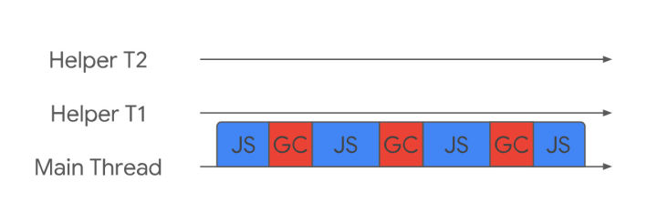
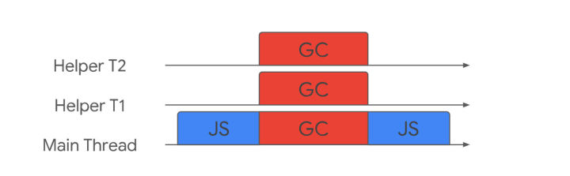
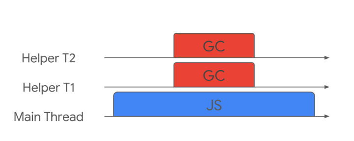

#  垃圾回收技术

### 发展史

2011 年，V8 从 stop-the-world 标记切换到增量标志。

2018 年，GC 技术又有了一个重大突破，这项技术名为并发标记。在Chrome 64和Node.js v10中已启用。他将标记时间缩短了60%~70%。还有「Parallel Scavenger」技术，它将新生代的垃圾回收时间缩短了20%~50%。

### 全停顿（Stop The World）

**特点：**应用逻辑暂停，全力执行垃圾回收

**描述：**垃圾回收算法在执行前，需要将应用逻辑暂停，执行完垃圾回收后再执行应用逻辑，这种行为称为 「全停顿」（Stop The World）。例如，如果一次GC需要100ms，应用逻辑就会暂停100ms。

**缺点：**全停顿的策略导致垃圾回收中不能及时响应用户的输入，而且如果有动画会造成动画效果的卡顿

### 增量垃圾回收（Incremental）

**特点：**垃圾回收任务和JS逻辑交错的进入主线程执行

**描述：**增量式垃圾回收是主线程间歇性的去做少量的垃圾回收的方式。不会在增量式垃圾回收的时候执行整个垃圾回收的过程，只是整个垃圾回收过程中的一小部分工作。做这样的工作是极其困难的，因为 JavaScript 也在做增量式垃圾回收的时候同时执行，这意味着堆的状态已经发生了变化，这有可能会导致之前的增量回收工作完全无效。从图中可以看出并没有减少主线程暂停的时间（事实上，通常会略微增加），只会随着时间的推移而增长。但这仍然是解决问题的的好方法，通过 JavaScript 间歇性的执行，同时也间歇性的去做垃圾回收工作，JavaScript 的执行仍然可以在用户输入或者执行动画的时候得到及时的响应。如果直接进行长时间的GC，会导致应用暂停和无响应，将会导致糟糕的用户体验。从2011年起，v8就将全停顿标记换成了增量标记。改进后的标记方式，最大停顿时间减少到原来的1/6。

**缺点：**1.并没有减少主线程暂停的时间（事实上，通常会略微增加）。

​     2.由于写入屏障(Write-barrier )机制的成本，增量标记可能会降低应用程序的吞吐量。

由于写入屏障(Write-barrier )机制的成本，增量标记可能会降低应用程序的吞吐量。但通过使用额外的工作线程可以提高吞吐量和暂停时间。以下两种方法可以在工作线程上进行标记：并行标记和并发标记。

### 并行标记（Parallel）

**特点：**主线程和协助线程在一时间做同样的任务

**描述：**并行是主线程和协助线程同时执行同样的工作，但是这仍然是一种 ‘stop-the-world’ 的垃圾回收方式，但是垃圾回收所耗费的时间等于总时间除以参与的线程数量（加上一些同步开销）。因为没有 JavaScript 的执行，因此只要确保同时只有一个协助线程在访问对象就好了。

### 并发标记（Concurrent）

**特点：**垃圾回收任务完全发生在后台，主线程可以自由的执行JavaScript。

**描述：**并发是主线程一直执行 JavaScript，而辅助线程在后台完全的执行垃圾回收。这种方式是这三种技术中最难的一种，JavaScript 堆里面的内容随时都有可能发生变化，从而使之前做的工作完全无效。最重要的是，现在有读/写竞争（read/write races），主线程和辅助线程极有可能在同一时间去更改同一个对象。这种方式的优势也非常明显，主线程不会被挂起，JavaScript 可以自由地执行 ，尽管为了保证同一对象同一时间只有一个辅助线程在修改而带来的一些同步开销。

### Chrome当前使用的技术

现今，V8 在新生代垃圾回收中使用**并行标记**，每个协助线程会将所有的活动对象都移动到 ‘To-Space’。在每一次尝试将活动对象移动到 ‘To-Space’ 的时候必须通确保原子化的读和写以及比较和交换操作。不同的协助线程都有可能通过不同的路径找到相同的对象，并尝试将这个对象移动到 ‘To-Space’；无论哪个协助线程成功移动对象到 ‘To-Space’，都必须更新这个对象的指针，并且去维护移动这个活动对象所留下的转发地址。以便于其他协助线程可以找到该活动对象更新后的指针。为了快速的给幸存下来的活动对象分配内存，清理任务会使用线程局部分配缓冲区。

V8 中的主垃圾回收器主要使用**并发标记**，一旦堆的动态分配接近极限的时候，将启动并发标记任务。每个辅助线程都会去追踪每个标记到的对象的指针以及对这个对象的引用。在 JavaScript 执行的时候，并发标记在后台进行。写入屏障（[write barriers](https://link.zhihu.com/?target=https%3A//dl.acm.org/citation.cfm%3Fid%3D2025255)）技术在辅助线程在进行并发标记的时候会一直追踪每一个 JavaScript 对象的新引用。当并发标记完成或者动态分配到达极限的时候，主线程会执行最终的快速标记步骤；在这个阶段主线程会被暂停，这段时间也就是主垃圾回收器执行的所有时间。在这个阶段主线程会再一次的扫描根集以确保所有的对象都完成了标记；然后辅助线程就会去做更新指针和整理内存的工作。并非所有的内存页都会被整理，加入到空闲列表的内存页就不会被整理。在暂停的时候主线程会启动并发清理的任务，这些任务都是并发执行的，并不会影响并行内存页的整理工作和 JavaScript 的执行。

### 名词解析 

**写入屏障（**[**write barriers**](https://link.zhihu.com/?target=https%3A//dl.acm.org/citation.cfm%3Fid%3D2025255)**）**: **内存屏障（英语：Memory barrier）**，也称内存栅栏，内存栅障，屏障指令等，是一类同步屏障指令，它使得 CPU 或编译器在对内存进行操作的时候, 严格按照一定的顺序来执行

### 参考链接：

> https://blog.csdn.net/weixin_33724059/article/details/86720543
>
> https://www.jianshu.com/p/b8ed21e8a4fb
>
> https://zhuanlan.zhihu.com/p/55917130
>
> https://www.oschina.net/translate/v8-javascript-engine