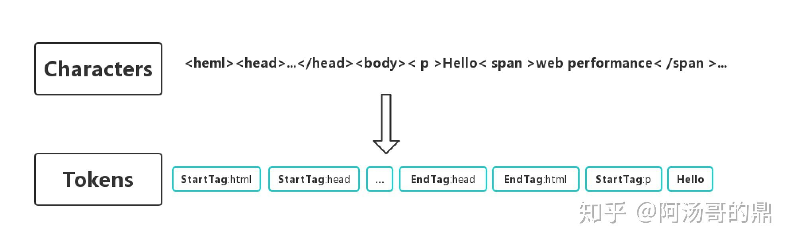

# 浏览器工作原理

### 浏览器结构


- 用户界面（User Interface）
- 浏览器引擎（Browser Engine）
- 渲染引擎（Rendering Engine）
- 网络（Networking）
- XML解析器（XML Parser）
- 显示后端（Display Backend）
- 数据持久层（Data Persistence）

### 常见渲染引擎

渲染引擎：能够能够将HTML/CSS/JavaScript文本及相应的资源文件转换成图像结果

渲染引擎的种类

| 渲染引擎           | 浏览器                           |
| ------------------ | -------------------------------- |
| Trident            | IE、Edge(旧)                     |
| Gecko              | Firefox                          |
| WebKit             | Safari                           |
| Blink(WebKit fork) | Chromium/Chrome，Opera，Edge(新) |


### 工作流程

简单流程


详细流程


### 浏览器的多进程架构


Browser：控制程序的“chrome”部分，包括地址栏，书签，后退和前进按钮。还处理Web浏览器的不可见的，和特权部分，例如网络请求和文件访问

Renderer：负责显示网站的选项卡内的所有内容

Plugin：控制网站使用的所有插件，例如flash

GPU：独立于其他进程的GPU处理任务。 它被分成多个不同的进程，因为GPU处理来自多个程序的请求并将它们绘制在同一个面中


### 渲染进程

渲染器进程负责选项卡内发生的所有事情。 在渲染器进程中，主线程处理你为用户编写的大部分代码

如果你使用了web worker 或 service worker，有时JavaScript代码的一部分将由工作线程处理。 排版和栅格线程也在渲染器进程内运行，以便高效、流畅地呈现页面


#### 渲染过程 ：解析部分


##### html解析

第一步（解析）：从网络或者磁盘下读取的HTML原始字节码，通过设置的charset编码，转换成相字符


第二步（token化）：通过词法分析器，将字符串解析成Token，Token中会标注出当前的Token是`开始标签`，还是`结束标签`，或者`文本标签`等。



第三步（生成Nodes并构建DOM树）：浏览器会根据Tokens里记录的`开始标签`，`结束标签`，将Tokens之间相互串联起来*（带有结束标签的Token不会生成Node）*。

> Token：**标记**，词法分析是计算机科学中将字符序列转换为**标记**（token）序列的过程。从输入字符流中生成标记的过程叫作**标记化**（tokenization），在这个过程中，[词法分析器](https://baike.baidu.com/item/词法分析器/4336210)还会对标记进行分类。 

Node包含了这个节点的所有属性。例如``标签最终生成出的节点对象中会保存图片地址等信息。
事实上，在构建DOM树时，不是要等所有的Tokens都转换成Nodes后才开始，而是一边生成Token一边采取`深度遍历算法`消耗Token来生成Node，如下图所示：

图中有颜色的小数字代表构建的具体步骤，可以看出，首先生成出`html Token`,并消耗Token创建出`html 节点对象`，接着生成`head Token`并消耗Token创建出`head节点对象`......，当所有的Tokens都消耗完了，紧接着DOM树也就构建完了。


> *1.词法分析是将字符流(char stream)转换为记号流(token stream)*
>
> *2.语法分析成 AST (Abstract Syntax Tree) 在HTML中就构建DOM节点，生成DOM树*

##### 子资源加载

> 注意JavaScript可以阻止解析

在构建DOM树中遇到css资源、图片、script脚本资源时进行网络加载

##### css解析，样式表计算

DOM会记录页面的内容，但是浏览器还需要知道这些内容该用什么样式去展示，所以还需要构建CSSOMTree。CSSOM的生成过程和DOM的生成过程十分相似，也是：1.解析，2.Token化，3.生成Nodes并构建CSSOMTree：

假设浏览器收到了下面这样一段css:

```css
body {font-size: 16px;}
p {font-weight: bold;}
p span {display:none;}
span {color: red;}
img {float: right;}
```

最终会生成如下的CSSOMTree:


官方对[CSSOM](https://developer.mozilla.org/zh-CN/docs/Glossary/CSSOM)构建给的一种解释：

> 未构建完的CSSOMTree是不准确的，浏览器必须等到CSSOMTree构建完毕后才能进入下一阶段。
> 所以，CSS的加载速度与构建CSSOMTree的速度将直接影响首屏渲染速度，因此在默认情况下CSS被视为阻塞渲染的资源，需要将它尽早、尽快地下载到客户端，以便缩短首次渲染的时间。

同理，JS也会可以修改CSS样式，影响CSSOMTree最终的结果。而我们前面提到，不完整的CSSOMTree是不可以被使用的，如果JS试图在**浏览器还未完成CSSOMTree的下载和构建**时去操作CSS样式，浏览器会**暂停脚本的运行和DOM的构建**，直至浏览器完成了CSSOM的下载和构建。也就是说，**JS脚本的出现会让CSSOM的构建阻塞DOM的构建**。

> 平时谈及页面性能优化，经常会强调css文件应该放在html文档中的前面引入，js文件应该放在后面引入，这么做的原因是什么呢？

如果JS放在前面，那么js执行时间与css执行时间会阻塞DOM树的构建


那如果我们把css放到前面，js放到最后引入时，构建时间会变成：


##### 布局：渲染/布局树构建

DOM/CSSOM树本身并不能直接用于排版和渲染，浏览器还会生成另外一棵树：Render树。

将CSSOM应用到DOM树中每一个元素上，形成RenderTree


- Render 树上的每一个节点被称为：`RenderObject`。

- RenderObject跟 DOM 节点几乎是一一对应的，当一个`可见的 DOM 节点`被添加到 DOM 树上时，内核就会为它生成对应的 RenderOject 添加到 Render 树上。

- 其中，可见的DOM节点不包括：
  - 一些不会体现在渲染输出中的节点（`<html><script><link>….`），会直接被忽略掉。
  - 通过CSS隐藏的节点。例如上图中的`span`节点，因为有一个CSS显式规则在该节点上设置了`display:none`属性，那么它在生成RenderObject时会被直接忽略掉。


##### 分层：Layer图层树

> 浏览器渲染引擎并不是直接使用Render树进行绘制，为了方便处理**Positioning,Clipping,Overflow-scroll,CSS Transfrom/Opacrity/Animation/Filter,Mask or Reflection,Z-index**等属性，浏览器需要生成另外一棵树：**Layer树 （ 层级树）**

RenderLayer树是基于Render树建立起来的一颗新的树。同样，RenderLayer节点和Render节点不是一一对应关系，而是一对多的关系。

浏览器会为一些**特定**的`RenderObject`生成对应的`RenderLayer`，其中的规则是：

- 是否是页面的根节点 document节点与html节点 *It’s the root object for the page*
- 是否有css的一些布局属性（relative absolute or a transform) *It has explicit CSS position properties (relative, absolute or a transform)*
- 是否透明 *It is transparent*
- 是否有溢出 *Has overflow, an alpha mask or reflection*
- 是否有css滤镜 *Has a CSS filter*
- 是否包含一个canvas元素使得节点拥有视图上下文 *Corresponds to canvas element that has a 3D (WebGL) context or an accelerated 2D context*
- 是否包含一个video元素 *Corresponds to a video element*

为了直观了解这三种树，下图给出了这三种树及其它们之间的对应关系。


##### Paint 绘制

在绘制阶段，主线程会遍历布局树（layout tree），生成一系列的绘画记录（paint records）。并将其提交到合成线程。


#### 渲染过程：合成部分

##### 分块、光栅化

**光栅化：**把文档的结构、元素的样式、几何 形状和绘制顺序转换为屏幕上的像素称为光栅化，这个操作会提交到GPU进程进行工作

**合成**是一种将页面的各个部分分层，分别栅格化，并在一个被称为合成器线程的独立线程中合成为页面的技术。

合成线程会根据视口viewport将图层(Layer) 切分为一块又一块的小图块（tiles），之后将这些小图块分别进行发送给一系列光栅线程（raster threads）进行光栅化，结束后光栅线程会将每个图块的光栅结果存在`GPU Process`的内存中。

为了优化显示体验，合成线程可以给不同的光栅线程赋予不同的优先级，将那些在视口中的或者视口附近的层先被光栅化。

##### 合成与显示

⼀旦所有图块都被光栅化， 合成线程就会⽣成⼀个绘制图块的命令⸺“DrawQuad” ， 然后将该命令通过IPC提交给浏览器进程。 浏览器进程⾥⾯有⼀个叫 viz 的组件， ⽤来接收合成线程发过来的 DrawQuad 命 令， 然后根据 DrawQuad 命令， 将其⻚⾯内容绘制到内存中， 最后再将内存显⽰在屏幕上。


#### 总结

渲染主线程

1. 渲染进程将 HTML 内容转换为能够读懂的 DOM 树结构。 
2. 渲染引擎将 CSS 样式表转化为浏览器可以理解的 styleSheets， 计算出 DOM 节点的样式。 
3. 创建布局树， 并计算元素的布局信息。 
4. 对布局树进⾏分层， 并⽣成分层树。 
5. 绘制（Paint）：为每个图层⽣成绘制列表， 并将其提交到合成线程。 

合成线程

1. 合成线程将图层分成图块， 并在光栅化线程池中将图块转换成位图。 
2. 合成线程发送绘制图块命令 DrawQuad 给浏览器进程。 
3. 浏览器进程根据 DrawQuad 消息⽣成⻚⾯， 并显⽰到显⽰器上。


### 浏览器对事件的处理

当页面渲染完毕以后，TAB内已经显示出了可交互的WEB页面，用户可以进行移动鼠标、点击页面等操作了，而当这些事件发生时候，浏览器是如何处理这些事件的呢？

以点击事件（click event）为例，让鼠标点击页面时候，首先接受到事件信息的是`Browser Process`，但是Browser Process只知道事件发生的类型和发生的位置，具体怎么对这个点击事件进行处理，还是由Tab内的`Renderer Process`进行的。Browser Process接受到事件后，随后便把事件的信息传递给了渲染进程，渲染进程会找到根据事件发生的坐标，找到目标对象（target），并且运行这个目标对象的点击事件绑定的监听函数（listener）。

### 渲染进程中合成器线程接收事件

前面我们说到，合成器线程可以独立于主线程之外通过已光栅化的层创建组合帧，例如页面滚动，如果没有对页面滚动绑定相关的事件，组合器线程可以独立于主线程创建组合帧，如果页面绑定了页面滚动事件，合成器线程会等待主线程进行事件处理后才会创建组合帧。那么，合成器线程是如何判断出这个事件是否需要路由给主线程处理的呢？

由于执行 JS 是主线程的工作，当页面合成时，合成器线程会标记页面中绑定有事件处理器的区域为`非快速滚动区域`(non-fast scrollable region)，如果事件发生在这些存在标注的区域，合成器线程会把事件信息发送给主线程，等待主线程进行事件处理，如果事件不是发生在这些区域，合成器线程则会直接合成新的帧而不用等到主线程的响应。


### 浏览器对事件的优化

一般我们屏幕的帧率是每秒60帧，也就是60fps，但是某些事件触发的频率超过了这个数值，比如wheel，mousewheel，mousemove，pointermove，touchmove，这些连续性的事件一般每秒会触发60~120次，假如每一次触发事件都将事件发送到主线程处理，由于屏幕的刷新速率相对来说较低，这样使得主线程会触发过量的命中测试以及JS代码，使得性能有了没必要是损耗。


出于优化的目的，浏览器会合并这些连续的事件，延迟到下一帧渲染是执行，也就是`requestAnimationFrame`之前。


而对于非连续性的事件，如keydown，keyup，mousedown，mouseup，touchstart，touchend等，会直接派发给主线程去执行。


### 重绘与回流

**reflow:**当render树的一部分或者全部因为大小边距等问题发生改变而需要重建的过程，叫做回流

**repaint:**当诸如颜色背景等不会引起页面布局变化，而只需要重新渲染的过程叫做重绘

#### 什么会引起回流

1. **页面渲染初始化**

2. **DOM结构变化，比如删除了某个节点；**骨头都被打断了，肯定比抽脂更严重，所以会引发回流

3. **render树变化，比如减少了padding；**也就是进行抽脂手术

4. **窗口resize事件触发**

5. 最复杂的一种：获取某些属性，引发回流 

   很多浏览器会对回流做优化，他会等到足够数量的变化发生，在做一次批处理回流。 **但是除了render树的直接变化。** 当获取一些属性时，浏览器为了获得正确的值也会触发回流。这样就使得浏览器的优化失效了

   1. 这些属性包括

   2. offsetTop, offsetLeft, offsetWidth, offsetHeight
   3. scrollTop/Left/Width/Height
   4. clientTop/Left/Width/Height
   5. width,height
   6. 调用了getComputedStyle(), 或者 IE的 currentStyle

可使用**fastdom**库进行优化，对读写分离

什么情况下：在一些js写的动画场景下，连续读取并更改dom时，会存在布局抖动问题，具体实例可见fastdom的实例

官方使用示例地址：[FastDom: Animation Example (wilsonpage.github.io)](http://wilsonpage.github.io/fastdom/examples/animation.html)

> **fastdom**通过批处理DOM读/写操作来消除布局微调。

通过谷歌开发者工具中的Performance测试官方示例,可明显看出前后的性能对比


### 参考文章

https://zhuanlan.zhihu.com/p/74792085

[前端都该懂的浏览器工作原理，你懂了吗？ - SegmentFault 思否](https://segmentfault.com/a/1190000022633988)

[为什么浏览器会使用多进程架构](https://blog.csdn.net/ithzhang/article/details/7917754)

[一文看懂Chrome浏览器工作原理](https://juejin.im/post/5e182a47e51d453cee48c752)

[浏览器多进程架构](https://zhuanlan.zhihu.com/p/102128787)

[图解浏览器的基本工作原理](https://zhuanlan.zhihu.com/p/47407398)

[Inside look at modern web browser (part 2)](https://developers.google.com/web/updates/2018/09/inside-browser-part2)

[Inside look at modern web browser (part 3)](https://developers.google.com/web/updates/2018/09/inside-browser-part3)