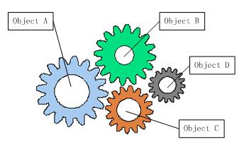
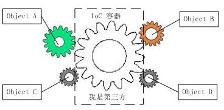

# IOC （Inverse of Control） 控制反转

IOC （Inverse of Control） 控制反转，也可以称为依赖倒置。

IOC理论提出的观点大体是这样的：借助于“第三方”实现具有依赖关系的对象之间的解耦。“第三方”，也就是IOC容器，

通俗讲IOC容器负责加载各种依赖，并提供给各个模块所依赖的实例

### 控制反转的理解

软件系统在没有引入IOC容器之前，如下图所示，对象A依赖于对象B，那么对象A在初始化或者运行到某一点的时候，自己必须主动去创建对象B或者使用已经创建的对象B。无论是创建还是使用对象B，控制权都在自己手上。

软件系统在引入IOC容器之后，这种情形就完全改变了，如下图所示，由于IOC容器的加入，对象A与对象B之间失去了直接联系，所以，当对象A运行到需要对象B的时候，IOC容器会主动创建一个对象B注入到对象A需要的地方。

 通过前后的对比，我们不难看出来：对象A获得依赖对象B的过程,由主动行为变为了被动行为，控制权颠倒过来了，这就是“控制反转”这个名称的由来。

### IOC也叫依赖注入(DI)

2004年，Martin Fowler探讨了同一个问题，既然IOC是控制反转，那么到底是“哪些方面的控制被反转了呢？”，经过详细地分析和论证后，他得出了答案：“获得依赖对象的过程被反转了”。控制被反转之后，获得依赖对象的过程由自身管理变为了由IOC容器主动注入。于是，他给“控制反转”取了一个更合适的名字叫做“依赖注入（Dependency Injection）”。他的这个答案，实际上给出了实现IOC的方法：注入。所谓依赖注入，就是由IOC容器在运行期间，动态地将某种依赖关系注入到对象之中。

所以，依赖注入(DI)和控制反转(IOC)是从不同的角度的描述的同一件事情，就是指通过引入IOC容器，利用依赖关系注入的方式，实现对象之间的解耦。

### JS中基于IOC的框架

awilix
inversify

### IOC/DI的好处

> 最简单的例子，你今天用MySql，明天要改成Oracle，后天又要改成SqlServer，
> 常规作法是每天改代码，今天 new MySql(); 明天改成 new Oracle();
>
> 如果用注入的方法，源代码都不用改，新增一个Oracle的实现，然后修改一下配置就可以发布了。

